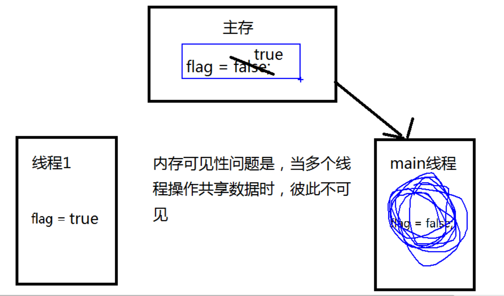
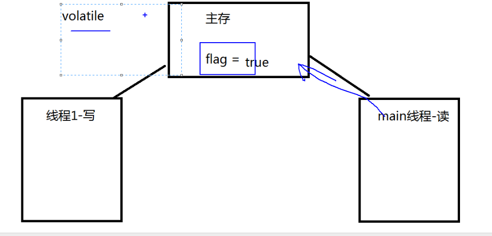
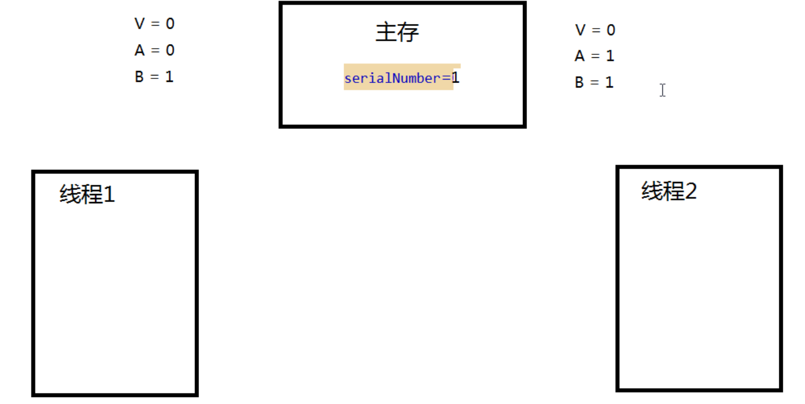
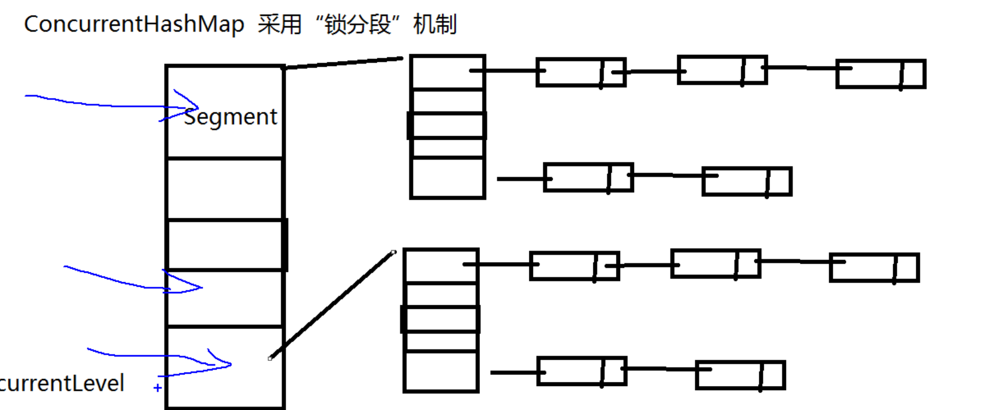
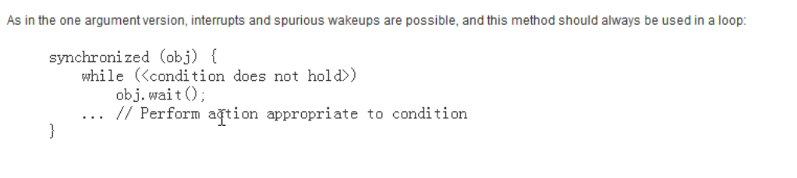

wJava JUC 简介
 在 Java 5.0 提供了 java.util.concurrent （简称JUC ）包，在此包中增加了在并发编程中很常用的实用工具类，用于定义类似于线程的自定义子系统，包括线程池、异步 IO 和轻量级任务框架。提供可调的、灵活的线程池。还提供了设计用于多线程上下文中的 Collection 实现等。

aqs

# 1-volatile 关键字 内存 可见性

## 内存可见性

 内存可见性（Memory Visibility）是指当某个线程正在使用对象状态而另一个线程在同时修改该状态，需要确保当一个线程修改了对象状态后，其他线程能够看到发生的状态变化。

- 可见性错误是指当读操作与写操作在不同的线程中执行时，我们无法确保执行读操作的线程能适时地看到其他线程写入的值，有时甚至是根本不可能的事情。

- 我们可以通过同步来保证对象被安全地发布。除此之外我们也可以使用一种更加轻量级的 volatile 变量。

- 内存可见性问题就是,当多个线程操作(主存内存的)共享数据时,彼此不可见

- 例如main线程先读取到false,线程1拉取主存中的数据到自己的内存中进行修改,还没有来得及写回主存,main()早就已经读取到数据了,两个线程读取到的数据是有差别的,因此内存对两个线程是不可见的





## volatile 关键字

 Java 提供了一种稍弱的同步机制，即 volatile 变量，用来确保将变量的更新操作通知到其他线程。
可以将 volatile 看做一个轻量级的锁，但是又与锁有些不同：

- 对于多线程，不具有互斥关系
- 不能保证状态变量的原子性操作
- main()线程加一个同步锁可以解决这个问题,但效率很低
- 使用volatile当多个线程操作共享数据是,可以保证内存中的数据可见可以理解多个线程都是直接操作主存的数




```java
/*
 * 一、volatile 关键字：当多个线程进行操作共享数据时，可以保证内存中的数据可见。
 * 					  相较于 synchronized 是一种较为轻量级的同步策略。
 *
 * 注意：
 * 1. volatile 不具备“互斥性”
 * 2. volatile 不能保证变量的“原子性”
 * 主存 flag=false
 * 每一个线程有自己的缓存
 * flag=true
 * 启动两个线程一个去读,一个去写
 * main()线程先读主存的flag
 * 线程1先把主存的数据读到自己的缓存中进行修改,再把结果写回到主存中去
 * 内存可见性问题是,当多个线程操作主存内存占用的
 *
 */
public class TestVolatile {

    public static void main(String[] args) {
        ThreadDemo td = new ThreadDemo();
        new Thread(td).start();

        while (true) {
            if (td.isFlag()) {
                System.out.println("------------------");
                break;
            }
        }
    }
}

class ThreadDemo implements Runnable {

    private volatile boolean flag = false;

    @Override
    public void run() {
        try {
            Thread.sleep(200);
        } catch (InterruptedException e) {
        }
        flag = true;
        System.out.println("flag=" + isFlag());
    }

    public boolean isFlag() {
        return flag;
    }

    public void setFlag(boolean flag) {
        this.flag = flag;
    }
}
```


# 2- 原子量 变量 CAS

compare and swap

## CAS 算法

CAS (Compare-And-Swap) 是一种硬件对并发的支持，针对多处理器操作而设计的处理器中的一种特殊指令，用于管理对共享数据的并发访问。
 CAS 是一种无锁的非阻塞算法的实现。

 CAS 包含了 3 个操作数：

-  需要读写的内存值 V
-  进行比较的值 A
-  拟写入的新值 B
-  当且仅当 V 的值等于 A 时，CAS 通过原子方式用新值 B 来更新 V 的值，否则不会执行任何操作。





## 原子变量

类的小工具包，支持在单个变量上解除锁的线程安全编程。事实上，此包中的类可将 volatile 值、字段和数组元素的概念扩展到那些也提供原子条件更新操作的类。

-  类 AtomicBoolean、AtomicInteger、AtomicLong 和 AtomicReference 的实例各自提供对
  相应类型单个变量的访问和更新。每个类也为该类型提供适当的实用工具方法。

-  AtomicIntegerArray、AtomicLongArray 和 AtomicReferenceArray 类进一步扩展了原子操作，对这些类型的数组提供了支持。这些类在为其数组元素提供 volatile 访问语义方面也引人注目，这对于普通数组来说是不受支持的。

-  核心方法：boolean compareAndSet(expectedValue, updateValue)

-  java.util.concurrent.atomic 包下提供了一些原子操作的常用类:

   AtomicBoolean 、AtomicInteger 、AtomicLong 、 AtomicReference
   AtomicIntegerArray 、AtomicLongArray
   AtomicMarkableReference
   AtomicReferenceArray
  AtomicStampedReference

  ```java
  package com.kkb.juc01;
  
  import java.util.concurrent.atomic.AtomicInteger;
  
  /*
   * 一、i++ 的原子性问题：i++ 的操作实际上分为三个步骤“读-改-写”
   * 		  int i = 10;
   * 		  i = i++; //10
   * 
   * 		  int temp = i;
   * 		  i = i + 1;
   * 		  i = temp;
   * 
   * 二、原子变量：在 java.util.concurrent.atomic 包下提供了一些原子变量。
   * 		1. volatile 保证内存可见性
   * 		2. CAS（Compare-And-Swap） 算法保证数据变量的原子性
   * 			CAS 算法是硬件对于并发操作的支持
   * 			CAS 包含了三个操作数：
   * 			①内存值  V
   * 			②预估值  A
   * 			③更新值  B
   * 			当且仅当 V == A 时， V = B; 否则，不会执行任何操作。
   */
  public class TestAtomicDemo {
  
  	public static void main(String[] args) {
  		AtomicDemo ad = new AtomicDemo();
  
  		for (int i = 0; i < 10; i++) {
  			new Thread(ad).start();
  		}
  	}
  	
  }
  
  class AtomicDemo implements Runnable{
  	private AtomicInteger num = new AtomicInteger();
  	@Override
  	public void run() {
  		try {
  			Thread.sleep(200);
  		} catch (InterruptedException e) {
  			e.printStackTrace();
  		}
  		System.out.println(getNum());
  	}
  
  	public int getNum() {
  		return num.getAndIncrement();
  	}
  }
  
  ```

  

# 3-ConcurrentHashMap 锁分段

## ConcurrentHashMap

 Java 5.0 在 java.util.concurrent 包中提供了多种并发容器类来改进同步容器
的性能。

-  ConcurrentHashMap 同步容器类是Java 5 增加的一个线程安全的哈希表。对与多线程的操作，介于 HashMap 与 Hashtable 之间。内部采用“锁分段”机制替代 Hashtable 的独占锁。进而提高性能。
- 此包还提供了设计用于多线程上下文中的 Collection 实现：

ConcurrentHashMap、ConcurrentSkipListMap、ConcurrentSkipListSet、CopyOnWriteArrayList 和 CopyOnWriteArraySet。当期望许多线程访问一个给定 collection 时，ConcurrentHashMap 通常优于同步的 HashMap，ConcurrentSkipListMap 通常优于同步的 TreeMap。当期望的读数和遍历远远大于列表的更新数时，CopyOnWriteArrayList 优于同步的 ArrayList。





```java

package com.kkb.juc01;

import java.util.Iterator;
import java.util.concurrent.CopyOnWriteArrayList;

/*
 * CopyOnWriteArrayList/CopyOnWriteArraySet : “写入并复制”
 * 注意：添加操作多时，效率低，因为每次添加时都会进行复制，开销非常的大。并发迭代操作多时可以选择。
 */
public class TestCopyOnWriteArrayList {

	public static void main(String[] args) {
		HelloThread ht = new HelloThread();
		
		for (int i = 0; i < 10; i++) {
			new Thread(ht).start();
		}
	}
}

class HelloThread implements Runnable{
	
//	private static List<String> list = Collections.synchronizedList(new ArrayList<String>());
	
	private static CopyOnWriteArrayList<String> list = new CopyOnWriteArrayList<>();
	static{
		list.add("AA");
		list.add("BB");
		list.add("CC");
	}
	
	@Override
	public void run() {
		
		Iterator<String> it = list.iterator();
		
		while(it.hasNext()){
			System.out.println(it.next());
			
			list.add("AA");
		}
	}
}
```


# 4- 实现 Callable 接口

## Callable 接口

Java 5.0 在 java.util.concurrent 提供了一个新的创建执行线程的方式：Callable 接口

- Callable 接口类似于 Runnable，两者都是为那些其实例可能被另一个线程执行的类设计的。但是 Runnable 不会返回结果，并且无法抛出经过检查的异常。
- Callable 需要依赖FutureTask ，FutureTask 也可以用作闭锁。

FutureTask也可以用于闭锁

```java
public class FutureTask<V> implements RunnableFuture<V>
public interface RunnableFuture<V> extends Runnable, Future<V>
```

要等线程执行完才可以获取结果

可以有返回值

可以抛出异常

```java
package com.kkb.juc02;

import java.util.concurrent.Callable;
import java.util.concurrent.ExecutionException;
import java.util.concurrent.FutureTask;

/*
 * 一、创建执行线程的方式三：实现 Callable 接口。 相较于实现 Runnable 接口的方式，方法可以有返回值，并且可以抛出异常。
 * 
 * 二、执行 Callable 方式，需要 FutureTask 实现类的支持，用于接收运算结果。  FutureTask 是  Future 接口的实现类
 */
public class TestCallable {
	
	public static void main(String[] args) {
		ThreadDemo td = new ThreadDemo();
		
		//1.执行 Callable 方式，需要 FutureTask 实现类的支持，用于接收运算结果。
		FutureTask<Integer> result = new FutureTask<>(td);
		
		new Thread(result).start();
		
		//2.接收线程运算后的结果
		try {
			Integer sum = result.get();  //FutureTask 可用于 闭锁
			System.out.println(sum);
			System.out.println("------------------------------------");
		} catch (InterruptedException | ExecutionException e) {
			e.printStackTrace();
		}
	}
}

class ThreadDemo implements Callable<Integer>{

	@Override
	public Integer call() throws Exception {
		int sum = 0;
		
		for (int i = 0; i <= 100000; i++) {
			sum += i;
		}
		
		return sum;
	}
	
}

```


# 5-Lock 同步 锁

## 显示锁 Lock

- 在 Java 5.0 之前，协调共享对象的访问时可以使用的机制只有 synchronized 和 volatile 。Java 5.0 后增加了一些新的机制，但并不是一种替代内置锁的方法，而是当内置锁不适用时，作为一种可选择的高级功能。
- ReentrantLock 实现了 Lock 接口，并提供了与synchronized 相同的互斥性和内存可见性。但相较synchronized 提供了更高的处理锁的灵活性。
- 原子变量也具有互斥性和内存可见性,而且不会阻塞线程

```java
package com.kkb.juc02;

import java.util.concurrent.locks.Lock;
import java.util.concurrent.locks.ReentrantLock;

/*
 * 一、用于解决多线程安全问题的方式：
 * 
 * synchronized:隐式锁
 * 1. 同步代码块
 * 
 * 2. 同步方法
 * 
 * jdk 1.5 后：
 * 3. 同步锁 Lock
 * 注意：是一个显示锁，需要通过 lock() 方法上锁，必须通过 unlock() 方法进行释放锁
 */
public class TestLock {
	
	public static void main(String[] args) {
		Ticket ticket = new Ticket();
		
		new Thread(ticket, "1号窗口").start();
		new Thread(ticket, "2号窗口").start();
		new Thread(ticket, "3号窗口").start();
	}

}

class Ticket implements Runnable{
	
	private int tick = 100;
	
	private Lock lock = new ReentrantLock();

	@Override
	public void run() {
		while(true){
			
			lock.lock(); //上锁
			
			try{
				if(tick > 0){
					try {
						Thread.sleep(200);
					} catch (InterruptedException e) {
					}
					
					System.out.println(Thread.currentThread().getName() + " 完成售票，余票为：" + --tick);
				}
			}finally{
				lock.unlock(); //释放锁
			}
		}
	}
	
}
```


## 用while解决虚假唤醒问题



```java
package com.kkb.juc02;

/*
 * 生产者和消费者案例
 */
public class TestProductorAndConsumer {

	public static void main(String[] args) {
		Clerk clerk = new Clerk();
		
		Productor pro = new Productor(clerk);
		Consumer cus = new Consumer(clerk);
		
		new Thread(pro, "生产者 A").start();
		new Thread(cus, "消费者 B").start();
		
		new Thread(pro, "生产者 C").start();
		new Thread(cus, "消费者 D").start();
	}
	
}

//店员
class Clerk{
	private int product = 0;
	
	//进货
	public synchronized void get(){//循环次数：0
		while(product >= 1){//为了避免虚假唤醒问题，应该总是使用在循环中
			System.out.println("产品已满！");
			
			try {
				this.wait();
			} catch (InterruptedException e) {
			}
			
		}
		
		System.out.println(Thread.currentThread().getName() + " : " + ++product);
		this.notifyAll();
	}
	
	//卖货
	public synchronized void sale(){//product = 0; 循环次数：0
		while(product <= 0){
			System.out.println("缺货！");
			
			try {
				this.wait();
			} catch (InterruptedException e) {
			}
		}
		
		System.out.println(Thread.currentThread().getName() + " : " + --product);
		this.notifyAll();
	}
}

//生产者
class Productor implements Runnable{
	private Clerk clerk;

	public Productor(Clerk clerk) {
		this.clerk = clerk;
	}

	@Override
	public void run() {
		for (int i = 0; i < 20; i++) {
			try {
				Thread.sleep(200);
			} catch (InterruptedException e) {
			}
			
			clerk.get();
		}
	}
}

//消费者
class Consumer implements Runnable{
	private Clerk clerk;

	public Consumer(Clerk clerk) {
		this.clerk = clerk;
	}

	@Override
	public void run() {
		for (int i = 0; i < 20; i++) {
			clerk.sale();
		}
	}
}
```


# 6- 线程 按序

## 线程按序交替

编写一个程序，开启 3 个线程，这三个线程的 ID 分别为
A、B、C，每个线程将自己的 ID 在屏幕上打印 10 遍，要
求输出的结果必须按顺序显示。
如：ABCABCABC…… 依次递归

```java
package com.kkb.juc02;

import java.util.concurrent.locks.Condition;
import java.util.concurrent.locks.Lock;
import java.util.concurrent.locks.ReentrantLock;

/*
 * 编写一个程序，开启 3 个线程，这三个线程的 ID 分别为 A、B、C，每个线程将自己的 ID 在屏幕上打印 10 遍，要求输出的结果必须按顺序显示。
 *	如：ABCABCABC…… 依次递归
 */
public class TestABCAlternate {

    public static void main(String[] args) {
        final AlternateDemo ad = new AlternateDemo();

        new Thread(new Runnable() {
            @Override
            public void run() {

                for (int i = 1; i <= 20; i++) {
                    ad.loopA(i);
                }

            }
        }, "A").start();

        new Thread(new Runnable() {
            @Override
            public void run() {

                for (int i = 1; i <= 20; i++) {
                    ad.loopB(i);
                }

            }
        }, "B").start();

        new Thread(new Runnable() {
            @Override
            public void run() {

                for (int i = 1; i <= 20; i++) {
                    ad.loopC(i);

                    System.out.println("-----------------------------------");
                }

            }
        }, "C").start();
    }

}

class AlternateDemo {

    private int number = 1; //当前正在执行线程的标记

    private Lock lock = new ReentrantLock();
    private Condition condition1 = lock.newCondition();
    private Condition condition2 = lock.newCondition();
    private Condition condition3 = lock.newCondition();

    /**
     * @param totalLoop : 循环第几轮
     */
    public void loopA(int totalLoop) {
        lock.lock();

        try {
            //1. 判断
            if (number != 1) {
                condition1.await();
            }

            //2. 打印
            for (int i = 1; i <= 1; i++) {
                System.out.println(Thread.currentThread().getName() + "\t" + i + "\t" + totalLoop);
            }

            //3. 唤醒
            number = 2;
            condition2.signal();
        } catch (Exception e) {
            e.printStackTrace();
        } finally {
            lock.unlock();
        }
    }

    public void loopB(int totalLoop) {
        lock.lock();

        try {
            //1. 判断
            if (number != 2) {
                condition2.await();
            }

            //2. 打印
            for (int i = 1; i <= 1; i++) {
                System.out.println(Thread.currentThread().getName() + "\t" + i + "\t" + totalLoop);
            }

            //3. 唤醒
            number = 3;
            condition3.signal();
        } catch (Exception e) {
            e.printStackTrace();
        } finally {
            lock.unlock();
        }
    }

    public void loopC(int totalLoop) {
        lock.lock();

        try {
            //1. 判断
            if (number != 3) {
                condition3.await();
            }

            //2. 打印
            for (int i = 1; i <= 1; i++) {
                System.out.println(Thread.currentThread().getName() + "\t" + i + "\t" + totalLoop);
            }

            //3. 唤醒
            number = 1;
            condition1.signal();
        } catch (Exception e) {
            e.printStackTrace();
        } finally {
            lock.unlock();
        }
    }

}
```


# 7- 线程 八

## 线程八锁(static class) 

this和 class锁的区别

一个对象里面如果有多个synchronized方法，某一个时刻内，只要一个线程去调用其中的一个synchronized方法了，其它的线程都只能等待，换句话说，某一个时刻内，只能有唯一一个线程去访问这些synchronized方法

• 所有的非静态同步方法用的都是同一把锁——实例对象本身this,更加灵活，也就是说如果一个实例对象的非静态同步方法获取锁后，该实例对象的其他非静态同步方法必须等待获取锁的方法释放锁后才能获取锁，**可是别的实例对象的**非静态同步方法因为跟该实例对象的非静态同步方法用的是不同的锁，所以毋须等待该实例对象已获取锁的非静态同步方法释放锁就可以获取他们自己的锁。

• 所有的static静态同步方法用的也是同一把锁——类对象本身，这两把锁是两个不同的对象，所以静态同步方法与非静态同步方法之间是不会有竞态条件的。但是一旦一个静态同步方法获取锁后，其他的静态同步方法都必须等待该方法释放锁后才能获取锁，而不管是同一个实例对象的静态同步方法之间，还是不同的实例对象的静态同步方法之间，只要它们同一个类的实例对象！


非static用的是this锁,不同的实例对象有不同的this,互补影响,但是同一个实例对象的其他非static同步方法有影响

static用的是 .class当前类锁,只有一个,所以分静态和静态同步方法之间是没有竞争的,但是所有的实例对象的静态方法都会受到影响

```java
package com.kkb.juc02;

/*
 * 题目：判断打印的 "one" or "two" ？
 * 
 * 1. 两个普通同步方法，两个线程，标准打印， 打印? //one  two
 * 2. 新增 Thread.sleep() 给 getOne() ,打印? //one  two
 * 3. 新增普通方法 getThree() , 打印? //three  one   two
 * 4. 两个普通同步方法，两个 Number 对象，打印?  //two  one
 * 5. 修改 getOne() 为静态同步方法，打印?  //two   one
 * 6. 修改两个方法均为静态同步方法，一个 Number 对象?  //one   two
 * 7. 一个静态同步方法，一个非静态同步方法，两个 Number 对象?  //two  one
 * 8. 两个静态同步方法，两个 Number 对象?   //one  two
 * 
 * 线程八锁的关键：
 * ①非静态方法的锁默认为  this,  静态方法的锁为 对应的 Class 实例
 * ②某一个时刻内，只能有一个线程持有锁，无论几个方法。
 */
public class TestThread8Monitor {
	
	public static void main(String[] args) {
		final Number number = new Number();
		final Number number2 = new Number();
		
		new Thread(new Runnable() {
			@Override
			public void run() {
				number.getOne();
			} 
		}).start();
		
		new Thread(new Runnable() {
			@Override
			public void run() {
//				number.getTwo();
				number2.getTwo();
			}
		}).start();
		
		/*new Thread(new Runnable() {
			@Override
			public void run() {
				number.getThree();
			}
		}).start();*/
		
	}

}

class Number{
	
	public static synchronized void getOne(){//Number.class
		try {
			Thread.sleep(3000);
		} catch (InterruptedException e) {
		}
		
		System.out.println("one");
	}
	
	public synchronized void getTwo(){//this
		System.out.println("two");
	}
	
	public void getThree(){
		System.out.println("three");
	}
	
}
```


# 8- 线程池

## 线程池

第四种获取线程的方法：线程池，一个 ExecutorService，它使用可能的几个池线程之一执行每个提交的任务，通常使用 Executors 工厂方法配置。

线程池可以解决两个不同问题：由于减少了每个任务调用的开销，它们通常可以在执行大量异步任务时提供增强的性能，并且还可以提供绑定和管理资源（包括执行任务集时使用的线程）的方法。每个 ThreadPoolExecutor 还维护着一些基本的统计数据，如完成的任务数。

记忆Executor根接口,ExecutorService子接口,ThreadPoolExecutor线程池的实现类

Executors工厂类 

```
一、线程池：提供了一个线程队列，队列中保存着所有等待状态的线程。避免了创建与销毁额外开销，提高了响应的速度。

二、线程池的体系结构：
   java.util.concurrent.Executor : 负责线程的使用与调度的根接口
      |--ExecutorService 子接口: 线程池的主要接口
         |--ThreadPoolExecutor 线程池的实现类
         |--ScheduledExecutorService 子接口：负责线程的调度
            |--ScheduledThreadPoolExecutor ：继承 ThreadPoolExecutor， 实现 ScheduledExecutorService

三、工具类 : Executors 
ExecutorService newFixedThreadPool() : 创建固定大小的线程池
ExecutorService newCachedThreadPool() : 缓存线程池，线程池的数量不固定，可以根据需求自动的更改数量。
ExecutorService newSingleThreadExecutor() : 创建单个线程池。线程池中只有一个线程

ScheduledExecutorService newScheduledThreadPool() : 创建固定大小的线程，可以延迟或定时的执行任务。
```


- 为了便于跨大量上下文使用，此类提供了很多可调整的参数和扩展钩子 (hook)。但是，强烈建议程序员使用较为方便的 Executors 工厂方法 ：
- Executors.newCachedThreadPool()（无界线程池，可以进行自动线程回收）
- Executors.newFixedThreadPool(int)（固定大小线程池）
- Executors.newSingleThreadExecutor()（单个后台线程）

```java
package com.kkb.juc02;

import java.util.ArrayList;
import java.util.List;
import java.util.concurrent.Callable;
import java.util.concurrent.ExecutorService;
import java.util.concurrent.Executors;
import java.util.concurrent.Future;

/*
 * 一、线程池：提供了一个线程队列，队列中保存着所有等待状态的线程。避免了创建与销毁额外开销，提高了响应的速度。
 * 
 * 二、线程池的体系结构：
 * 	java.util.concurrent.Executor : 负责线程的使用与调度的根接口
 * 		|--**ExecutorService 子接口: 线程池的主要接口
 * 			|--ThreadPoolExecutor 线程池的实现类
 * 			|--ScheduledExecutorService 子接口：负责线程的调度
 * 				|--ScheduledThreadPoolExecutor ：继承 ThreadPoolExecutor， 实现 ScheduledExecutorService
 * 
 * 三、工具类 : Executors 
 * ExecutorService newFixedThreadPool() : 创建固定大小的线程池
 * ExecutorService newCachedThreadPool() : 缓存线程池，线程池的数量不固定，可以根据需求自动的更改数量。
 * ExecutorService newSingleThreadExecutor() : 创建单个线程池。线程池中只有一个线程
 * 
 * ScheduledExecutorService newScheduledThreadPool() : 创建固定大小的线程，可以延迟或定时的执行任务。
 */
public class TestThreadPool {
	
	public static void main(String[] args) throws Exception {
		//1. 创建线程池
		ExecutorService pool = Executors.newFixedThreadPool(5);
		
		List<Future<Integer>> list = new ArrayList<>();
		
		for (int i = 0; i < 10; i++) {
			Future<Integer> future = pool.submit(new Callable<Integer>(){

				@Override
				public Integer call() throws Exception {
					int sum = 0;
					
					for (int i = 0; i <= 100; i++) {
						sum += i;
					}
					
					return sum;
				}
				
			});

			list.add(future);
		}
		
		pool.shutdown();
		
		for (Future<Integer> future : list) {
			System.out.println(future.get());
		}
		
		
		
		/*ThreadPoolDemo tpd = new ThreadPoolDemo();
		
		//2. 为线程池中的线程分配任务
		for (int i = 0; i < 10; i++) {
			pool.submit(tpd);
		}
		
		//3. 关闭线程池
		pool.shutdown();*/
	}
	
//	new Thread(tpd).start();
//	new Thread(tpd).start();

}

class ThreadPoolDemo implements Runnable{

	private int i = 0;
	
	@Override
	public void run() {
		while(i <= 100){
			System.out.println(Thread.currentThread().getName() + " : " + i++);
		}
	}
	
}
```


## 线程

### ScheduledExecutorService

 一个 ExecutorService，可安排在给定的延迟后运行或定期执行的命令。

```java
public class TestScheduledThreadPool {

	public static void main(String[] args) throws Exception {
		ScheduledExecutorService pool = Executors.newScheduledThreadPool(5);
		
		for (int i = 0; i < 5; i++) {
			Future<Integer> result = pool.schedule(new Callable<Integer>(){

				@Override
				public Integer call() throws Exception {
					int num = new Random().nextInt(100);//生成随机数
					System.out.println(Thread.currentThread().getName() + " : " + num);
					return num;
				}
				
			}, 1, TimeUnit.SECONDS);
			
			System.out.println(result.get());
		}
		
		pool.shutdown();
	}
	
}
```


