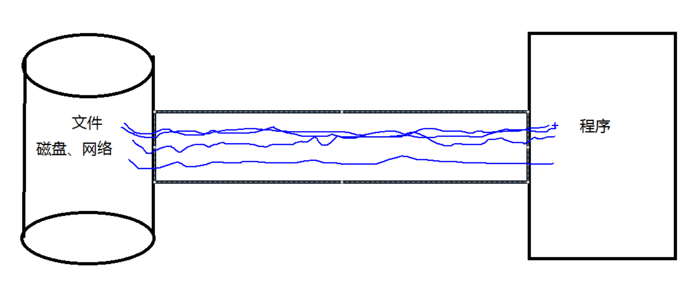

# 1-Java NIO 简介

-  Java NIO（New IO）是从Java 1.4版本开始引入的一个新的IO API，可以替代标准的Java IO API。
- NIO与原来的IO有同样的作用和目的，但是使用的方式完全不同，NIO支持面向缓冲区的、基于通道的IO操作。
- NIO将以更加高效的方式进行文件的读写操作。

## Java NIO 与 IO 的主要区别

| IO                      | NIO                         |
| ----------------------- | --------------------------- |
| 面向流(Stream Oriented) | 面向缓冲区(Buffer Oriented) |
| 阻塞IO(Blocking IO)     | 非阻塞IO(Non Blocking IO)   |
| (无)                    | 选择器(Selectors)           |

传统的io是建立流,单向的,面向流的传输

而nio是通道,理解为铁路,铁路本身不能完成传输,铁路只能连接,通道本身没有任何的数据

通道里面有缓冲区,缓冲区就是火车,缓冲区是双向的

NIO是非阻塞的,面向缓冲区的,双向的

# 2- 通道与缓冲区

 Java NIO系统的核心在于：通道(Channel)和缓冲区(Buffer)。通道表示打开到 IO 设备(例如：文件、套接字)的连接。若需要使用 NIO 系统，需要获取用于连接 IO 设备的通道以及用于容纳数据的缓冲区。然后操作缓冲区，对数据进行处理。

**简而言之，Channel 负责传输和连接， Buffer 负责存储**

## 缓冲区（Buffer）

- 缓冲区（Buffer） ：一个用于特定基本数据类型的容器。由 java.nio 包定义的，所有缓冲区都是 Buffer 抽象类的子类。
  
- Java NIO 中的 Buffer 主要用于与 NIO 通道进行交互，数据是从通道读入缓冲区，从缓冲区写入通道中的。

- Buffer 就像一个数组，可以保存多个相同类型的数据。根据数据类型不同(boolean 除外) ，有以下 Buffer 常用子类

- ByteBuffer
- CharBuffer
- ShortBuffer
- IntBuffer
- LongBuffer
- FloatBuffer
- DoubleBuffer

上述 Buffer 类 他们都采用相似的方法进行管理数据，只是各自管理的数据类型不同而已。都是通过如下方法获取一个 Buffer对象：static XxxBuffer allocate(int capacity) : 创建一个容量为capacity 的 XxxBuffer 对象

### 缓冲区的基本属性

 Buffer 中的重要概念：

- 量 容量 (capacity) ：表示 Buffer 最大数据容量，缓冲区容量不能为负，并且创建后不能更改。
- 制 限制 (limit) ：第一个不应该读取或写入的数据的索引，即位于 limit 后的数据不可读写。缓冲区的限制不能为负，并且不能大于其容量。
- 置 位置 (position)： ：下一个要读取或写入的数据的索引。缓冲区的位置不能为负，并且不能大于其限制
- 记 标记 (mark) 与重置 (reset) ：标记是一个索引，通过 Buffer 中的 mark() 方法指定 Buffer 中一个特定的 position，之后可以通过调用 reset() 方法恢复到这个 position.
- 标记 、 位置 、 限制 、 容量遵守以下不变式： 0 <= mark <= position <= limit <= capacity

### Buffer 的常用方法

| 方 方 法               | 描 描 述                                                  |
| ---------------------- | --------------------------------------------------------- |
| Buffer clear()         | 清空缓冲区并返回对缓冲区的引用                            |
| Buffer flip()          | 为 将缓冲区的界限设置为当前位置，并将当前位置充值为 0     |
| int capacity()         | 返回 Buffer 的 capacity 大小                              |
| boolean hasRemaining() | 判断缓冲区中是否还有元素                                  |
| int limit()            | 返回 Buffer 的界限(limit) 的位置                          |
| Buffer limit(int n)    | 将设置缓冲区界限为 n, 并返回一个具有新 limit 的缓冲区对象 |
| Buffer mark()          | 对缓冲区设置标记                                          |
| int position()         | 返回缓冲区的当前位置 position                             |
| Buffer position(int n) | 将设置缓冲区的当前位置为 n , 并返回修改后的 Buffer 对象   |
| int remaining()        | 返回 position 和 limit 之间的元素个数                     |
| Buffer reset()         | 将位置 position 转到以前设置的 mark 所在的位置            |
| Buffer rewind()        | 将位置设为为 0， 取消设置的 mark                          |

###  缓冲区的数据操作

 Buffer 所有子类提供了两个用于数据操作的方法：get()与 put() 方法

- 取 获取 Buffer 中的数据

get() ：读取单个字节
get(byte[] dst)：批量读取多个字节到 dst 中
get(int index)：读取指定索引位置的字节(不会移动 position)

- 放到 入数据到 Buffer 中 中

put(byte b)：将给定单个字节写入缓冲区的当前位置
put(byte[] src)：将 src 中的字节写入缓冲区的当前位置
put(int index, byte b)：将指定字节写入缓冲区的索引位置(不会移动 position)

### (字节)直接与非直接缓冲区

- 字节缓冲区要么是直接的，要么是非直接的。
- 如果为**直接字节缓冲区**，则 Java 虚拟机会尽最大努力直接在机 此缓冲区上执行本机 I/O 操作。也就是说，在每次调用基础操作系统的一个本机 I/O 操作之前（或之后），虚拟机都会尽量避免将缓冲区的内容复制到中间缓冲区中（或从中间缓冲区中复制内容）。
- 直接字节缓冲区可以通过调用此类的 allocateDirect() 工厂方法 来创建。此方法返回的 缓冲区进行分配和取消分配所需成本通常高于非直接缓冲区 。直接缓冲区的内容可以驻留在常规的垃圾回收堆之外，因此，它们对应用程序的内存需求量造成的影响可能并不显。所以，建议将直接缓冲区主要分配给那些易受基础系统的机 本机 I/O 操作影响的大型、持久的缓冲区。一般情况下，最好仅在直接缓冲区能在程序性能方面带来明显好处时分配它们。
- 直接字节缓冲区还可以过 通过FileChannel 的 map() 方法 将文件区域直接映射到内存中来创建 。该方法返回MappedByteBuffer 。Java 平台的实现有助于通过 JNI 从本机代码创建直接字节缓冲区。如果以上这些缓冲区中的某个缓冲区实例指的是不可访问的内存区域，则试图访问该区域不会更改该缓冲区的内容，并且将会在访问期间或稍后的某个时间导致抛出不确定的异常。
- 其 字节缓冲区是直接缓冲区还是非直接缓冲区可通过调用其 isDirect() 方法来确定。提供此方法是为了能够在
  性能关键型代码中执行显式缓冲区管理 。

### 非直接缓冲区

非直接缓冲区,应用程序把数据读到用户空间的缓存(用户地址空间的缓存,是jvm空间内存空间),然后copy到系统的内核地址空间的缓存中

增加了copy的成本,缓冲区进行分配和取消分配所需的成本比较高

### 直接缓冲区

直接开辟系统的物理内存

应用程序直接把数据read到系统层面的物理内存中,物理磁盘直接从物理磁盘中拉取数据,省略了copy

## 通道（Channel）

通道（Channel）：由 java.nio.channels 包定义的。Channel 表示 IO 源与目标打开的连接。Channel 类似于传统的“流”。只不过 Channel本身不能直接访问数据，Channel 只能与Buffer 进行交互。

Java 为 为 Channel 接口提供的最主要实现类如下：
• FileChannel：用于读取、写入、映射和操作文件的通道。
• DatagramChannel：通过 UDP 读写网络中的数据通道。
• SocketChannel：通过 TCP 读写网络中的数据。
• ServerSocketChannel：可以监听新进来的 TCP 连接，对每一个新进来的连接都会创建一个 SocketChannel。

 

### 获取通道(重点面试聊聊)

获取通道的一种方式是对支持通道的对象调用getChannel() 方法。支持通道的类如下：

- FileInputStream
- FileOutputStream
- RandomAccessFile
- DatagramSocket
- Socket
- ServerSocket

获取通道的其他方式是使用 Files 类的静态方法 newByteChannel() 获取字节通道。或者通过通道的静态方法 open() 打开并返回指定通道。

### 通道的数据传输

- 将 Buffer 中数据写入 Channel

-  从 Channel 读取数据到 Buffer

### 分散读取 (Scatter) 

分散读取（Scattering Reads）是指从 Channel 中读取的数据“分散”到多个 Buffer 中。

注意：按照缓冲区的顺序，从 Channel 中读取的数据依次将 Buffer 填满。

### 聚集 写入(Gather)

 聚集写入（Gathering Writes）是指将多个 Buffer 中的数据“聚集”到 Channel。

注意：按照缓冲区的顺序，写入 position 和 limit 之间的数据到 Channel 。

### transferFrom()

-  将数据从源通道传输他 到其他 Channel 中 ：

### transferTo()

- 将数据从源通道传输他 到其他 Channel 中

### FileChannel 的常用方法

# 3-NIO 的非阻塞式网络通信

## 阻塞与非阻塞

- 传统的 IO 流都是阻塞式的。也就是说，当一个线程调用 read() 或 write()时，该线程被阻塞，直到有一些数据被读取或写入，该线程在此期间不能执行其他任务。因此，在完成网络通信进行 IO 操作时，由于线程会阻塞，所以服务器端必须为每个客户端都提供一个独立的线程进行处理，当服务器端需要处理大量客户端时，性能急剧下降。

- Java NIO 是非阻塞模式的。当线程从某通道进行读写数据时，若没有数据可用时，该线程可以进行其他任务。线程通常将非阻塞 IO 的空闲时间用于在其他通道上执行 IO 操作，所以单独的线程可以管理多个输入和输出通道。因此，NIO 可以让服务器端使用一个或有限几个线程来同时处理连接到服务器端的所有客户端。

当某个通道的数据完成就绪的时候,才会给他非配一个或者多个线程,这样就不会阻塞线程

## 选择器（Selector）

-  选择器（Selector） 是 SelectableChannle 对象的多路复用器，Selector 可以同时监控多SelectableChannel 的 IO 状况，也就是说，利用 Selector可使一个单独的线程管理多个 Channel。Selector 是非阻塞 IO 的核心。

-  SelectableChannle 的结构如下图：

## 选择 器（Selector ）的应用

-  创建 Selector ：通过调用 Selector.open() 方法创建一个 Selector。

- 向选择器注册通道：SelectableChannel.register(Selector sel, int ops)

- 当调用 register(Selector sel, int ops) 将通道注册选择器时，选择器对通道的监听事件，需要通过第二个参数 ops 指定。

-  可以监听的事件类型（用 可使用 SelectionKey 的四个常量 表示）：

1. 读 : SelectionKey.OP_READ （1）
2. 写 : SelectionKey.OP_WRITE （4）
3. 连接 : SelectionKey.OP_CONNECT （8）
4. 接收 : SelectionKey.OP_ACCEPT （16）

- 若注册时不止监听一个事件，则可以使用“位或”操作符连接。

## SelectionKey

 SelectionKey：表示 SelectableChannel 和 Selector 之间的注册关系。每次向选择器注册通道时就会选择一个事件(选择键)。选择键包含两个表示为整数值的操作集。操作集的每一位都表示该键的通道所支持的一类可选择作。

## Selector 的常用方法

## SocketChannel

- Java NIO中的SocketChannel是一个连接到TCP网络套接字的通道。

- 操作步骤：

  打开 SocketChannel

  读写数据

  关闭 SocketChannel

 Java NIO中的 ServerSocketChannel 是一个可以监听新进来的TCP连接的通道，就像标准IO中的ServerSocket一样。

## DatagramChannel

Java NIO中的DatagramChannel是一个能收发UDP包的通道。
操作步骤：

- 打开 DatagramChannel
- 接收/发送数据

## 管道 (Pipe)

 Java NIO 管道是2个线程之间的单向数据连接。Pipe有一个source通道和一个sink通道。数据会被写到sink通道，从source通道读取。

## 向 管道写数据

## 从 管道读取数据

- 从读取管道的数据，需要访问source通道。

- 调用source通道的read()方法来读取数据

# Bio Nio Aio区别

https://blog.csdn.net/weixin_43122090/article/details/105462088

## 什么是IO

Java中I/O是以流为基础进行数据的输入输出的，所有数据被串行化(所谓串行化就是数据要按顺序进行输入输出)写入输出流。简单来说就是java通过io流方式和外部设备进行交互。

在Java类库中，IO部分的内容是很庞大的，因为它涉及的领域很广泛：标准输入输出，文件的操作，网络上的数据传输流，字符串流，对象流等等等。

比如程序从服务器上下载图片，就是通过流的方式从网络上以流的方式到程序中，在到硬盘中

在了解不同的IO之前先了解：同步与异步，阻塞与非阻塞的区别
同步，一个任务的完成之前不能做其他操作，必须等待（等于在打电话）
异步，一个任务的完成之前，可以进行其他操作（等于在聊QQ）
阻塞，是相对于CPU来说的， 挂起当前线程，不能做其他操作只能等待
非阻塞,，无须挂起当前线程，可以去执行其他操作

同步就是一个任务完成执行不能执行其他的操作,必须要等待

异步就是一个任务完成之前,可以进行其他的操作

阻塞时相当于CPU而言的,挂起当前线程,不能做其他操作只能等待

非阻塞,无需要挂起当前线程,可以执行其他的操作---强大啊

## 什么是BIO

BIO：同步并阻塞，服务器实现一个连接一个线程，即客户端有连接请求时服务器端就需要启动一个线程进行处理，没处理完之前此线程不能做其他操作（如果是单线程的情况下，我传输的文件很大呢？），当然可以通过线程池机制改善。BIO方式适用于连接数目比较小且固定的架构，这种方式对服务器资源要求比较高，并发局限于应用中，JDK1.4以前的唯一选择，但程序直观简单易理解。

BIO是同步(不能执行其他的任务)并阻塞(挂起也不能执行其他的任务),同步并阻塞就是服务器实现一个连接需要一个线程,当客户端有请求的时候要启动一个线程去处理,没处理完成之前当前线程不能做其他的操作,当然可以通过线程池的机制去改善,所以说BIO适合用于连接数比较小而且固定的框架

## 什么是NIO

NIO:同步非阻塞，服务器实现一个连接一个线程，即客户端发送的连接请求都会注册到多路复用器上，多路复用器轮询到连接有I/O请求时才启动一个线程进行处理。NIO方式适用于连接数目多且连接比较短（轻操作）的架构，比如聊天服务器，并发局限于应用中，编程比较复杂，JDK1.4之后开始支持。

同步非阻塞,newIuputOutput就是一个很好的例子,客户端发送请求都会注册到多路复用器上(selector),多路复用器轮询连接有I/O请求时才会启动一个线程处理,

## 什么是AIO

AIO：异步非阻塞，服务器实现模式为一个有效请求一个线程，客户端的I/O请求都是由操作系统先完成了再通知服务器应用去启动线程进行处理，AIO方式使用于连接数目多且连接比较长（重操作）的架构，比如相册服务器，充分调用操作系统参与并发操作，编程比较复杂，JDK1.7之后开始支持。.

AIO属于NIO包中的类实现，其实IO主要分为BIO和NIO，AIO只是附加品，解决IO不能异步的实现

在以前很少有Linux系统支持AIO，Windows的IOCP就是该AIO模型。但是现在的服务器一般都是支持AIO操作

AIO是异步非阻塞的,客户端的io请求都是由操作系统先完成了再通知服务应用去启动线程进行处理

## BIO和NIO、AIO的区别

BIO是阻塞的，NIO是非阻塞的.
BIO是面向流的，只能单向读写，NIO是面向缓冲的, 可以双向读写
使用BIO做Socket连接时，由于单向读写，当没有数据时，会挂起当前线程，阻塞等待，为防止影响其它连接,，需要为每个连接新建线程处理.，然而系统资源是有限的,，不能过多的新建线程，线程过多带来线程上下文的切换，从来带来更大的性能损耗，因此需要使用NIO进行BIO多路复用，使用一个线程来监听所有Socket连接，使用本线程或者其他线程处理连接
AIO是非阻塞 以异步方式发起 I/O 操作。当 I/O 操作进行时可以去做其他操作，由操作系统内核空间提醒IO操作已完成（不懂的可以往下看）
————————————————
版权声明：本文为CSDN博主「小杰要吃蛋」的原创文章，遵循CC 4.0 BY-SA版权协议，转载请附上原文出处链接及本声明。
原文链接：https://blog.csdn.net/weixin_43122090/article/details/105462088
