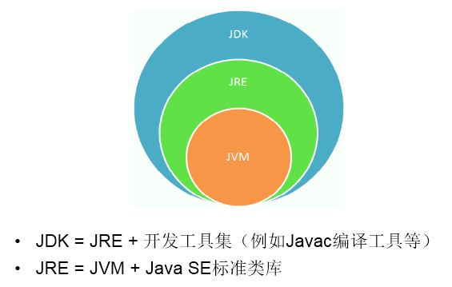
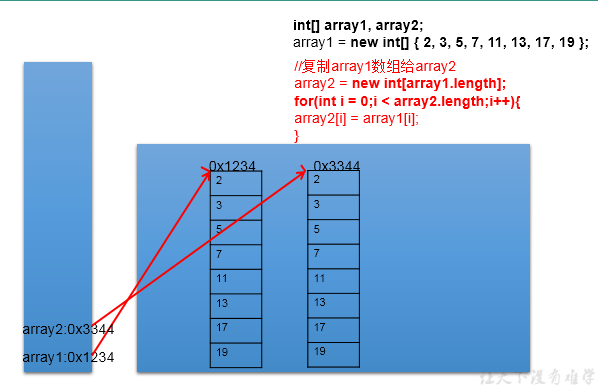
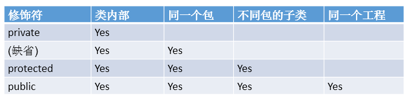
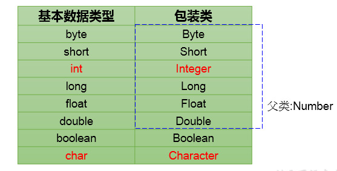
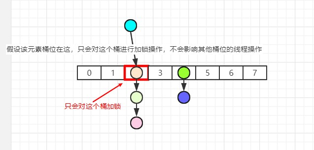
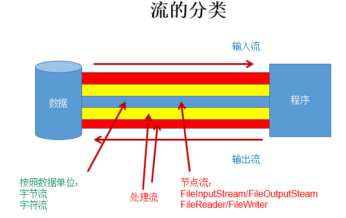

# 1.Java的概述

## 1 开发环境的搭建

JDK (java development kit= java开发工具包)

JDK是提供给Java开发人员使用的 其中包括了java的开发工具(javac编译工具),也包括了JRE

JRE ( java runtime environment=Java 运行环境 )

JRE 包括JVM 和Java程序所需要的核心类库

JVM(Java Virtual Machine=Java虚拟机)




## 2 注释和API文档

单行注释：//

多行注释：/*    */

文档注释：/**    */    参与编译,注释一个文档或者一个方法或者一个类

单行注释和多行注释，注释了的内容不参与编译。

编译以后生成的.class结尾的字节码文件中不包含注释掉的信息


# 2.  基本语法


## 1 . 变量的使用(重点)

### 1 按数据类型分类


基本数据类型: 

​	数值型: byte short int long float double

​	字符型: char

​	布尔型: boolean

引用数据类型:

​	类:class 字符串也是一个类

​	接口: interface

​	数组: []

详细说明：
//1. 整型：byte(1字节=8bit) \ short(2字节) \ int(4字节) \ long(8字节)
		//① byte范围：-128 ~ 127
	// ② 声明long型变量，必须以"l"或"L"结尾
		// ③ 通常，定义整型变量时，使用int型。
       //④整型的常量，默认类型是：int型
//2. 浮点型：float(4字节) \ double(8字节)
		//① 浮点型，表示带小数点的数值
		//② **float表示数值的范围比long还大**
	//③ 定义float类型变量时，变量要以"f"或"F"结尾
	//④ 通常，定义浮点型变量时，使用double型。
	//⑤ 浮点型的常量，默认类型为：double
//3. 字符型：char (1字符=2字节)
		//① 定义char型变量，通常使用一对'',内部只能写一个字符
	//② 表示方式：1.声明一个字符 2.转义字符 3.直接使用 Unicode 值来表示字符型常量
//4.布尔型：boolean
	//① 只能取两个值之一：true 、 false
	//② 常常在条件判断、循环结构中使用


###  2 按声明位置分类


###  3 基本数据类型变量间运算规则

自动类型转换(只涉及7种基本数据类型）

结论：当容量小的数据类型的变量与容量大的数据类型的变量做运算时，结果自动提升为容量大的数据类型。
byte 、char 、short --> int --> long --> float --> double 
特别的：当byte、char、short三种类型的变量做运算时，结果为int型

说明：此时的容量大小指的是，表示数的范围的大和小。比如：float容量要大于long的容量

对于**byte,short,char三种类型而言**，他们是平级的，因此不能相互自动转换，可以使用下述的强制类型转换。


## 2. 二进制


## 	3.运算符

​		1.算术运算符： + - + - * / % (前)++ (后)++ (前)-- (后)-- + 

​		2.赋值运算符：=  +=  -=  *=  /=  %=

​		3.比较运算符（关系运算符）: == != >  <  >=  <=  instanceof

​		4.逻辑运算符：& &&  |  || !  ^

​		5.位运算符：<<  >> >>> &  |  ^  ~

​		6.三元运算符：(条件表达式)? 表达式1 : 表达式2


## 	4.流程控制


2.1 for循环结构
for(①;②;④){
	③
}
执行过程：① - ② - ③ - ④ - ② - ③ - ④ - ... - ②


2.2 while循环结构
①
while(②){
	③;
	④;
}
执行过程：① - ② - ③ - ④ - ② - ③ - ④ - ... - ②


2.3 do-while循环结构
①
do{
	③;
	④;
}while(②);
执行过程：① - ③ - ④ - ② - ③ - ④ - ... - ②


2.4

“无限循环”结构: while(true) 或 for(;;)


# 3.  数组


## 1.数组的概述

### 	1 数组的特点:

​		有序排列

​		数组属于引用数据类型的变量:它的元素可以是**基本数据类型**也可以是**引用数据类型**

​		创建数组对象会在内存中开辟一整块连续的空间

​		数据的长度一但确定 将无法更改


### 	2 数据结构与算法:

1.数据与数据之间的逻辑关系：集合、一对一、一对多、多对多
2.数据的存储结构：
线性表：顺序表（比如：数组）、链表、栈、队列
树形结构：二叉树
图形结构：

排序算法：
搜索算法：


## 2.一维数组


## 3.二维数组


## 4.数组的常见算法

数组的赋值与复制

一个是共用引用地址,一个是把元素一个个赋值

赋值:两个变量共用 同一个地址,地址一样,所以指向同一个数组实体


复制:给array2在堆空间中新开辟了数组的空间。将array1数组中的元素值一个一个的赋值到array2数组中。




## 5.Arrays工具类的使用


## 6.数组的常见异常

1.数组角标越界异常：ArrayIndexOutOfBoundsException

2.空指针异常：NullPointerException


# 4.面向对象上

## 1.类与对象

### JVM内存结构

编译完源程序以后，生成一个或多个字节码文件。
我们使用JVM中的类的加载器和解释器对生成的字节码文件进行解释运行。意味着，需要将字节码文件对应的类加载到内存中，涉及到内存解析。


栈: 我们将局部变量存储在栈结构中
堆: 我们将new出来的结构（比如：数组、对象）加载在堆空间中。

补充：对象的属性（非static的）加载在堆空间中。
方法区：类的加载信息、常量池、静态域(static修饰的吗 静态变量也是类变量)

## 2 .类的结构之一：属性 vs局部变量

### 		2.1 在类中声明的位置的不同

​	属性：直接定义在类的一对{}内

​	局部变量：声明在方法内、方法形参、代码块内、构造器形参、构造器内部的变量


### 		2.2 权限修饰符的不同

​	属性：可以在声明属性时，指明其权限，使用权限修饰符。

​	常用的权限修饰符：

​		

​	**局部变量：不可以使用权限修饰符。**


### 		2.3 默认初始化值的情况：

​	属性：类的属性，根据其类型，都默认初始化值。

​	整型（byte、short、int、long：0）

​	浮点型（float、double：0.0）

​	字符型（char：0  （或'\u0000'））

​	布尔型（boolean：false）


​	引用数据类型（类、数组、接口：null）


​	局部变量：没默认初始化值。

​	意味着，我们在调用局部变量之前，一定要显式赋值。

​	特别地：形参在调用时，我们赋值即可。


### 		2.4 在内存中加载的位置：

​	属性：加载到堆空间中   （非static 实例变量），static 加载到方法区

​	局部变量：加载到栈空间


## 3 .类的结构之二：方法

### 1.方法的重载(同一个类当中)

​		同一个类、同名方法、参数列表不同：参数个数不同，参数类型不同

​		跟方法的权限修饰符、返回值类型、形参变量名、方法体都没关系！


### 2.可变个数形参的方法

​	可变个数形参的格式：数据类型 ... 变量名

​	可变个数形参在方法的形参中，必须声明在末尾

​	可变个数形参在方法的形参中,最多只能声明一个可变形参

### 3.java的值传递机制(重点面试聊聊)

1.针对于方法内变量的赋值举例：

​	如果**变量**是基本数据类型，此时赋值的是变量所保存的数据值。
​	如果**变量**是引用数据类型，此时赋值的是变量所保存的数据的地址值。


2.针对于方法的参数概念

​	形参：方法定义时，声明的小括号内的参数
​	实参：方法调用时，实际传递给形参的数据


3.java中参数传递机制：值传递

​	如果**参数**是基本数据类型，此时实参赋给形参的是实参真实存储的数据值。

​	如果**参数**是引用数据类型，此时实参赋给形参的是实参存储数据的地址值。


## 4.类的结构之三：构造器(重点面试聊聊)

​	1.如果没显式的定义类的构造器的话，则系统默认提供一个**空参的构造器**

​	2.定义构造器的格式：**权限修饰符**  类名(形参列表){},懒汉模式就是私有化构造器

​	3.一个类中定义的**多个构造器，彼此构成重载**

​	4.一旦我们显式的定义了类的构造器之后，**系统就不再提供默认的空参构造器**,要自己创造一个

​	5.一个类中，至少会有一个构造器。


## 5.关键字：this

​	this理解为：当前对象  或 当前正在创建的对象

​	在类的方法中和构造器中，我们可以使用"this.属性"或"this.方法"的方式，调用当前对象属性或方法

### 	this调用构造器：

​		1 可以显示使用this(形参列表)调用本类中指定的其他构造器

​		2 this() 调用的是空参构造器,有参构造器会默认在第一行调用空参构造器吗


## 6.关键字：package/import


# 5.面向对象中

## 1.面向对象的特征一：封装性

​	封装性思想:

​	把该隐藏的隐藏起来，该暴露的暴露出来。这就是封装性的设计思想。

​		体现一：将类的属性xxx私化(private),同时，提供公共的(public)方法来获取(getXxx)和设置(setXxx)此属性值

​		体现二：不对外暴露的私有的方法

​		体现三：单例模式（将构造器私有化）

​		体现四：如果不希望类在包外被调用，可以将类设置为缺省的。

​	**4种权限都可以用来修饰类的内部结构：属性、方法、构造器、内部类**

​	**修饰类的话，只能使用：缺省、public**


## 2.面向对象的特征二：继承性

① 减少了代码的冗余，提高了代码的复用性

② 便于功能的扩展

③ 为之后多态性的使用，提供了前提


体现：一旦子类A继承父类B以后，子类A中就获取了父类B中声明的所有的属性和方法。

特别的，父类中声明为private的属性或方法，子类继承父类以后，仍然认为获取了父类中私的结构。

只因为封装性的影响，使得子类不能直接调用父类的结构而已


## 3.面向对象的特征三：多态性

### 1 何为多态性

​	一个事物得多种形态

​	用一个父类来引用(接收 或者指向) 不同的子类,例如用object来接收

​	通过父类接受子类,运行时通过父类调用子类重写父类的方法


### 2 多态性的使用:虚拟方法调用

​	编译器调用父类中声明的方法,但在运行期,我们实际执行的是子类重写父类的方法

​	总结：编译，看左边；运行，看右边。

​	**对象的多态性，只适用于方法，不适用于属性（编译和运行都看左边）**


### 3 多态性的使用前提

① 类的继承关系  ② 方法的重写

### 4 多态性的应用举例：

举例一：
	public void func(Animal animal){

​		Animal animal = new Dog();
​		animal.eat();
​		animal.shout();
​	}
举例二：
public void method(Object obj){}


### 5 关于向上转型与向下转型

**向上转型**: Animal dog = new Dog(); 

​		直接体现多态,内存中实际上是加载了子类特有的属性和方法,

​		但是由于变量声明为父类类型,导致编译时,只能调用父类特有的属性和方法

​		子类特有的属性和方法不能调用(只能调用子类重的方法)。所有需要向下转型来解决

**向下转型:** 

​		当然 dog也instanceof Animal

​		if(dog instanceof Dog){

​			Dog d=(Dog)dog;

​		}


### 6 谈谈你对多态性的理解？

​	多态实现代码的通用性

​	抽象类 接口的使用体现了多态性

​	object中的equals方法可以给他的子类所使用,当然可以重写

​	

​	

### 7 多态是编译时行为还是运行时行为？

编译时看左边,父类,运行时看右边,实际调用的时子类重写父类的方法


## 4.方法的重写(同名,同参)

返回类型好像可以不一样???

重写:

子类继承父类以后，可以对父类中同名同参数的方法，进行**覆盖操作.**

重写以后，当创建子类对象以后，通过子类对象调用子父类中的同名同参数的方法时，**实际执行的是子类重写父类的方法。**


重写规则:

① 子类重写的方法的**方法名和形参列表**与父类被重写的方法的方法名和形参列表**相同**

② 子类重写的方法的**权限修饰符不小于父类**被重写的方法的权限修饰符,一般写一样得了

​		特殊情况：子类**不能重写**父类中声明**为private权限**的方法

③ 返回值类型：

​		**父类被重写的方法的返回值类型是void**，则子类重写的方法的返回值类型**只能是void**

​		**父类**被重写的方法的**返回值类型**是**A类型**，则子类重写的方法的返回值类型可以是**A类或A类的子类**(引用数据类型)

​		父类被重写的方法的返回值类型是基本数据类型(比如：double)，则子类重写的方法的返回值类型必须是相同的基本数据类型(必须也				是double)

④ 子类重写的方法抛出的异常类型不大于父类被重写的方法抛出的异常类型（具体放到异常处理时候讲）

子类和父类中的同名同参数的方法要么都声明为非static的（考虑重写，要么都声明为static的（不是重写)。


### 区分方法的重写和重载？

​	重载:同类同名不同参,提高代码得复用性

​	重写:同名同参不同类,体现多态


## 5.关键字：super

super 关键字可以理解为：父类的

可以用来调用的结构: 属性、方法、构造器


### 调用属性、方法:

​	1 我们可以在子类的方法或构造器中。通过使用"super.属性"或"super.方法"的方式，显式的调用父类中声明的属性或方法。但是，通常情况下，我们习惯省略"super."

​	2 特殊情况：当子类和父类中定义了同名的属性时，我们要想在子类中调用父类中声明的属性，则必须显式的使用"super.属性"的方式，表明调用的是父类中声明的属性。

​	3 特殊情况：当子类重写了父类中的方法以后，我们想在子类的方法中调用父类中被重写的方法时，则必须显式的使用"super.方法"的方式，表明调用的是父类中被重写的方法。

### 调用构造器:

​	1  我们可以在子类的构造器中显式的使用"super(形参列表)"的方式，调用**父类中声明的指定的构造器**

​	2 我们在类的构造器中**，针对于"this(形参列表)"或"super(形参列表)"只能二一，不能同时出现**

​	3 在构造器的首行，没显式的声明"this(形参列表)"或"super(形参列表),**则默认调用的是父类中空参的构造器：super()**


## 6.子类对象实例化全过程

### 1.从结果上看：继承性

子类继承父类以后，就获取了父类中声明的属性或方法。

创建子类得对象,在堆空间中,就会加载父类所声明得属性,方法应该在方法区吧


### 2.从过程上看：

当我们通过子类的构造器创建子类对象时，我们一定会直接或间接的调用其父类的构造器，进而调用父类的父类的构造器，...直到调用了java.lang.Object类中空参的构造器为止。正因为加载过所的父类的结构，所以才可以看到内存中父类中的结构，子类对象才可以考虑进行调用。


## 7.Object类的使用

如果在类的声明中未使用extends关键字指明其父类，则默认父类为java.lang.Object类 

Object类中的功能(方法)就具通用性。

toString() / 

getClass() /

hashCode() / 

clone() / 

finalize()

wait() 、

 notify()、

notifyAll()

#### final、finally、finalize的区别？

​	final是常量 finally是exception

####  == 和 equals() 区别

##### == 

对于基本类型和引用类型 == 的作用效果是不同的，如下所示：

- 基本类型：比较的是值是否相同；
- 引用类型：比较的是引用是否相同；

##### equals

equals是 String和Integer 重写了 Object 的 equals 方法，把引用比较改成了值比较。

equals 本质上就是 ==


## 8.**包装类的使用**(重点面试聊聊)




```java
基本数据类型<--->包装类：JDK 5.0 新特性：自动装箱 与自动拆箱
Integer integer = new Integer(11);
int v = integer.intValue();

基本数据类型、包装类--->String:调用String重载的valueOf(Xxx xxx)   包装类的toString也可以
String s = String.valueOf(11);
String s2 = Integer.toString(11);

String--->基本数据类型、包装类:调用包装类的parseXxx(String s)  
int i = Integer.parseInt("11");
Integer integer = new Integer(i);
```


总结:要转成什么就用什么类,基本数据类型特殊,一样是用包装类


# 6.面向对象下

## 1.关键字：static


****


## 2.类的结构：代码块

1.代码块的作用：用来初始化类、对象的信

2.分类：**代码块要是使用修饰符，只能使用static**


## 3.关键字：final

可以用来修饰：类、方法、变量

用来修饰一个类:此类**不能被其他类所继承。**

用来修饰方法：表明此方法**不可以被重写**

用来修饰变量：此时的"变量"就称为是一个**常量**

**static final 用来修饰属性：全局常量**


## 4.关键字：abstract

可以用来修饰：类、方法


abstract修饰类：抽象类

​	此类不能实例化

​	抽象类中一定有构造器，便于子类实例化时调用


abstract修饰方法：抽象方法

​	只声明方法,没有方法体

​	具有抽象方法的一定是抽象类,抽象类可以没有抽象方法

​	若子类没有重写父类所有的抽象方法,此类也是一个抽象类 需要使用abstract来修饰


注意点: 

​	abstract **不能修 饰属性  构造器**

​	不能修饰  **私有方法  final方法  final类**


## 5.关键字：interface

1 Java中，接口和类是并列的两个结构

2  接口中**不能定义构造器的**！**意味着接口不可以实例化**

3Java类可以实现多个接口   --->**弥补了Java单继承性的局限性**  格式：class AA extends BB implements CC,DD,EE

4 接口与接口之间可以继承，而且可以多继承 **弥补了Java单继承性的局限性**

5 接口的具体使用，体现多态性

6 接口，实际上可以看做是一种规范


### Java8中关于接口的新规范

这些感觉都不用记忆，要用的时候直接用代码尝试一下

知识点1：接口中定义的**静态方法，只能通过接口来调用。**

知识点2：通过实现类的对象，**可以调用接口中的默认方法。**
如果实现类重写了接口中的默认方法，调用时，仍然调用的是重写以后的方法

知识点3：如果子类(或实现类)继承的父类和实现的接口中声明了同名同参数的默认方法，那么子类在没重写此方法的情况下，默认调用的是父类中的同名同参数的方法。-->**类优先原则**

知识点4：如果实现类实现了多个接口，而这多个接口中定义了同名同参数的默认方法，
那么在实现类没重写此方法的情况下，报错。-->接口冲突。**这就需要我们必须在实现类中重写此方法**

知识点5：如何在子类(或实现类)的方法中调用父类、接口中被重写的方法

```java
public void myMethod(){
		method3();//调用自己定义的重写的方法
		super.method3();//调用的是父类中声明的
		//调用接口中的默认方法
		CompareA.super.method3();
		CompareB.super.method3();
	}
```

​	

###  抽象类和接口的异同？

相同点:

​	不能实例化,都可以包含抽象方法

不同点:

​	**抽象类:单继承,接口可以多继承**

​	抽象类: 有变量,常量,抽象方法,非抽象方法

​	接口: JDK8后 除了定义全局常量和抽象方法之外，还可以定义静态方法(只能通过接口调用)、默认方法

​	

## 6.类的结构：内部类

### 1.内部类的分类：

成员内部类（静态、非静态 ） vs 局部内部类(方法内、代码块内、构造器内)

### 2.成员内部类的理解：

​	一方面，作为外部类的成员：

​				调用外部类的结构

​				可以被static修饰

​				可以被4种不同的权限修饰

​	另一方面，作为一个类：

​				类内可以定义属性、方法、构造器等

​				可以被abstract修饰


### 3.成员内部类：

​	3.1如何创建成员内部类的对象？(静态的，非静态的)
​		

```java
创建静态的Dog内部类的实例(静态的成员内部类):
	Person.Dog dog = new Person.Dog();

创建非静态的Bird内部类的实例(非静态的成员内部类):	
	Person.Bird bird = new Person.Bird();//错误的
	Person p = new Person();
	Person.Bird bird = p.new Bird();
```

​	

3.2如何在成员内部类中调用外部类的结构？

```java
class Person{
    String name = "小明";
    public void eat(){
    }
    //非静态成员内部类
    class Bird{
        String name = "杜鹃";
        public void display(String name){
            System.out.println(name);//方法的形参
            System.out.println(this.name);//内部类的属性
            System.out.println(Person.this.name);//外部类的属性
            //Person.this.eat();
        }
    }
}
```


### 4.局部内部类的使用：	

```java
//返回一个实现了Comparable接口的类的对象
public Comparable getComparable(){
    //创建一个实现了Comparable接口的类:局部内部类
    //方式一：
    class MyComparable implements Comparable{

        @Override
        public int compareTo(Object o) {
            return 0;
        }		
    }

    return new MyComparable();
    //方式二：
    return new Comparable(){
        @Override
        public int compareTo(Object o) {
            return 0;
        }	
    };
}
```


### 5 注意点：

在局部内部类的方法中（比如：show如果调用局部内部类所声明的方法(比如：method)中的局部变量(比如：num)的话,要求此局部变量声明为final的。

jdk 7及之前版本：要求此局部变量显式的声明为final的
jdk 8及之后的版本：可以省略final的声明


总结：
	成员内部类和局部内部类，在编译以后，都会生成字节码文件。

格式：

​	成员内部类：外部类$内部类名.class
​	局部内部类：外部类$数字 内部类名.class


# 7.异常的处理

## 1.异常

### 1.异常的体系结构

 java.lang.Throwable
  		|-----java.lang.Error:一般不编写针对性的代码进行处理。
 		 |-----java.lang.Exception:可以进行异常的处理
 			 |------编译时异常(checked)
 					 |-----IOException
 						 |-----FileNotFoundException
  					|-----ClassNotFoundException
  			|------运行时异常(unchecked,RuntimeException)
  					|-----NullPointerException
  					|-----ArrayIndexOutOfBoundsException
 					 |-----ClassCastException
 					 |-----NumberFormatException
  					|-----InputMismatchException
 					 |-----ArithmeticException

```java
算术异常类：ArithmeticExecption

空指针异常类：NullPointerException

类型强制转换异常：ClassCastException

数组负下标异常：NegativeArrayException

数组下标越界异常：ArrayIndexOutOfBoundsException

违背安全原则异常：SecturityException

文件已结束异常：EOFException

文件未找到异常：FileNotFoundException

字符串转换为数字异常：NumberFormatException


```


### 2.从程序执行过程，看编译时异常和运行时异常

​	编译时异常：执行javac.exe命名时，可能出现的异常
​	运行时异常：执行java.exe命名时，出现的异常


## 2.异常的处理

### 1.异常处理方式一：try-catch-finally


### 2.异常处理方式二：throws +异常类型


### 3. 对比两种处理方式

throws的方式只是将异常抛给了方法的调用者。并没真正将异常处理掉。


### 4. 体会开发中应该如何选择两种处理方式？

子类重写的方法抛出的异常类型不大于父类被重写的方法抛出的异常类型


## 3.手动抛出异常对象

### 1 throw 和  throws区别：


## 4.自定义异常类

```java
/*
 * 如何自定义异常类？
 * 1. 继承于现的异常结构：RuntimeException 、Exception
 * 2. 提供全局常量：serialVersionUID
 * 3. 提供重载的构造器
 * 
 */
public class MyException extends Exception{
	
	static final long serialVersionUID = -7034897193246939L;
	
	public MyException(){
		
	}
	
	public MyException(String msg){
		super(msg);
	}
}
```


# 8.多线程

## 总结

高并发：多个线程同时操作一个共享资源，这个时候，要确确保共享资源的唯一性，同步性，一般同步资源作为线程类的内部变量，，run方法中可以通过同步代码块的方法，或者 sychronized的同步代码块，或者同步方法，确保只有一个线程在操作这个共享变量，例如买票，sychronized同步代码块就有两种线程的区别，要加一个同步锁，锁是一个对象，例如继承runnable接口，那么所有的对象都是唯一的，所有默认使用this锁就够了，但是如果使用Thread类，使用这个对象作为锁是不准确的，因为每次都要new一个对象，

如果使用代码块，就没有这个困扰了吗，那么同步代码块如何传入参数呢

传入的参数有问题吗，这个可以测试一下


另一种情况：

高并行：多个线程同时执行，不同的程序，（既然是不同的程序，那同时操作一个数据源，是不是多线程）

## 1. 程序、进程、线程的理解

进程作为资源分配的单位，系统在运行时会为每个进程分配不同的**内存区域**

线程作为调度和执行的单位,每个进程拥有独立的运行栈和程序计数器(pc),线程切换的开销小


总结: 

​	进程作为资源的分配单位,线程作为调度和执行的单位

​	进程是正在运行的程序,线程是程序内部的一条执行路径

​	**每个线程拥有自己的独立的  栈 程序计数器**

​	**多个线程共享同一个进程的方法区,堆**


## 2. 并行与并发

一个Java应用程序java.exe，其实至少三个线程：**main()主线程，gc()垃圾回收线程，异常处理线程**。

当然如果发生异常，会影响主线程。

并行：多个CPU同时执行多个任务

并发：一个CPU(采用时间片)同时执行多个任务


## 3. 创建多线程的两种方式

### 方式一：继承Thread类的方式：

* 1. 创建一个继承于Thread类的子类
* 2. 重写Thread类的run() --> 将此线程执行的操作声明在run()中
* 3. 创建Thread类的子类的对象
* 4. **通过此对象调用start()**：①启动当前线程 ② 调用当前线程的run()

### 方式二：实现Runnable接口的方式：

* 1. 创建一个实现了Runnable接口的类
* 2. 实现类去实现Runnable中的抽象方法：run()
* 3. 创建实现类的对象
* 4. **将此对象作为参数传递到Thread类的构造器中，创建Thread类的对象**
* 5. **通过Thread类的对象调用start()**

### 两种方式的对比：

开发中：优先选择：实现Runnable接口的方式

原因：

​		实现的方式没类的单继承性的局限性

​		实现的方式更适合来处理多个线程共享数据的情况。
联系：public class Thread implements Runnable

相同点：两种方式都需要重写run(),将线程要执行的逻辑声明在run()中。
    目前两种方式，要想启动线程，都是调用的Thread类中的start()。


## 4. Thread类中的常用方法

* 1. start():启动当前线程；调用当前线程的run()

* 2. run(): 通常需要重写Thread类中的此方法，将创建的线程要执行的操作声明在此方法中

* 3. currentThread():**静态方法**，返回执行当前代码的线程

* 4. getName():获取当前线程的名字

* 5. setName():设置当前线程的名字

* 6. yield():释放当前cpu的执行权

* 7. join():在线程a中调用线程b的join(),此时线程a就进入阻塞状态，直到线程b完全执行完以后，线程a才结束阻塞状态。

* 8. stop():已过时。当执行此方法时，强制结束当前线程。

* 9. sleep(long millitime):让当前线程“睡眠”指定的millitime毫秒。在指定的millitime毫秒时间内，当前线程是阻塞状态。

* 10. isAlive():判断当前线程是否存活

  

  线程的优先级：

  ​	MAX_PRIORITY：10

  ​	MIN _PRIORITY：1

  ​	NORM_PRIORITY：5  -->默认优先级

  

  如何获取和设置当前线程的优先级：

  ​	getPriority():获取线程的优先级

  ​	setPriority(int p):设置线程的优先级

  

  说明：高优先级的线程要抢占低优先级线程cpu的执行权。但是只是从概率上讲，高优先级的线程高概率的情况下被执行。

  并不意味着只当高优先级的线程执行完以后，低优先级的线程才执行。

  


线程通信：wait() / notify() / notifyAll() :此三个方法定义在Object类中的。

补充：线程的分类
	一种是守护线程，一种是用户线程。


## 5. Thread的生命周期


yied也不会释放锁


## 6. 线程的同步机制

### 方式一：同步代码块

```java
synchronized (对象){

​	//需要被同步的代码；

}
```

1.操作共享数据的代码，即为需要被同步的代码.

2.共享数据：多个线程共同操作的变量.

3.同步监视器，俗称：锁。任何一个类的对象，都可以充当锁, 要求：多个线程必须要共用同一把锁.

#### 补充：

​			在实现**Runnable**接口创建多线程的方式中，我们可以考虑使**用this充当同步监视器**。 this 当前类的实例对象
​       	 在继承**Thread**类创建多线程的方式中，慎用this充当同步监视器，**考虑使用当前类充当同步监视器**   当前类就是就是类

同步代码块的锁是什么?

​	任意对象都可以作为同步锁。所有对象都自动含有单一的锁（监视器）

​	同步代码块的锁：自己指定，很多时候也是指定为this或类名.class			


### 方式二：同步方法


```java
public synchronized void show (String name){

….

}
```


#### 同步方法的总结：

​		**同步方法仍然涉及到同步监视器，只是不需要我们显式的声明**

​		**非静态的同步方法，同步监视器是：this**(类)

​		**静态的同步方法，同步监视器是：当前类本身**,(当前类)


### 方式三：Lock锁  --- JDK5.0新增

```java
class A{
	private final ReentrantLock lock = new ReenTrantLock();
	public void m(){
		lock.lock();
		try{
		//保证线程安全的代码 同步代码; 
        }
		finally{
			lock.unlock();
		}
    }
}
注意：如果同步代码有异常，要将unlock()写入finally语句块
```


#### 1 synchronized和Lock的区别(面试)

相同：二者都可以解决线程安全问题

不同：

​		synchronized机制在执行完相应的同步代码以后，自动的释放同步监视器

​		Lock是显示锁,手动开启手动关闭

​		Lock只有代码块锁,synchronized还有方法锁


#### 2 线程安全的单例模式(懒汉式)

```java
私有化的构造器
私有化的 静态成员变量,初始化为null
私有化的 静态的方法去获取 静态的成员变量
    里面要进行判断 当前的静态的成员变量是否为空
    synchronized(当前类)
class Bank{
	private Bank(){}
    private static Bank instance=null;
    public static Bank getInstance(){
        if(instance==null){
            synchronized(Bank.class){
                if(instance==null){
                    instance = new Bank();
                }
            }
        }
        return instance;
    }
}
```


## 7. 线程通信

### 1.线程通信涉及到的三个方法：

* wait():一旦执行此方法，当前线程就进入阻塞状态，**并释放同步监视器。**

* notify():一旦执行此方法，就会唤醒被wait的一个线程。如果有多个线程被wait，就唤醒优先级高的那个。

* notifyAll():一旦执行此方法，就会唤醒所有被wait的线程。

  

### 2.说明：

* 1.wait()，notify()，notifyAll()三个方法**必须使用在同步代码块或同步方法中**。
* 2.wait()，notify()，notifyAll()三个方法的**调用者**必须是同步代码块或同步方法中的**同步监视器。**
* 3.wait()，notify()，notifyAll()三个方法是定义在**java.lang.Object类中。**


### 3.面试题：sleep() 和 wait()的异同？

sleep不会释放锁,wait()回暖释放锁当两者都是用在同步方法或者同步代码块当中

相同点:

​	都会阻塞

不同点:

​	声明位置不同,**Thread类中声明sleep() , Object类中声明wait()**

​	调用的要求不同,**sleep()可以在任何需要的场景下调用。 wait()必须使用在同步代码块或同步方法中**

​	关于是否释放同步监视器,如果都用在同步代码块或者同步方法,sleep不会释放锁,wait()会释放锁


### 4.会不会释放锁的操作：


## 8. JDK5.0新增线程创建的方式

###  	1.新增方式一：实现Callable接口。 --- JDK 5.0新增

说明：
* 如何理解实现Callable接口的方式创建多线程比实现Runnable接口创建多线程方式强大？
* 1. call()可以返回值的。
* 2. call()可以抛出异常，被外面的操作捕获，获取异常的信息
* 3. Callable是支持泛型的

```java
//1.创建一个实现Callable的实现类
class NumThread implements Callable{
    //2.实现call方法，将此线程需要执行的操作声明在call()中
    @Override
    public Object call() throws Exception {
        int sum = 0;
        for (int i = 1; i <= 100; i++) {
            if(i % 2 == 0){
                System.out.println(i);
                sum += i;
            }
        }
        return sum;
    }
}


public class ThreadNew {
    public static void main(String[] args) {
        //3.创建Callable接口实现类的对象
        NumThread numThread = new NumThread();
        //4.将此Callable接口实现类的对象作为传递到FutureTask构造器中，创建FutureTask的对象
        FutureTask futureTask = new FutureTask(numThread);
        //5.将FutureTask的对象作为参数传递到Thread类的构造器中，创建Thread对象，并调用start()
        new Thread(futureTask).start();

        try {
            //6.获取Callable中call方法的返回值
            //get()返回值即为FutureTask构造器参数Callable实现类重写的call()的返回值。
            Object sum = futureTask.get();
            System.out.println("总和为：" + sum);
        } catch (InterruptedException e) {
            e.printStackTrace();
        } catch (ExecutionException e) {
            e.printStackTrace();
        }
    }

}
```


### 	 2.新增方式二：使用线程池

说明：
* 好处：
* 1.提高响应速度（减少了创建新线程的时间）
* 2.降低资源消耗（重复利用线程池中线程，不需要每次都创建）
* 3.便于线程管理
*      corePoolSize：核心池的大小
*      maximumPoolSize：最大线程数
*      keepAliveTime：线程没任务时最多保持多长时间后会终止

```java
class NumberThread implements Runnable{

    @Override
    public void run() {
        for(int i = 0;i <= 100;i++){
            if(i % 2 == 0){
                System.out.println(Thread.currentThread().getName() + ": " + i);
            }
        }
    }
}

class NumberThread1 implements Runnable{

    @Override
    public void run() {
        for(int i = 0;i <= 100;i++){
            if(i % 2 != 0){
                System.out.println(Thread.currentThread().getName() + ": " + i);
            }
        }
    }
}

public class ThreadPool {

    public static void main(String[] args) {
        //1. 提供指定线程数量的线程池
        ExecutorService service = Executors.newFixedThreadPool(10);
        ThreadPoolExecutor service1 = (ThreadPoolExecutor) service;
        //设置线程池的属性
//        System.out.println(service.getClass());
//        service1.setCorePoolSize(15);
//        service1.setKeepAliveTime();


        //2.执行指定的线程的操作。需要提供实现Runnable接口或Callable接口实现类的对象
        service.execute(new NumberThread());//适合适用于Runnable
        service.execute(new NumberThread1());//适合适用于Runnable

//        service.submit(Callable callable);//适合使用于Callable
        //3.关闭连接池
        service.shutdown();
    }

}
```


# 9.Java常用类

## String

```java
public String(char value[], int offset, int count) 
这是一个构造方法,传入的起始的index,和要截取的长度,而不是最后的offset
public String substring(int beginIndex, int endIndex) 
public String substring(int beginIndex)
这个是截取字符串,两端的都是index
    
    
public boolean equals(Object anObject) {
       //先比较地址
        if (this == anObject) {
            return true;
        }
    //如果是同一个类型,进行类型的转换
        if (anObject instanceof String) {
            //进行类型的转换
            String anotherString = (String)anObject;
            int n = value.length;
            //先比较长度,如果长度相等,有可能相等
            if (n == anotherString.value.length) {
               	//长度相等的前提下比较每一个字符是否相等
                char v1[] = value;
                char v2[] = anotherString.value;
                int i = 0;
                while (n-- != 0) {
                    if (v1[i] != v2[i])
                        return false;
                    i++;
                }
                return true;
            }
        }
    	//如果不是同一个类型,肯定不相等
        return false;
    } 

//String 实现了Comparable接口,要重写compareTo方法
public int compareTo(String anotherString) {
        int len1 = value.length;
        int len2 = anotherString.value.length;
        int lim = Math.min(len1, len2);
        char v1[] = value;
        char v2[] = anotherString.value;
		//比较里面每一个字符的大小
        int k = 0;
        while (k < lim) {
            char c1 = v1[k];
            char c2 = v2[k];
            if (c1 != c2) {
                return c1 - c2;
            }
            k++;
        }
        return len1 - len2;
    }
```

## StringBuilder

```java
public final class StringBuilder
    extends AbstractStringBuilder
    implements java.io.Serializable, CharSequence
{}
```


## StringBuffer

```java
public final class StringBuffer
    extends AbstractStringBuilder
    implements java.io.Serializable, CharSequence
{}    

public synchronized StringBuffer append(Object obj) {
        toStringCache = null;
        super.append(String.valueOf(obj));
        return this;
    }
使用的是同步方法

```


## 1.String类


### 1.概述

String声明为final的，不可被继承,不可变

String实现了Serializable接口：表示字符串是支持序列化的

实现了Comparable接口：表示String可以比较大小

**String内部定义了final char[] valuwe用于存储字符串数据**

通过字面量的方式,**此时的字符串值声明在字符串常量池中**


### 2.String实例化的不同方式


a


### 3.常用方法

```java
int length()：返回字符串的长度： return value.length
char charAt(int index)： 返回某索引处的字符return value[index]
boolean isEmpty()：判断是否是空字符串：return value.length == 0
String toLowerCase()：使用默认语言环境，将 String 中的所字符转换为小写
String toUpperCase()：使用默认语言环境，将 String 中的所字符转换为大写
String trim()：返回字符串的副本，忽略前导空白和尾部空白
boolean equals(Object obj)：比较字符串的内容是否相同
boolean equalsIgnoreCase(String anotherString)：与equals方法类似，忽略大小写
String concat(String str)：将指定字符串连接到此字符串的结尾。 等价于用“+”
int compareTo(String anotherString)：比较两个字符串的大小
String substring(int beginIndex)：返回一个新的字符串，它是此字符串的从beginIndex开始截取到最后的一个子字符串。
String substring(int beginIndex, int endIndex) ：返回一个新字符串，它是此字符串从beginIndex开始截取到endIndex(不包含)的一个子字符串。

boolean endsWith(String suffix)：测试此字符串是否以指定的后缀结束
boolean startsWith(String prefix)：测试此字符串是否以指定的前缀开始
boolean startsWith(String prefix, int toffset)：测试此字符串从指定索引开始的子字符串是否以指定前缀开始

boolean contains(CharSequence s)：当且仅当此字符串包含指定的 char 值序列时，返回 true
int i (String str)：返回指定子字符串在此字符串中第一次出现处的索引
int indexOf(String str, int fromIndex)：返回指定子字符串在此字符串中第一次出现处的索引，从指定的索引开始
int lastIndexOf(String str)：返回指定子字符串在此字符串中最右边出现处的索引
int lastIndexOf(String str, int fromIndex)：返回指定子字符串在此字符串中最后一次出现处的索引，从指定的索引开始反向搜索

注：indexOf和lastIndexOf方法如果未找到都是返回-1

替换：
String replace(char oldChar, char newChar)：返回一个新的字符串，它是通过用 newChar 替换此字符串中出现的所 oldChar 得到的。
String replace(CharSequence target, CharSequence replacement)：使用指定的字面值替换序列替换此字符串所匹配字面值目标序列的子字符串。
String replaceAll(String regex, String replacement)：使用给定的 replacement 替换此字符串所匹配给定的正则表达式的子字符串。
String replaceFirst(String regex, String replacement)：使用给定的 replacement 替换此字符串匹配给定的正则表达式的第一个子字符串。
匹配:
boolean matches(String regex)：告知此字符串是否匹配给定的正则表达式。
切片：
String[] split(String regex)：根据给定正则表达式的匹配拆分此字符串。
String[] split(String regex, int limit)：根据匹配给定的正则表达式来拆分此字符串，最多不超过limit个，如果超过了，剩下的全部都放到最后一个元素中。
```


### 4.String与其它结构的转换

#### 1 String与基本数据类型、包装类之间的转换

	String --> 基本数据类型、包装类：调用包装类的静态方法：parseXxx(str)
	基本数据类型、包装类 --> String:调用String重载的valueOf(xxx)


#### 2 String与字符数组之间的转换

	String --> char[]:调用String的toCharArray()
	char[] --> String:调用String的构造器


#### 3 String与字节数组之间的转换

	编码：String --> byte[]:调用String的getBytes()
	解码：byte[] --> String:调用String的构造器


#### 4 String与StringBuffer、StringBuilder之间的转换

	String -->StringBuffer、StringBuilder:调用StringBuffer、StringBuilder构造器
	StringBuffer、StringBuilder -->String:①调用String构造器；②StringBuffer、StringBuilder的toString()


## 2.StringBuilder(重点面试聊聊)

### 1.String、StringBuffer、StringBuilder三者的对比 biibiubiu 才快

底层都是字符串数组

String:不可变的字符序列；底层使用char[]存储
StringBuffer:可变的字符序列；**线程安全的，效率低**；底层使用char[]存储
StringBuilder:可变的字符序列；jdk5.0新增的，**线程不安全的，效率高**；底层使用char[]存储


### 2.StringBuffer与StringBuilder的内存解析(重点)

```java
String str1 = new String("abc");//char[] value = new char[]{'a','b','c'};底层创建的是不可变数组

StringBuffer sb1 = new StringBuffer();//char[] value = new char[16];底层创建了一个长度是16的数组。

StringBuffer sb2 = new StringBuffer("abc");//char[] value = new char["abc".length() + 16];

扩容问题:
		如果要添加的数据底层数组盛不下了，那就需要扩容底层的数组。
        默认情况下，扩容为原来容量的2倍 + 2，同时将原数组中的元素复制到新的数组中。

        指导意义：开发中建议大家使用：StringBuffer(int capacity) 或 StringBuilder(int capacity)

```


### 3.StringBuffer、StringBuilder中的常用方法

```java
增：append(xxx)
删：delete(int start,int end)
改：setCharAt(int n ,char ch) / replace(int start, int end, String str)
查：charAt(int n )
插：insert(int offset, xxx)
长度：length();
遍历：for() + charAt() / toString()
    StringBuffer reverse() ：把当前字符序列逆转

```

注意：作为参数传递的话，方法内部String不会改变其值，StringBuffer和StringBuilder

会改变其值。

这句话是什么意思是啊


## 3.JDK 8之前日期时间API


### 	1 获取系统当前时间戳：System类中的currentTimeMillis()

```
long timeStamp = System.currentTimeMills();
//返回的是 与1970年1月1日0时0分0秒之间的毫秒差
```


### 	2 java.util.Date类与java.sql.Date类

```java

    java.util.Date类
           |---java.sql.Date类

    1.java.util.Date两个构造器的使用
        >构造器一：Date()：创建一个对应当前时间的Date对象,默认获取当前时间
        >构造器二：创建指定毫秒数的Date对象,传入时间戳也可以
        
    2.java.util.Date两个方法的使用
        >toString():显示当前的年、月、日、时、分、秒
        >getTime():获取当前Date对象对应的毫秒数。（时间戳）返回自 1970 年 1 月 1 日 00:00:00 GMT 时间戳

    3. java.sql.Date对应着数据库中的日期类型的变量
        >如何实例化
        >如何将java.util.Date对象转换为java.sql.Date对象
        先getTime拿到时间戳
        	//情况一：
        		Date date4 = new java.sql.Date(2343243242323L);
        		java.sql.Date date5 = (java.sql.Date) date4;
        	//情况二：
        		Date date6 = new Date();
        		java.sql.Date date7 = new java.sql.Date(date6.getTime());
     
```


### 	3 java.text.SimpleDataFormat类


​		格式化(format):Date->String

```java
Date date = new Date();
SimpleDateFormat sdf = new SimpleDateFormat("yyyy-MM-dd hh:mm:ss");

格式化
String format = sdf.format(date);


解析
try {
            System.out.println(sdf.parse(format));
        } catch (ParseException e) {
            e.printStackTrace();
        }
```


### 	4 Calendar类：日历类、抽象类


```java
		//1.实例化
        //方式一：创建其子类（GregorianCalendar的对象
        //方式二：调用其静态方法getInstance()
        Calendar calendar = Calendar.getInstance();
		// System.out.println(calendar.getClass());

        //2.常用方法
        //get()
        int days = calendar.get(Calendar.DAY_OF_MONTH);
        System.out.println(calendar.get(Calendar.DAY_OF_YEAR));

        //set()
        //calendar可变性
         calendar.set(Calendar.DAY_OF_MONTH,22);
        days = calendar.get(Calendar.DAY_OF_MONTH);
 

        //add()
        calendar.add(Calendar.DAY_OF_MONTH,-3);
        days = calendar.get(Calendar.DAY_OF_MONTH);
        

        //getTime():日历类---> Date
		//特殊 返回的是Date
        Date date = calendar.getTime();
        System.out.println(date);

        //setTime():Date ---> 日历类
        Date date1 = new Date();
        calendar.setTime(date1);
        days = calendar.get(Calendar.DAY_OF_MONTH);
        

```


## 4.JDK8中新日期时间API

### 1.日期时间API的迭代：

第一代：jdk 1.0 Date类
第二代：jdk 1.1 Calendar类，一定程度上替换Date类
第三代：jdk 1.8 提出了新的一套API

### 2.前两代存在的问题举例：

可变性：像日期和时间这样的类应该是不可变的。
偏移性：Date中的年份是从1900开始的，而月份都从0开始。
格式化：格式化只对Date用，Calendar则不行。
此外，它们也不是线程安全的；不能处理闰秒等。

### 3.java 8 中新的日期时间API涉及到的包


1 Java 8 新特性:

时区（ZonedDateTime）

和持续时间（Duration）的类。

LocalDate代表IOS格式（yyyy-MM-dd）的日期,可以存储 生日、纪念日等日期。

LocalTime表示一个时间，而不是日期。 

LocalDateTime是用来表示日期和时间的，这是一个最常用的类之一。


2 常用方法


## 5.Java比较器

### 1.Java比较器的使用背景：

​	正常情况下,对象只能 == 或者!=  比较大小要  实现接口 Comparable接口 Comparator接口


### 2.自然排序：使用Comparable接口

```java
步骤
    先判断类型,符合在强装向下转型,再比较
public class Goods implements  Comparable{
    private String name;
    private double price;
    //指明商品比较大小的方式:照价格从低到高排序,再照产品名称从高到低排序
    @Override
    public int compareTo(Object o) {
        if(o instanceof Goods){
            Goods goods = (Goods)o;
            //方式一：
            if(this.price > goods.price){
                return 1;
            }else if(this.price < goods.price){
                return -1;
            }else{
               return -this.name.compareTo(goods.name);
            }
            //方式二：用包装类内部的比较器
//           return Double.compare(this.price,goods.price);
        }
        throw new RuntimeException("传入的数据类型不一致！");
    }
}
```


### 3.定制排序：使用Comparator接口

```java
当元素的类型没实现java.lang.Comparable接口而又不方便修改代码
    重写compare(Object o1,Object o2)方法，比较o1和o2的大小：
    String 和 Double本身具备比较强
    
Comparator com = new Comparator() {
    //指明商品比较大小的方式:照产品名称从低到高排序,再照价格从高到低排序
    @Override
    public int compare(Object o1, Object o2) {
        if(o1 instanceof Goods && o2 instanceof Goods){
            Goods g1 = (Goods)o1;
            Goods g2 = (Goods)o2;
            if(g1.getName().equals(g2.getName())){
                return -Double.compare(g1.getPrice(),g2.getPrice());
            }else{
                return g1.getName().compareTo(g2.getName());
            }
        }
        throw new RuntimeException("输入的数据类型不一致");
    }
}
```

### 4.两种排序方式对比

*    Comparable接口的方式一旦一定，保证Comparable接口实现类的对象在任何位置都可以比较大小。
*    Comparator接口属于临时性的比较。


## 6.其他类

### 1.System

由于该类的构造器是private的，所以无法创建该类的对象，也就是无法实例化该类。其内部的成员变量和成员方法都是static的，所以也可以很方便的进行调用。

```java
native long currentTimeMillis()
void exit(int status)
void gc()
String getProperty(String key)
```


### 2.Math类

java.lang.Math提供了一系列静态方法用于科学计算。其方法的参数和返回值类型一般为double型。


### 3.BigInteger类、BigDecimal类

① java.math包的BigInteger可以表示不可变的任意精度的整数。
② 要求数字精度比较高，用到java.math.BigDecimal类


# 10.枚举类和注解

## 1.枚举类的使用

### 1.枚举类的说明

​	枚举类的   类对象只有有限个,确定的

​	对象实例化要通过类的静态常量来实例化

​	构造器是优化的,在私有化构造器里面

​	当然类的属性也是是优化的常量,直接返回一个实例对象,所以需要通过public get来获取


### 2.自己定义一个枚举类

```java
class Season{
    //1.私有化的常量属性:private final
	private final String seasonName;
    private final String seasonDesc;
    
    //2.私有化的构造器,并给对象赋值
    private Season(String seasonName,String seasonDesc){
        this.seasonName = seasonName;
        this.seasonDesc = seasonDesc;
    }
    
    //3.提供当前枚举类的多个对象: public static final 公开的静态常量
    public static final Season SPRING = new Season("春天","春暖花开");
    public static final Season SUMMER = new Season("夏天","夏日炎炎");
    public static final Season AUTUMN = new Season("秋天","秋高气爽");
    public static final Season WINTER = new Season("冬天","冰天雪地");
    
     //4.其他诉求1：获取枚举类对象的属性
    public String getSeasonName() {
        return seasonName;
    }

    public String getSeasonDesc() {
        return seasonDesc;
    }
    //4.其他诉求2：提供toString()
    @Override
    public String toString() {
        return "Season{" +
                "seasonName='" + seasonName + '\'' +
                ", seasonDesc='" + seasonDesc + '\'' +
                '}';
    }
}
```


## 3.jdk5.0新增使用enum定义枚举类

```java
enum Season1{
    //1.提供当前枚举类对象 ,多个对象用逗号隔开,末尾用分号结束
    SPRING("春天","春暖花开"),
    SUMMER("夏天","夏日炎炎"),
    AUTUMN("秋天","秋高气爽"),
    WINTER("冬天","冰天雪地");
    
    //2.声明Season对象的属性:private final修饰
    private final String seasonName;
    private final String seasonDesc;
    
    //3.私化类的构造器,并给对象属性赋值
    private Season1(String seasonName,String seasonDesc){
        this.seasonName=seasonName;
        this.seasonDesc=seasonDesc;
    }
    
    //4.其他诉求1：获取枚举类对象的属性
    public String getSeasonName() {
        return seasonName;
    }

    public String getSeasonDesc() {
        return seasonDesc;
    }
}
```


### 4.enum的常用方法

```java
Season1 summer = Season1.SUMMER;
String s1 = summer.toString();
Season1[] values = Season1.values();
Season1 winter = Season1.valueOf("WINTER");
```

### 5.enum通过接口实现方法 显示

```java
interface Info{
    void show();
}

//使用enum关键字枚举类
enum Season1 implements Info{
    //1.提供当前枚举类的对象，多个对象之间用","隔开，末尾对象";"结束
    SPRING("春天","春暖花开"){
        @Override
        public void show() {
            System.out.println("春天在哪里？");
        }
    },,;
```


## 2.注解的使用

还没有整理

```java
1. 注解的理解
① jdk 5.0 新增的功能
*
② Annotation 其实就是代码里的特殊标记, 这些标记可以在编译, 类加载, 运行时被读取, 并执行相应的处理。通过使用 Annotation,
* 程序员可以在不改变原逻辑的情况下, 在源文件中嵌入一些补充信息。
*
③在JavaSE中，注解的使用目的比较简单，例如标记过时的功能，忽略警告等。在JavaEE/Android
* 中注解占据了更重要的角色，例如用来配置应用程序的任何切面，代替JavaEE旧版中所遗留的繁冗
* 代码和XML配置等。

框架 = 注解 + 反射机制 + 设计模式

2. 注解的使用示例
* 示例一：生成文档相关的注解
* 示例二：在编译时进行格式检查(JDK内置的个基本注解)
    @Override: 限定重写父类方法, 该注解只能用于方法
    @Deprecated: 用于表示所修饰的元素(类, 方法等)已过时。通常是因为所修饰的结构危险或存在更好的择
    @SuppressWarnings: 抑制编译器警告

 * 示例：跟踪代码依赖性，实现替代配置文件功能

3. 如何自定义注解：参照@SuppressWarnings定义


 * ① 注解声明为：@interface
 * ② 内部定义成员，通常使用value表示
 * ③ 可以指定成员的默认值，使用default定义
 * ④ 如果自定义注解没成员，表明是一个标识作用。


说明：
如果注解有成员，在使用注解时，需要指明成员的值。
自定义注解必须配上注解的信息处理流程(使用反射)才意义。
自定义注解通过都会指明两个元注解：Retention、Target

代码举例：
@Inherited
@Repeatable(MyAnnotations.class)
@Retention(RetentionPolicy.RUNTIME)
@Target({TYPE, FIELD, METHOD, PARAMETER, CONSTRUCTOR, LOCAL_VARIABLE,TYPE_PARAMETER,TYPE_USE})
public @interface MyAnnotation {

    String value() default "hello";
}
4. 元注解 ：对现有的注解进行解释说明的注解。 
jdk 提供的4种元注解：
Retention：指定所修饰的 Annotation 的生命周期：SOURCE\CLASS（默认行为\RUNTIME
       只声明为RUNTIME生命周期的注解，才能通过反射获取。
Target:用于指定被修饰的 Annotation 能用于修饰哪些程序元素
*******出现的频率较低*******
Documented:表示所修饰的注解在被javadoc解析时，保留下来。
Inherited:被它修饰的 Annotation 将具继承性。

--->类比：元数据的概念：String name = "Tom";
5. 如何获取注解信息:通过发射来进行获取、调用。
前提：要求此注解的元注解Retention中声明的生命周期状态为：RUNTIME.
6.JDK8中注解的新特性：可重复注解、类型注解

6.1 可重复注解：① 在MyAnnotation上声明@Repeatable，成员值为MyAnnotations.class
               ② MyAnnotation的Target和Retention等元注解与MyAnnotations相同。

6.2 类型注解：
ElementType.TYPE_PARAMETER 表示该注解能写在类型变量的声明语句中（如：泛型声明。
ElementType.TYPE_USE 表示该注解能写在使用类型的任何语句中。
```


# 11.Java集合

## HashMap

总结

new  HashMap()并不会初始化一个 Node数组

put()时,如果数组为空则进行 resize() 

resize()里面包括初始化和扩容

初始化后,根据 k.hashCode() & (len-1) 获取要添加元素的index,再获取这个位置原来的元素,开始判断如何添加元素

如果,这位置的元素为空,直接添加

如果,这位置位置的元素,第一个元素旧hash冲突和key冲突会是一个覆盖的操作

如果是红黑树,在红黑树上进行元素的添加

如果是多个元素的链表,遍历链表的每一个元素

​		如果遍历的过程中找到hash冲突和key冲突,也是一个覆盖的操作

​		如果遍历的过程中没有key冲突,就尾插新元素到链表的末尾,尾插后,判断链表的长度是否达到8个了,要不要转红黑树

对于覆盖操作有特殊的处理,因为要返回覆盖前的value

当插入操作完成之后,判断是达到扩容的阈值,是则进行扩容


初始化长度是16

扩容一般是 当前的 size > oldCapacity* 负载因子0.75,扩容2倍

扩容后会对元素进行迁移,

如果是当个元素直接 取hashCode ^ (new数组的长度-1) 搬到新数组中去

如果是红黑树,进行特殊的处理

如果是多个元素的链表,遍历链表的元素,对元素的hashCode ^ (旧数组的长度) ,把元素拆分为两个链表

​			一个搬到和旧元素一个的index位置

​			另一个搬到index + oldCapacity的位置

'

长度减1 &  hashCode( 取到hashCode之后会进行一个   hashCode ^异或 高位右移动16位,减少冲突,不会使得链表那么长)

size是元素得个数 

如果不是2的倍数

长度-1 不能保证低位全部是1,会使得hashCode很多位用不上

'

上图是扩容得精髓

扩容之后元素在新数组的的index只会是  旧index或者新的 index+1en

因为 len-1只是变了一位, 这一位的数值就是旧数组的


1.7头插法很方便高效

1.8尾插法,主要是总要判断当前数组位置的元素有没有8个元素,所以要遍历到最后,所以是尾插法

如果有8个元素,还没有到达64的数组长度,只会做一个扩容,而不是树化


```java
final V putVal(int hash, K key, V value, boolean onlyIfAbsent,
                   boolean evict) {
        Node<K,V>[] tab; //表数组
    	Node<K,V> p; //i位置原有的元素 
    	int n; //数组的长度
    	int i; //新元素应该存放的index
        if ((tab = table) == null || (n = tab.length) == 0)
            //如果还没有初始化,直接初始化
            n = (tab = resize()).length;
        if ((p = tab[i = (n - 1) & hash]) == null)
            //i位置的元素为空,直接插入
            tab[i] = newNode(hash, key, value, null);
        else {//又元素情况
            Node<K,V> e; //临时保存,所要更改的元素
            K k; //key
            if (p.hash == hash && ((k = p.key) == key || (key != null && key.equals(k))))
                //hash冲突而且 key也冲突(第一个元素就冲突), 把原位置的元素 赋值给e
                e = p;
            else if (p instanceof TreeNode)
                //原来位置是红黑树,把p转化为红黑树,再再红黑树的基础上 添加 key_value
                e = ((TreeNode<K,V>)p).putTreeVal(this, tab, hash, key, value);
            else {
                //如果都不是,证明是链表
                for (int binCount = 0; ; ++binCount) {
                    if ((e = p.next) == null) {
                        //看看是不是到最后一个元素了,是就先插入尾部,再判断8是否要变成红黑树吗
                        p.next = newNode(hash, key, value, null);
                        if (binCount >= TREEIFY_THRESHOLD - 1) // -1 for 1st
                            treeifyBin(tab, hash);
                        break;
                    }
                    if (e.hash == hash && ((k = e.key) == key || (key != null && key.equals(k))))
                        //多个元素的情况下hash冲突和key冲突,e还是记录最后要更改的元素
                        break;
                    p = e;
                }
            }
            if (e != null) { // existing mapping for key
                //把旧的元素的值取出来
                V oldValue = e.value;
                if (!onlyIfAbsent || oldValue == null)
                    //对e的值进行更新
                    e.value = value;
                //更新之后,再把e重新添加
                afterNodeAccess(e);
                return oldValue;
            }
        }
        ++modCount;
        if (++size > threshold)
            //插入完成之后,再判断要不要进行扩容
            resize();
        afterNodeInsertion(evict);
        return null;
    }


final Node<K,V>[] resize() {
        Node<K,V>[] oldTab = table;
        int oldCap = (oldTab == null) ? 0 : oldTab.length;
        int oldThr = threshold;
        int newCap, newThr = 0;
        if (oldCap > 0) {
            if (oldCap >= MAXIMUM_CAPACITY) {
                threshold = Integer.MAX_VALUE;
                return oldTab;
            }
            else if ((newCap = oldCap << 1) < MAXIMUM_CAPACITY &&
                     oldCap >= DEFAULT_INITIAL_CAPACITY)
                newThr = oldThr << 1; // double threshold
        }
        else if (oldThr > 0) // initial capacity was placed in threshold
            newCap = oldThr;
        else {               // zero initial threshold signifies using defaults
            newCap = DEFAULT_INITIAL_CAPACITY;
            newThr = (int)(DEFAULT_LOAD_FACTOR * DEFAULT_INITIAL_CAPACITY);
        }
        if (newThr == 0) {
            float ft = (float)newCap * loadFactor;
            newThr = (newCap < MAXIMUM_CAPACITY && ft < (float)MAXIMUM_CAPACITY ?
                      (int)ft : Integer.MAX_VALUE);
        }
        threshold = newThr;
        @SuppressWarnings({"rawtypes","unchecked"})
        Node<K,V>[] newTab = (Node<K,V>[])new Node[newCap];
        table = newTab;
        if (oldTab != null) {
            //元素得迁移
            for (int j = 0; j < oldCap; ++j) {
                Node<K,V> e;//遍历要迁移得元素
                if ((e = oldTab[j]) != null) {
                    //先把旧数组当前得元素置为空
                    oldTab[j] = null;
                    if (e.next == null)
                        //e只有一个元素素,直接去hash & (len-1),直接添加到新数组里面
                        newTab[e.hash & (newCap - 1)] = e;
                    else if (e instanceof TreeNode)
                        //e是一个红黑树,特殊的迁移
                        ((TreeNode<K,V>)e).split(this, newTab, j, oldCap);
                    else { // preserve order
                        //e是是链表而且是多个元素,把元素按照  e.hash & oldCap 拆分成为两个链表
                        //一个链表存放到旧链表对应的index 另一个存放到 index+oldCapacity
                        Node<K,V> loHead = null, loTail = null;
                        Node<K,V> hiHead = null, hiTail = null;
                        Node<K,V> next;
                        do {
                            next = e.next;
                            if ((e.hash & oldCap) == 0) {
                                if (loTail == null)
                                    loHead = e;
                                else
                                    loTail.next = e;
                                loTail = e;
                            }
                            else {
                                if (hiTail == null)
                                    hiHead = e;
                                else
                                    hiTail.next = e;
                                hiTail = e;
                            }
                        } while ((e = next) != null);
                        if (loTail != null) {
                            loTail.next = null;
                            newTab[j] = loHead;
                        }
                        if (hiTail != null) {
                            hiTail.next = null;
                            newTab[j + oldCap] = hiHead;
                        }
                    }
                }
            }
        }
        return newTab;
    }
```


## ConcurrentHashMap

### jdk1.7 Segment是什么

他会继承 reetranLock,是一把锁

综上：ConcurrentHashMap中保存了一个**默认长度为16的Segment[]**，每个Segment元素中保存了一个**默认长度为2的HashEntry[]**，我们添加的元素，是存入对应的Segment中的HashEntry[]中。所以ConcurrentHashMap中默认元素的长度是32个，而不是16个

我们发现Segment是继承自ReentrantLock的，学过线程的兄弟都知道，它可以实现同步操作，从而保证多线程下的安全。因为每个Segment之间的锁互不影响，所以我们也将ConcurrentHashMap中的这种锁机制称之为**分段锁**，这比HashTable的线程安全操作高效的多。


###  HashEntry是什么

用voliatile修饰

```java
static final class HashEntry<K,V> {
    final int hash; //通过运算，得到的键的hash值
    final K key; // 存入的键
    volatile V value; //存入的值
    volatile HashEntry<K,V> next; //记录下一个元素，形成单向链表

    HashEntry(int hash, K key, V value, HashEntry<K,V> next) {
        this.hash = hash;
        this.key = key;
        this.value = value;
        this.next = next;
    }
}
```

### jdk1.7添加安全

基于key，计算hash值

int hash = hash(key);

因为一个键要计算两个数组的索引，为了避免冲突，这里取高位计算Segment[]的索引

判断该索引位的Segment对象是否创建，没有就创建segment对象 ensureSement()

ensureSement()中创建数组也是通过 自旋的方式,把创建好segment对象放到segment数组当中

Segment的put方法 主要是在Entry数组中添加元素   元素是Entry对象,对象又next关键字


### jdk1.8 sizeCtl含义解释

> 注意：以上这些构造方法中，都涉及到一个变量`sizeCtl`，这个变量是一个非常重要的变量，而且具有非常丰富的含义，它的值不同，对应的含义也不一样，这里我们先对这个变量不同的值的含义做一下说明，后续源码分析过程中，进一步解释
>
> `sizeCtl`为0，代表数组未初始 化， 且数组的初始容量为16
>
> `sizeCtl`为正数，如果数组未初始化，那么其记录的是数组的初始容量，如果数组已经初始化，那么其记录的是数组的扩容阈值
>
> `sizeCtl`为-1，表示数组正在进行初始化
>
> `sizeCtl`小于0，并且不是-1，表示数组正在扩容， -(1+n)，表示此时有n个线程正在共同完成数组的扩容操作

### jdk1.8添加安全putVal

如果数组还未初始化，先对数组进行初始化

如果hash计算得到的桶位置没有元素，利用cas将元素添加,cas+自旋（和外侧的for构成自旋循环），保证元素添加安全

如果hash计算得到的桶位置元素的hash值为MOVED，证明正在扩容，那么协助扩容

如果hash计算的桶位置元素不为空，且当前没有处于扩容操作，进行元素添加,对当前桶进行加锁，保证线程安全，执行元素添加操作
            synchronized (f),又分为普通链表节点的添加和树节点的添加

添加的是新元素，维护集合长度，并判断是否要进行扩容操作

数组初始化，initTable方法,cas+自旋，保证线程安全，对数组进行初始化操作,sizeCtl的值为-1，修改成功，进行数组初始化，失败，继续自旋




### jdk1.8扩容安全transfer

如果是多cpu，那么每个线程划分任务，最小任务量是16个桶位的迁移

已经迁移的桶位，会用这个节点占位（这个节点的hash值为-1--MOVED） ForwardingNode<K,V> fwd = new ForwardingNode<K,V>(nextTab);


### jdk1.8多线程扩容效率改进helpTransfer

发现此处为fwd节点，协助扩容，扩容结束后，再循环回来添加元素


## 0.有序无序总结(重点)

所谓的有序无序,看的是是否从左到右插入

排序才是大小的比较


list是有序(按位置)的->object[]数组或者 Node双向链表

- ArrayList也是位置有序 ,底层**Object[]** **10(1.5倍 7创建8懒汉)**的Object[]数组,不安全


- LinkedList是也是位置有序的,底层是**双向链表(Node类型)**代替数组,不安全


- vector:位置有序,效率低,底层**Object[]** **10(2倍  78都创建 )**的Object[]数组,安全,


set是无序(按位置)的->重写equals()因为不能重复  重写hashCode因为存储无序,**数组的元素是链表, ** 是不是懒汉模式不知道啊

- hashSet无序,底层是**数组(16*2)+单链表(7上8下)**,先比hashCode,在比equals(),不安全,


- linkedHashSet位置无序,遍历有序,底层是**数组(16*2)+单链表(7上8下)**,链表中的**每个元素维护一个前一个后索引,**是遍历有序


- treeSet,要求数据是同类型,底层是红黑树,按位置不清楚,大小有序的,所以引用类型的数据要实现比较接口


map底层是set(key是set 无序 不重复)位置无序->key须重写hashCode()和equals()方法

- hashMap是(按位置) 无序的,**底层是16(7是Entry[]数组+链表,8是 Node[]数组+链表+红黑树,7上8下,7创建8懒汉)**,可以null,当数组的某一个索引位置上的元素以链表形式存在的数据个数 > 8 且当前数组的长度 > 64时，此时此索引位置上的所数据改为使用红黑树存储。16*0.75=12  8链表,64数组


- LinkHashMap也是按位置无序,**底层 Entry[],维护一个前一个后索引,所以遍历有序,其他和hashMap一样**


- TreeMap**底层是红黑树**,按位置无序,但是按大小有序(维护了元素之间的大小关系),所以要实现Compareble接口


- HashTable不可以null


## 1.数组与集合

### 1.数组

概述:

集合数组 是对于多个数据进行存储操作,称为java容器

此时的存储属于内存层面,不涉及持久化的存储 .txt ..


特点:

数组一旦初始化后 长度确定了

一定定义好(声明),其元素类型就确定了


弊端:

长度不可改,方法有限,

增删插 不方便效率低,

不能直接获取有限元素的个数

有序 可重复,  不能满足无需不可重复

### 2.集合

```java
Java 集合可分为 Collection 和 Map 两种体系
Collection接口：单列数据，定义了存取一组对象的方法的集合
	List(Array)：元素有序、可重复的集合
	Set：元素无序、不可重复的集合
Map接口：双列数据，保存具有映射关系“key-value对”的集合
```


## 2.Collection接口


### 1.结构

|----Collection接口：单列集合，用来存储一个一个的对象

​				|----List接口：存储有序的、可重复的数据。  -->“动态”数组

​							|----ArrayList、LinkedList、Vector

​				|----Set接口：存储无序的、不可重复的数据   -->高中讲的“集合”

​							|----HashSet、LinkedHashSet、TreeSet


### 2.Collection接口常用方法

```java
1、添加
	add(Object obj)
	addAll(Collection coll) 
2、获取有效元素的个数
	int size()
3、清空集合
	void clear()
4、是否是空集合
    boolean isEmpty()
5、是否包含某个元素
	boolean contains(Object obj)：是通过元素的equals方法来判断是否是同一个对象
	boolean containsAll(Collection c)：也是调用元素的equals方法来比较的。拿两个集合的元素挨个比较。顺序也要一致吗?
6、删除
	boolean remove(Object obj) ：通过元素的equals方法判断是否是要删除的那个元素。只会删除找到的第一个元素
	boolean removeAll(Collection coll)：取当前集合的差集
    删：remove(int index) / remove(Object obj)
7、取两个集合的交集
	boolean retainAll(Collection c)：把交集的结果存在当前集合中，不影响c 
8、集合是否相等
	boolean equals(Object obj)
9、转成对象数组
	Object[] toArray()
10、获取集合对象的哈希值
	hashCode()
11、遍历
	iterator()：返回迭代器对象，用于集合遍历
```


### 3.Collection集合与数组间的转换

```java
//集合 --->数组：toArray()
Object[] arr = coll.toArray()

//拓展：数组 --->集合:调用Arrays类的静态方法asList(T ... t)
List<String> list = Arrays.asList(new String[]{"AA","BB","CC"});

```


### 4.使用Collection集合存储对象，要求对象所属的类满足：

向Collection 接口实现类中添加对象obj时,要求obj所在类重写equals()

为什么啊?   contains() containsAll() equals()  remove() removeAll()  都会通过equals() 比较

特殊地  containsALL会挨个比较


## 3.Iterator接口与foreach循环 

### 1.Iterator

Iterator 是java.utils下定义的一个迭代接口

Iterator对象成为迭代器(设计模式的一种)

迭代器模式:提供一个方法访问容器中的各个元素,而不暴露该对象的内部细节


```java
//1.迭代器的使用
Iterator iterator = coll.iterator();
//hasNext():判断是否还下一个元素
while(iterator.hasNext()){
    //next():①指针下移 ②将下移以后集合位置上的元素返回
    System.out.println(iterator.next());
}

//2.remove()删除元素
while (iterator.hasNext()){
            Object obj = iterator.next();
            if("Tom".equals(obj)){
                iterator.remove();
            }
}
```


### 2.foreach

```java
//for(集合元素的类型 局部变量 : 集合对象)  
    for(Object obj : coll){
        System.out.println(obj);
    }

//for(数组元素的类型 局部变量 : 数组对象)
    for(int i : arr){
        System.out.println(i);
    }
```


## 4.Collection子接口：List接口

### 1.存储的数据特点：

存储序的、可重复的数据。VS Set无序 不可重复

### 2. 常用方法：(记住)

```java
增：add(Object obj)
删：remove(int index) / remove(Object obj)
改：set(int index, Object ele)
查：get(int index)
插：add(int index, Object ele)
长度：size()
遍历：① Iterator迭代器方式
     ② 增强for循环
     ③ 普通的循环
```


### 3. 常用实现类：(重点)

```java
|----Collection接口：单列集合，用来存储一个一个的对象
  |----List接口：存储序的、可重复的数据。  -->“动态”数组,替换原的数组
      |----ArrayList：作为List接口的主要实现类;线程不安全,效率高;底层使用Object[] elementData存储
      |----LinkedList：对于频繁的插入 删除操作效率比ArrayList高;底层使用双向链表存储
      |----Vector：作为List古老的实现类;线程安全,效率低,底层使用Object[] elementData存储
```


### 4 ArrayList的源码分析(重点)：

#### 	1.jdk7情况(10数组+1.5倍+线程不安全)

```java
ArrayList list = new ArrayList();//底层默认创建了长度为10的object[] 数组elementData
list.add(123);//elementData[0] = new Integer(123);
...
list.add(11);//如果此次的添加导致底层elementData数组容量不够，则扩容

底层默认创建了长度为10的object[] 数组elementData
默认情况下容量扩展为原来的1.5倍,同时需要将原来数组中的数组复制到新的数组中
结论:
	建议开发中使用带参数的构造器: ArrayList list = new ArrayList(int capacity);


```


#### 	2.jdk8情况

(后10数组 +1.5倍 +线程不安全)

10 懒汉 1.5倍 不安全

```java
ArrayList list = new ArrayList();//底层Object[] elementData初始化为{},并没有创建长度为10的数组
list.add(123);//第一次调用add()时,底层才创建了长度为10的数组,并将数据添加到elementData[0]

底层Object[] elementData初始化为{},并没有创建长度为10的数组,第一次添加元素才创建
后续的添加和扩容和jdk7一样
结论:
	jdk7中的ArrayList的对象创建类似单例的饿汉模式,jdk8的则类似单例的懒汉模式,延迟数组的创建,节省内存
        
```


### 5.LinkedList

的源码分析(重点)(链表(Node(数据))取代数组 长度不确定)：

```java
LinkedList list = new LinkedList();//内部声明了Node类型的First 和 Last属性 默认为null
list.add(123);//将123封装到Node中,创建了Node对象

Node定义为:体现了LinkedList的双向链表的说法
    private static class Node<E> {
            E item;
            Node<E> next;
            Node<E> prev;

            Node(Node<E> prev, E element, Node<E> next) {
            this.item = element;
            this.next = next;
            this.prev = prev;
            }
        }

结论:
	内部先声明Node,添加元素的时候再实际创建Node对象
    链表的长度不用指定,链表的元素是Node,把集合的元素封装到Node中
    形成上下的链接,提高增删改的效率
```


### 6.Vector的源码分析(重点) (10数组+2倍)： 

```java
jdk7和jdk8中通过Vector()构造器创建对象时,底层都是创建 了 长度为10的数组
 扩容方面,默认扩容为原来的2倍
```


### 7.总结

```java'
扩容的标准是什么?
三者都是有序,可以重复的

ArrayList 7和8的区别在于延迟底层Object[] elementData数组的创建,长度是10,扩容1.5倍,线程不安全,效率高
LinkedList,底层引入Node双向节点,把集合的元素封装到Node里面,提高增删改的效率,不用指定长度和扩容,不知道安全不安全
vector 7和8 中 底层Object[]数组长度为10 扩容为2倍,但是线程安全,效率低
```


### 8.面试题ArrayList、LinkedList、Vector者的异同？

#### 1 ArrayList和LinkedList的异同

二者都线程不安全，相对线程安全的Vector，执行效率高。

ArrayList是实现了基于动态数组的数据结构，LinkedList基于链表的数据结构。

对于随机访问get和set，ArrayList觉得优于LinkedList，因为LinkedList要移动指针。

对于新增和删除操作add(特指插入)和remove，LinkedList比较占优势，因为ArrayList要移动数据。

#### 2ArrayList和Vector的区别

Vector和ArrayList几乎是完全相同的,唯一的区别在于Vector是同步类(synchronized)，属于

强同步类。因此开销就比ArrayList要大，访问要慢。

正常情况下,大多数的Java程序员使用ArrayList而不是Vector,因为同步完全可以由程序员自己来控制。

Vector每次扩容请求其大小的2倍空间，而ArrayList是1.5倍。


## 5.Collection子接口：Set接口


### 1.set存储的数据特点：

​	无序的、不可重复的元素 vs List的有序可以重复

1. 无序性：不等于随机性。存储的数据在底层数组中并非照数组索引的顺序添加，而是根据数据的哈希值决定的。
2. 不可重复性：保证添加的元素照equals()判断时，不能返回true.即：相同的元素只能添加一个。


### 2. 常用实现类(三种类总结)

|----Collection接口：单列集合，用来存储一个一个的对象

​		 |----Set接口：存储无序的、不可重复的数据   -->高中讲的“集合”

​				 |----TreeSet：可以照添加对象的指定属性，进行排序。

​		 		|----HashSet：作为Set接口的主要实现类；线程不安全的；可以存储null值

​		 		|----LinkedHashSet：作为HashSet的子类；遍历其内部数据时，可以按照添加的顺序遍历在添加数据的同时，每个数据还维护了两个引用，记录此数据前一个数据和后一个数据。 对于频繁的遍历操作，LinkedHashSet效率高于HashSet.

 

总结:HashSet 线程是不安全的,但是可以存储null
LinkedHashSet 底层和HashSet一样是数组,数组的元素是链表,
但是LinkedHashSet的 在添加数据时(不是元素,元素可以时链表),这个数据维护了两个引用,记录前后数据,所以它时按顺序添加的,对于频繁的遍历操作 效率会大一点

### 3.hashSet

#### 1 hashSet底层(16数组+链表 0.75*2倍)

底层也是数组，初始容量为16，当如果使用率超过0.75，（16*0.75=12）

就会扩大容量为原来的2倍。（16扩容为32，依次为64,128....等）


####  2 hashSet元素添加过程

底层还是数组,数组得长度使16

先比较hashCode得到元素得索引,

如果这位置没有元素直接成功

 如果有元素:

​		比较hasdCode,如果不一样直接添加(7上8下)

​		比较equals,如果不一样(7上8下),否则失败

想象数组在上面下垂,挂找链表
7的元素入数组,在上面,下挂旧的链表
8则直接把最新的元素挂到最下方

```
我们向HashSet中添加元素a,首先调用元素a所在类的hashCode()方法，计算元素a的哈希值，
此哈希值接着通过某种算法计算出在HashSet底层数组中的存放位置（即为：索引位置，判断
数组此位置上是否已经元素：
    如果此位置上没其他元素，则元素a添加成功。 --->情况1
    如果此位置上其他元素b(或以链表形式存在的多个元素，则比较元素a与元素b的hash值：
        如果hash值不相同，则元素a添加成功。--->情况2
        如果hash值相同，进而需要调用元素a所在类的equals()方法：
               equals()返回true,元素a添加失败
               equals()返回false,则元素a添加成功。--->情况2

对于添加成功的情况2和情况3而言：元素a 与已经存在指定索引位置上数据以链表的方式存储。
jdk 7 :元素a放到数组中，指向原来的元素。
jdk 8 :原来的元素在数组中，指向元素a
总结：七上八下
```


### 4.LinkedHashSet

#### 1 linkedHashSet底层

底层是数组,数组的元素是链表

根据数据的HashCode值决定数据的位置

双向链表维护次序,看起来是以插入顺序保存的


### 5.TreeSet

#### 1treeSet底层


#### 2.treeSet的使用

1.向TreeSet中添加的数据，要求是相同类的对象。
2.两种排序方式：自然排序（实现Comparable接口 和 定制排序（Comparator）
TreeSet特殊,元素时按照大小排序的,而不是LinkedHashSet的按照添加的先后顺序
所有数组上的元素(即对象要实现Comparable接口的自然排序或者定制排序接口Comparator)
而且指定添加同类的元素

但是他们都是无序的,因为底层存储的时候,是乱序的,只不过是维护了元素之间的关系

还要求是相同类型的对象,因为String等类型,内部具有equals()方法和hashCode 可以实现元素的存储
TreeSet内部


1.自然排序中，比较两个对象是否相同的标准为：compareTo()返回0.不再是equals().
2.定制排序中，比较两个对象是否相同的标准为：compare()返回0.不再是equals().

##### 	1 方式一：自然排序

```java
//方式一：自然排序
@Test
    public void test1(){
        TreeSet set = new TreeSet();


        //举例二：
        set.add(new User("Tom",12));
        set.add(new User("Jerry",32));
        set.add(new User("Jim",2));
        set.add(new User("Mike",65));
        set.add(new User("Jack",33));
        set.add(new User("Jack",56));


        Iterator iterator = set.iterator();
        while(iterator.hasNext()){
            System.out.println(iterator.next());
        }

    }
```


##### 		2 方式二：定制排序

```java
//方式二：定制排序
    @Test
    public void test2(){
        Comparator com = new Comparator() {
            //照年龄从小到大排列
            @Override
            public int compare(Object o1, Object o2) {
                if(o1 instanceof User && o2 instanceof User){
                    User u1 = (User)o1;
                    User u2 = (User)o2;
                    return Integer.compare(u1.getAge(),u2.getAge());
                }else{
                    throw new RuntimeException("输入的数据类型不匹配");
                }
            }
        };

        TreeSet set = new TreeSet(com);
        set.add(new User("Tom",12));
        set.add(new User("Jerry",32));
        set.add(new User("Jim",2));
        set.add(new User("Mike",65));
        set.add(new User("Mary",33));
        set.add(new User("Jack",33));
        set.add(new User("Jack",56));


        Iterator iterator = set.iterator();
        while(iterator.hasNext()){
            System.out.println(iterator.next());
        }
    }
```


### 6.重写equals()&HashCode

#### 1equals()

```
当一个类有自己特有的“逻辑相等”概念,当改写equals()的时候，总是
要改写hashCode()，根据一个类的equals方法（改写后），两个截然不
同的实例有可能在逻辑上是相等的，但是，根据Object.hashCode()方法，
它们仅仅是两个对象。
 因此，违反了“相等的对象必须具有相等的散列码”。
 结论：复写equals方法的时候一般都需要同时复写hashCode方法。通
常参与计算hashCode的对象的属性也应该参与到equals()中进行计算
```


#### 2 HashCode()

```
选择系数的时候要选择尽量大的系数。因为如果计算出来的hash地址越大，所谓的
“冲突”就越少，查找起来效率也会提高。（减少冲突）
 并且31只占用5bits,相乘造成数据溢出的概率较小。
 31可以 由i*31== (i<<5)-1来表示,现在很多虚拟机里面都有做相关优化。（提高算法效
率）
 31是一个素数，素数作用就是如果我用一个数字来乘以这个素数，那么最终出来的结
果只能被素数本身和被乘数还有1来整除！(减少冲突)
```


## 6.Map接口


### 1.常用实现类结构

|----Map:双列数据，存储key-value对的数据   ---类似于高中的函数：y = f(x)

​			   |----HashMap:作为Map的主要实现类；线程不安全的，效率高；存储null的key和value

​								|----LinkedHashMap:保证在遍历map元素时，可以照添加的顺序实现遍历。

​											原因：在原的HashMap底层结构基础上，添加了一对指针，指向前一个和后一个元素。

​												对于频繁的遍历操作，此类执行效率高于HashMap。

​				|----TreeMap:保证照添加的key-value对进行排序，实现排序遍历。此时考虑key的自然排序或定制排序

​											底层使用红黑树

​				|----Hashtable:作为古老的实现类；线程安全的，效率低；不能存储null的key和value

​									|----Properties:常用来处理配置文件。key和value都是String类型

#### [面试题]

##### 1HashMap的底层实现原理？

底层用的是数组+链表  jdk8后是数组+链表+红黑树(当数组的长度,或者复杂度超多一定的时候  引入红黑树)
LinkHashMap只是多了一个前后的指针

##### 2HashMap 和 Hashtable的异同？

HashMap可以存储null的key和value,无序,按照hashCode+equals() 存储到底层的数组+链表+红黑树(TreeMap是有序的  底层直接红黑树吗)
HashTable古来的实现类,线程安全效率低,而且不能存储null的key和value, 古来的实现类还有vector

##### 3.CurrentHashMap 与 Hashtable的异同？（暂时不讲)


### 2.存储结构的理解：

Map中的key:无序的、不可重复的，使用Set存储所的key  ---> key所在的类要重写equals()和hashCode() （以HashMap为例)
Map中的value:无序的、可重复的，使用Collection存储所的value --->value所在的类要重写equals()   **为什么啊**
一个键值对：key-value构成了一个Entry对象。
Map中的entry:无序的、不可重复的，使用Set存储所有的entry


### 3.常用方法

添加：put(Object key,Object value)

删除：remove(Object key)

修改：put(Object key,Object value)

查询：get(Object key)

长度：size()

遍历：keySet() / values() / entrySet()

### 4.HashMap与LinkedHashMap内存结构(难点）


#### 4.1 HashMap在jdk7底层：


HashMap map = new HashMap():

在实例化以后，底层创建了长度是16的一维数组Entry[] table。

...可能已经执行过多次put...

首先，调用key1所在类的hashCode()计算key1哈希值，此哈希值经过某种算法计算以后，得到在Entry数组中的存放位置。

​		如果此位置上的数据为空，此时的key1-value1添加成功。 ----情况1

​		如果此位置上不为空，(意味着此位置上存在一个或多个数据(以链表形式存在)),比较key1和已经存在的一个或多个数据的哈希值：

​				如果key1的哈希值与已经存在的数据的哈希值都不相同，此时key1-value1添加成功。----情况2

​				如果key1的哈希值和已经存在的某一个数据(key2-value2)的哈希值相同，继续比较：调用key1所在类的equals(key2)方法

​						如果equals()返回false:此时key1-value1添加成功。----情况3

​						如果equals()返回true:使用value1替换value2。


#### 4.2 HashMap在jdk8底层：


1. new HashMap():底层没创建一个长度为16的数组
2. jdk 8底层的数组是：Node[],而非Entry[]
3. 首次调用put()方法时，底层创建长度为16的数组
4. jdk7底层结构只：数组+链表。jdk8中底层结构：数组+链表+红黑树。
4.1 形成链表时，七上八下（jdk7:新的元素指向旧的元素。jdk8：旧的元素指向新的元素）
4.2 当数组的某一个索引位置上的元素以链表形式存在的数据个数 > 8 且当前数组的长度 > 64时，此时此索引位置上的所数据改为使用红黑树存储。

#### 4.3 HashMap底层典型属性：

DEFAULT_INITIAL_CAPACITY : HashMap的默认容量，16
DEFAULT_LOAD_FACTOR：HashMap的默认加载因子：0.75
threshold：扩容的临界值，=容量*填充因子：16 * 0.75 => 12
TREEIFY_THRESHOLD：Bucket中链表长度大于该默认值，转化为红黑树:8
MIN_TREEIFY_CAPACITY：桶中的Node被树化时最小的hash表容量:64

#### 4.4 LinkedHashMap的底层(了解)

LinkedHashMap底层使用的结构与HashMap相同，因为LinkedHashMap继承于HashMap.
区别就在于：LinkedHashMap内部提供了Entry，替换HashMap中的Node. 换来换去的


### 5.TreeMap的底层和使用

TreeSet底层使用**红黑树**结构存储数据

向TreeMap中添加key-value，要求key必须是由同一个类创建的对象

因为要照key进行排序：自然排序 、定制排序


### 6.Hashtable

 Hashtable是个古老的 Map 实现类，JDK1.0就提供了。不同于HashMap，

Hashtable是线程安全的。

Hashtable实现原理和HashMap相同，功能相同。底层都使用哈希表结构，查询速度快，很多情况下可以互用。 

与HashMap不同，Hashtable 不允许使用 null 作为 key 和 value

### 7.Hashtable子类Properties

Properties 类是 Hashtable 的子类，该对象用于处理属性文件

由于属性文件里的 key、value 都是字符串类型，所以 Properties 里的 key 和 value 都是字符串类型

存取数据时，建议使用setProperty(String key,String value)方法和getProperty(String key)方法


## 7.Collections工具类

### 1.作用：操作Collection和Map的工具类

### 2.常用方法：

```java
reverse(List)：反转 List 中元素的顺序
shuffle(List)：对 List 集合元素进行随机排序
sort(List)：根据元素的自然顺序对指定 List 集合元素升序排序
sort(List，Comparator)：根据指定的 Comparator 产生的顺序对 List 集合元素进行排序
swap(List，int， int)：将指定 list 集合中的 i 处元素和 j 处元素进行交换
Object max(Collection)：根据元素的自然顺序，返回给定集合中的最大元素
Object max(Collection，Comparator)：根据 Comparator 指定的顺序，返回给定集合中的最大元素
Object min(Collection)
Object min(Collection，Comparator)
int frequency(Collection，Object)：返回指定集合中指定元素的出现次数
void copy(List dest,List src)：将src中的内容复制到dest中
boolean replaceAll(List list，Object oldVal，Object newVal)：使用新值替换 List 对象的所旧值


说明：ArrayList和HashMap都是线程不安全的，如果程序要求线程安全，我们可以将ArrayList、HashMap转换为线程的。
使用synchronizedList(List list） 和 synchronizedMap(Map map）
```


# 12.泛型

## 1.泛型的理解

所谓泛型，就是允许在定义类、接口时通过一个标识表示类中某个属性的类型或者是某个方法的返
回值及参数类型。这个类型参数将在使用时（例如，继承或实现这个接口，用这个类型声明变量、
创建对象时确定（即传入实际的类型参数，也称为类型实参）。


## 2.泛型在集合中的使用

​	①集合接口或集合类在jdk5.0时都修改为带泛型的结构。

​	② 在实例化集合类时，可以指明具体的泛型类型

​	③ 指明完以后，在集合类或接口中凡是定义类或接口时，内部结构（比如：方法、构造器、属性等）使用到类的泛型的位置，都指定为实例化的泛型类型,比如：add(E e)  --->实例化以后：add(Integer e)

​	④ 注意点：泛型的类型必须是类，不能是基本数据类型。需要用到基本数据类型的位置，拿包装类替换

​	⑤ 如果实例化时，没指明泛型的类型。默认类型为java.lang.Object类型。

```java
@Test
    public void test2(){
       ArrayList<Integer> list =  new ArrayList<Integer>();

        list.add(78);
        list.add(87);
        list.add(99);
        list.add(65);
        //编译时，就会进行类型检查，保证数据的安全
//        list.add("Tom");

        //方式一：
//        for(Integer score : list){
//            //避免了强转操作
//            int stuScore = score;
//
//            System.out.println(stuScore);
//
//        }
        //方式二：
        Iterator<Integer> iterator = list.iterator();
        while(iterator.hasNext()){
            int stuScore = iterator.next();
            System.out.println(stuScore);
        }

    }
```


## 3.自定义泛型类、泛型接口、泛型方法

### 1.举例

```java
public class Order<T> {

    String orderName;
    int orderId;

    //类的内部结构就可以使用类的泛型

    T orderT;

    public Order(){
        //编译不通过
//        T[] arr = new T[10];
        //编译通过
        T[] arr = (T[]) new Object[10];
    }

    public Order(String orderName,int orderId,T orderT){
        this.orderName = orderName;
        this.orderId = orderId;
        this.orderT = orderT;
    }

    //如下的个方法都不是泛型方法
    public T getOrderT(){
        return orderT;
    }

    public void setOrderT(T orderT){
        this.orderT = orderT;
    }

    @Override
    public String toString() {
        return "Order{" +
                "orderName='" + orderName + '\'' +
                ", orderId=" + orderId +
                ", orderT=" + orderT +
                '}';
    }
    //静态方法中不能使用类的泛型。
//    public static void show(T orderT){
//        System.out.println(orderT);
//    }

    public void show(){
        //编译不通过
//        try{
//
//
//        }catch(T t){
//
//        }

    }

    //泛型方法：在方法中出现了泛型的结构，泛型参数与类的泛型参数没任何关系。
    //换句话说，泛型方法所属的类是不是泛型类都没关系。
    //泛型方法，可以声明为静态的。原因：泛型参数是在调用方法时确定的。并非在实例化类时确定。
    public static <E>  List<E> copyFromArrayToList(E[] arr){

        ArrayList<E> list = new ArrayList<>();

        for(E e : arr){
            list.add(e);
        }
        return list;

    }
}

【SubOrder.java】
public class SubOrder extends Order<Integer> {//SubOrder:不是泛型类


    public static <E> List<E> copyFromArrayToList(E[] arr){

        ArrayList<E> list = new ArrayList<>();

        for(E e : arr){
            list.add(e);
        }
        return list;

    }


}


//实例化时，如下的代码是错误的
SubOrder<Integer> o = new SubOrder<>();

【SubOrder1.java】
public class SubOrder1<T> extends Order<T> {//SubOrder1<T>:仍然是泛型类

}


【测试】
@Test
    public void test1(){
        //如果定义了泛型类，实例化没指明类的泛型，则认为此泛型类型为Object类型
        //要求：如果大家定义了类是带泛型的，建议在实例化时要指明类的泛型。
        Order order = new Order();
        order.setOrderT(123);
        order.setOrderT("ABC");

        //建议：实例化时指明类的泛型
        Order<String> order1 = new Order<String>("orderAA",1001,"order:AA");

        order1.setOrderT("AA:hello");

    }

    @Test
    public void test2(){
        SubOrder sub1 = new SubOrder();
        //由于子类在继承带泛型的父类时，指明了泛型类型。则实例化子类对象时，不再需要指明泛型。
        sub1.setOrderT(1122);

        SubOrder1<String> sub2 = new SubOrder1<>();
        sub2.setOrderT("order2...");
    }

    @Test
    public void test3(){

        ArrayList<String> list1 = null;
        ArrayList<Integer> list2 = new ArrayList<Integer>();
        //泛型不同的引用不能相互赋值。
//        list1 = list2;

        Person p1 = null;
        Person p2 = null;
        p1 = p2;


    }

    //测试泛型方法
    @Test
    public void test4(){
        Order<String> order = new Order<>();
        Integer[] arr = new Integer[]{1,2,3,4};
        //泛型方法在调用时，指明泛型参数的类型。
        List<Integer> list = order.copyFromArrayToList(arr);

        System.out.println(list);
    }
```


### 2.注意点


### 3.应用场景举例

```java
【DAO.java】:定义了操作数据库中的表的通用操作。   ORM思想(数据库中的表和Java中的类对应)
public class DAO<T> {//表的共性操作的DAO

    //添加一条记录
    public void add(T t){

    }

    //删除一条记录
    public boolean remove(int index){

        return false;
    }

    //修改一条记录
    public void update(int index,T t){

    }

    //查询一条记录
    public T getIndex(int index){

        return null;
    }

    //查询多条记录
    public List<T> getForList(int index){

        return null;
    }

    //泛型方法
    //举例：获取表中一共有多少条记录？获取最大的员工入职时间？
    public <E> E getValue(){

        return null;
    }

}

【CustomerDAO.java】:
public class CustomerDAO extends DAO<Customer>{//只能操作某一个表的DAO
}

【StudentDAO.java】:
public class StudentDAO extends DAO<Student> {//只能操作某一个表的DAO
}

```


## 4.泛型在继承上的体现

```java
/*
    1. 泛型在继承方面的体现

      虽然类A是类B的父类，但是G<A> 和G<B>二者不具备子父类关系，二者是并列关系。

       补充：类A是类B的父类，A<G> 是 B<G> 的父类

     */
    @Test
    public void test1(){

        Object obj = null;
        String str = null;
        obj = str;

        Object[] arr1 = null;
        String[] arr2 = null;
        arr1 = arr2;
        //编译不通过
//        Date date = new Date();
//        str = date;
        List<Object> list1 = null;
        List<String> list2 = new ArrayList<String>();
        //此时的list1和list2的类型不具子父类关系
        //编译不通过
//        list1 = list2;
        /*
        反证法：
        假设list1 = list2;
           list1.add(123);导致混入非String的数据。出错。

         */

        show(list1);
        show1(list2);

    }


    public void show1(List<String> list){

    }

    public void show(List<Object> list){

    }

    @Test
    public void test2(){

        AbstractList<String> list1 = null;
        List<String> list2 = null;
        ArrayList<String> list3 = null;

        list1 = list3;
        list2 = list3;

        List<String> list4 = new ArrayList<>();

    }

```


## 5.通配符

```java
/*
    通配符的使用
       通配符：?

       类A是类B的父类，G<A>和G<B>是没关系的，二者共同的父类是：G<?>


     */

    @Test
    public void test3(){
        List<Object> list1 = null;
        List<String> list2 = null;

        List<?> list = null;

        list = list1;
        list = list2;
        //编译通过
//        print(list1);
//        print(list2);


        //
        List<String> list3 = new ArrayList<>();
        list3.add("AA");
        list3.add("BB");
        list3.add("CC");
        list = list3;
        //添加(写入)：对于List<?>就不能向其内部添加数据。
        //除了添加null之外。
//        list.add("DD");
//        list.add('?');

        list.add(null);

        //获取(读取)：允许读取数据，读取的数据类型为Object。
        Object o = list.get(0);
        System.out.println(o);


    }

    public void print(List<?> list){
        Iterator<?> iterator = list.iterator();
        while(iterator.hasNext()){
            Object obj = iterator.next();
            System.out.println(obj);
        }
    }

2.涉及通配符的集合的数据的写入和读取:

见上	

3.有限制条件的通配符的使用
/*
    限制条件的通配符的使用。
        ? extends A:
                G<? extends A> 可以作为G<A>和G<B>的父类，其中B是A的子类

        ? super A:
                G<? super A> 可以作为G<A>和G<B>的父类，其中B是A的父类

     */
    @Test
    public void test4(){

        List<? extends Person> list1 = null;
        List<? super Person> list2 = null;

        List<Student> list3 = new ArrayList<Student>();
        List<Person> list4 = new ArrayList<Person>();
        List<Object> list5 = new ArrayList<Object>();

        list1 = list3;
        list1 = list4;
//        list1 = list5;

//        list2 = list3;
        list2 = list4;
        list2 = list5;

        //读取数据：
        list1 = list3;
        Person p = list1.get(0);
        //编译不通过
        //Student s = list1.get(0);

        list2 = list4;
        Object obj = list2.get(0);
        ////编译不通过
//        Person obj = list2.get(0);

        //写入数据：
        //编译不通过
//        list1.add(new Student());

        //编译通过
        list2.add(new Person());
        list2.add(new Student());

    }	 
```


# 13.IO流

## 1.File类的使用

### 1.File类的理解

* 1. File类的一个对象，代表一个文件或一个文件目录(俗称：文件夹)
* 2. File类声明在java.io包下
* 3. File类中涉及到关于文件或文件目录的创建、删除、重命名、修改时间、文件大小等方法，
*    并未涉及到写入或读取文件内容的操作。如果需要读取或写入文件内容，必须使用IO流来完成。
* 4. 后续File类的对象常会作为参数传递到流的构造器中，指明读取或写入的"终点".

### 2.File的实例化

#### 2.1 常用构造器

File(String filePath)
File(String parentPath,String childPath)
File(File parentFile,String childPath)

#### 2.2 路径的分类(重要)

相对路径：相较于某个路径下，指明的路径。
绝对路径：包含盘符在内的文件或文件目录的路径

IDEA中：
如果大家开发使用JUnit中的单元测试方法测试，相对路径即为当前Module下。
如果大家使用main()测试，相对路径即为当前的Project下。

#### 2.3 路径分隔符

windows和DOS系统默认使用“\”来表示 window(win右)
UNIX和URL使用“/”来表示

### 3.File类的常用方法


## 2.IO流概述

### 1.流的分类

1.操作数据单位：字节流、字符流

2.数据的流向：输入流、输出流

3.流的角色：节点流、处理流




### 2.流的体系结构


### 3.重点说明的几个流结构


### 4.输入、输出的标准化过程

#### 


## 3.节点流（或文件流）

### 1.FileReader的使用

```java
public void testFileReader1()  {
        FileReader fr = null;
        try {
            //1.File类的实例化
            File file = new File("hello.txt");

            //2.FileReader流的实例化
            fr = new FileReader(file);

            //3.读入的操作
            //read(char[] cbuf):返回每次读入cbuf数组中的字符的个数。如果达到文件末尾，返回-1
            char[] cbuf = new char[5];
            int len;
            while((len = fr.read(cbuf)) != -1){
                //方式一：
                //错误的写法
//                for(int i = 0;i < cbuf.length;i++){
//                    System.out.print(cbuf[i]);
//                }
                //正确的写法
//                for(int i = 0;i < len;i++){
//                    System.out.print(cbuf[i]);
//                }
                //方式二：
                //错误的写法,对应着方式一的错误的写法
//                String str = new String(cbuf);
//                System.out.print(str);
                //正确的写法
                String str = new String(cbuf,0,len);
                System.out.print(str);
            }
        } catch (IOException e) {
            e.printStackTrace();
        } finally {
            if(fr != null){
                //4.资源的关闭
                try {
                    fr.close();
                } catch (IOException e) {
                    e.printStackTrace();
                }

            }
        }

    }
```


### 2.FileWriter的使用+ 复制

写出的时候 write(char[]/byte[] buffer,0,len)

```java
public void testFileWriter() {
    FileWriter fw = null;
    try {
        //1.提供File类的对象，指明写出到的文件
        File file = new File("hello1.txt");

        //2.提供FileWriter的对象，用于数据的写出
        fw = new FileWriter(file,false);

        //3.写出的操作
        fw.write("I have a dream!\n");
        fw.write("you need to have a dream!");
    } catch (IOException e) {
        e.printStackTrace();
    } finally {
        //4.流资源的关闭
        if(fw != null){

            try {
                fw.close();
            } catch (IOException e) {
                e.printStackTrace();
            }
        }
    }
}

//文本的复制
 文本文件的复制：
@Test
    public void testFileReaderFileWriter() {
        FileReader fr = null;
        FileWriter fw = null;
        try {
            //1.创建File类的对象，指明读入和写出的文件
            File srcFile = new File("hello.txt");
            File destFile = new File("hello2.txt");

            //不能使用字符流来处理图片等字节数据
//            File srcFile = new File("爱情与友情.jpg");
//            File destFile = new File("爱情与友情1.jpg");


            //2.创建输入流和输出流的对象
             fr = new FileReader(srcFile);
            fw = new FileWriter(destFile);


            //3.数据的读入和写出操作
            char[] cbuf = new char[5];
            int len;//记录每次读入到cbuf数组中的字符的个数
            while((len = fr.read(cbuf)) != -1){
                //每次写出len个字符
                fw.write(cbuf,0,len);

            }
        } catch (IOException e) {
            e.printStackTrace();
        } finally {
            //4.关闭流资源
            //方式一：
//            try {
//                if(fw != null)
//                    fw.close();
//            } catch (IOException e) {
//                e.printStackTrace();
//            }finally{
//                try {
//                    if(fr != null)
//                        fr.close();
//                } catch (IOException e) {
//                    e.printStackTrace();
//                }
//            }
            //方式二：
            try {
                if(fw != null)
                    fw.close();
            } catch (IOException e) {
                e.printStackTrace();
            }

            try {
                if(fr != null)
                    fr.close();
            } catch (IOException e) {
                e.printStackTrace();
            }

        }

    }
```


### 3.FileInputStream和FileOutputStream的使用

```java
public void testFileInputOutputStream()  {
    FileInputStream fis = null;
    FileOutputStream fos = null;
    try {
        //1.造文件
        File srcFile = new File("爱情与友情.jpg");
        File destFile = new File("爱情与友情2.jpg");

        //2.造流
        fis = new FileInputStream(srcFile);
        fos = new FileOutputStream(destFile);

        //3.复制的过程
        byte[] buffer = new byte[5];
        int len;
        while((len = fis.read(buffer)) != -1){
            fos.write(buffer,0,len);
        }

    } catch (IOException e) {
        e.printStackTrace();
    } finally {
        if(fos != null){
            //4.关闭流
            try {
                fos.close();
            } catch (IOException e) {
                e.printStackTrace();
            }
        }
        if(fis != null){
            try {
                fis.close();
            } catch (IOException e) {
                e.printStackTrace();
            }

        }
    }

}
```


## 4.缓冲流的使用

### 0.总结read()&byte[]&char[] (重点)

输入流read()的时候   如果是文本文件使用插入 char[5]接受  如果是非文本文件 使用 byte[5] 接收比较好

当然 byte[]既可以接受字节文件 也可以接受文本文件

### 1.缓冲流涉及到的类

* BufferedInputStream
* BufferedOutputStream
* BufferedReader
* BufferedWriter


### 2.作用

作用：提供流的读取、写入的速度
提高读写速度的原因：内部提供了一个缓冲区。默认情况下是8kb


### 3.BufferedInputStream和BufferedOutputStream:处理非文本

```java
//实现文件复制的方法
    public void copyFileWithBuffered(String srcPath,String destPath){
        BufferedInputStream bis = null;
        BufferedOutputStream bos = null;

        try {
            //1.造文件
            File srcFile = new File(srcPath);
            File destFile = new File(destPath);
            //2.造流
            //2.1 造节点流
            FileInputStream fis = new FileInputStream((srcFile));
            FileOutputStream fos = new FileOutputStream(destFile);
            //2.2 造缓冲流
            bis = new BufferedInputStream(fis);
            bos = new BufferedOutputStream(fos);

            //3.复制的细节：读取、写入
            byte[] buffer = new byte[1024];
            int len;
            while((len = bis.read(buffer)) != -1){
                bos.write(buffer,0,len);
            }
        } catch (IOException e) {
            e.printStackTrace();
        } finally {
            //4.资源关闭
            //要求：先关闭外层的流，再关闭内层的流
            if(bos != null){
                try {
                    bos.close();
                } catch (IOException e) {
                    e.printStackTrace();
                }

            }
            if(bis != null){
                try {
                    bis.close();
                } catch (IOException e) {
                    e.printStackTrace();
                }

            }
            //说明：关闭外层流的同时，内层流也会自动的进行关闭。关于内层流的关闭，我们可以省略.
//        fos.close();
//        fis.close();
        }
    }
```


### 4.BufferedReader和BufferedWriter处理文本

##### 总结(重点)

 while((len = br.read(cbuf)) != -1){
           bw.write(cbuf,0,len);

​			bw.newLine();

​          bw.flush();
 }

要刷新一下

```java
public void testBufferedReaderBufferedWriter(){
        BufferedReader br = null;
        BufferedWriter bw = null;
        try {
            //创建文件和相应的流
            br = new BufferedReader(new FileReader(new File("dbcp.txt")));
            bw = new BufferedWriter(new FileWriter(new File("dbcp1.txt")));

            //读写操作
            //方式一：使用char[]数组
//            char[] cbuf = new char[1024];
//            int len;
//            while((len = br.read(cbuf)) != -1){
//                bw.write(cbuf,0,len);
//    //            bw.flush();
//            }

            //方式二：使用String
            String data;
            while((data = br.readLine()) != null){
                //方法一：
//                bw.write(data + "\n");//data中不包含换行符
                //方法二：
                bw.write(data);//data中不包含换行符
                bw.newLine();//提供换行的操作

            }


        } catch (IOException e) {
            e.printStackTrace();
        } finally {
            //关闭资源
            if(bw != null){

                try {
                    bw.close();
                } catch (IOException e) {
                    e.printStackTrace();
                }
            }
            if(br != null){
                try {
                    br.close();
                } catch (IOException e) {
                    e.printStackTrace();
                }

            }
        }

    }
```


## 5.转换流的使用

提供字节流与字符流之间的转换

程序容易识别字符这样记忆

InputStreamReader：  将一个字节的输入流转换为字符的输入流    

OutputStreamWriter：将一个字符的输出流转换为字节的输出流    


```java
@Test
    public void test1() throws IOException {

        FileInputStream fis = new FileInputStream("dbcp.txt");
//        InputStreamReader isr = new InputStreamReader(fis);//使用系统默认的字符集
        //参数2指明了字符集，具体使用哪个字符集，取决于文件dbcp.txt保存时使用的字符集
        InputStreamReader isr = new InputStreamReader(fis,"UTF-8");//使用系统默认的字符集
        char[] cbuf = new char[20];
        int len;
        while((len = isr.read(cbuf)) != -1){
            String str = new String(cbuf,0,len);
            System.out.print(str);
        }
        isr.close();
    }

/*
此时处理异常的话，仍然应该使用try-catch-finally

综合使用InputStreamReader和OutputStreamWriter
 */
@Test
public void test2() throws Exception {
    //1.造文件、造流
    File file1 = new File("dbcp.txt");
    File file2 = new File("dbcp_gbk.txt");

    FileInputStream fis = new FileInputStream(file1);
    FileOutputStream fos = new FileOutputStream(file2);

    InputStreamReader isr = new InputStreamReader(fis,"utf-8");
    OutputStreamWriter osw = new OutputStreamWriter(fos,"gbk");

    //2.读写过程
    char[] cbuf = new char[20];
    int len;
    while((len = isr.read(cbuf)) != -1){
        osw.write(cbuf,0,len);
    }

    //3.关闭资源
    isr.close();
    osw.close();


}
```


## 6.其它的流的使用

### 1. 标准的输入输出流：

System.in:标准的输入流，默认从键盘输入
System.out:标准的输出流，默认从控制台输出

修改默认的输入和输出行为：
System类的setIn(InputStream is) / setOut(PrintStream ps)方式重新指定输入和输出的流。

### 2. 打印流：

PrintStream 和PrintWriter
说明：
提供了一系列重载的print()和println()方法，用于多种数据类型的输出
System.out返回的是PrintStream的实例

### 3. 数据流：

DataInputStream 和 DataOutputStream

作用：
用于读取或写出基本数据类型的变量或字符串

```java
/*
练习：将内存中的字符串、基本数据类型的变量写出到文件中。

注意：处理异常的话，仍然应该使用try-catch-finally.
 */
@Test
public void test3() throws IOException {
    //1.
    DataOutputStream dos = new DataOutputStream(new FileOutputStream("data.txt"));
    //2.
    dos.writeUTF("刘建辰");
    dos.flush();//刷新操作，将内存中的数据写入文件
    dos.writeInt(23);
    dos.flush();
    dos.writeBoolean(true);
    dos.flush();
    //3.
    dos.close();


}
/*
将文件中存储的基本数据类型变量和字符串读取到内存中，保存在变量中。

注意点：读取不同类型的数据的顺序要与当初写入文件时，保存的数据的顺序一致！

 */
@Test
public void test4() throws IOException {
    //1.
    DataInputStream dis = new DataInputStream(new FileInputStream("data.txt"));
    //2.
    String name = dis.readUTF();
    int age = dis.readInt();
    boolean isMale = dis.readBoolean();

    System.out.println("name = " + name);
    System.out.println("age = " + age);
    System.out.println("isMale = " + isMale);

    //3.
    dis.close();

}

```


## 7.对象流的使用

### 1.对象流：

ObjectInputStream 和 ObjectOutputStream

### 2.作用

ObjectOutputStream:内存中的对象--->存储中的文件、通过网络传输出去：序列化过程
ObjectInputStream:存储中的文件、通过网络接收过来 --->内存中的对象：反序列化过程

### 3.对象的序列化机制

对象序列化机制允许把内存中的Java对象转换成平台无关的二进制流，从而允许把这种二进制流持久地保存在磁盘
上，或通过网络将这种二进制流传输到另一个网络节点。//当其它程序获取了这种二进制流，就可以恢复成原来的
Java对象

### 4.序列化代码实现：

```java
@Test
public void testObjectOutputStream(){
    ObjectOutputStream oos = null;

    try {
        //1.
        oos = new ObjectOutputStream(new FileOutputStream("object.dat"));
        //2.
        oos.writeObject(new String("我爱北京天安门"));
        oos.flush();//刷新操作

         oos.writeObject(new Person("王铭",23));
        oos.flush();

        oos.writeObject(new Person("张学良",23,1001,new Account(5000)));
        oos.flush();

    } catch (IOException e) {
        e.printStackTrace();
    } finally {
        if(oos != null){
            //3.
            try {
                oos.close();
            } catch (IOException e) {
                e.printStackTrace();
            }

        }
    }

}
```


### 5.反序列化代码实现

```java
@Test
public void testObjectInputStream(){
    ObjectInputStream ois = null;
    try {
        ois = new ObjectInputStream(new FileInputStream("object.dat"));

        Object obj = ois.readObject();
        String str = (String) obj;

        Person p = (Person) ois.readObject();
        Person p1 = (Person) ois.readObject();

        System.out.println(str);
        System.out.println(p);
        System.out.println(p1);

    } catch (IOException e) {
        e.printStackTrace();
    } catch (ClassNotFoundException e) {
        e.printStackTrace();
    } finally {
        if(ois != null){
            try {
                ois.close();
            } catch (IOException e) {
                e.printStackTrace();
            }

        }
    }


}
```


### 6.实现序列化的对象所属的类需要满足：

  1.需要实现接口：Serializable

* 2.当前类提供一个全局常量：serialVersionUID
* 3.除了当前Person类需要实现Serializable接口之外，还必须保证其内部所属性也必须是可序列化的。（默认情况下，基本数据类可序列化）
* 补充：ObjectOutputStream和ObjectInputStream不能序列化static和transient修饰的成员变量


## 8.RandomAccessFile的使用

### 1.随机存取文件流：RandomAccessFile

### 2.使用说明：

1.RandomAccessFile直接继承于java.lang.Object类，实现了DataInput和DataOutput接口

2.RandomAccessFile既可以作为一个输入流，又可以作为一个输出流

3.如果RandomAccessFile作为输出流时，写出到的文件如果不存在，则在执行过程中自动创建。如果写出到的文件存在，则会对原文件内容进行覆盖。（默认情况下，从头覆盖）

4.可以通过相关的操作，实现RandomAccessFile“插入”数据的效果。seek(int pos)

### 3.典型代码1：

```java
@Test
public void test1() {

    RandomAccessFile raf1 = null;
    RandomAccessFile raf2 = null;
    try {
        //1.
        raf1 = new RandomAccessFile(new File("爱情与友情.jpg"),"r");
        raf2 = new RandomAccessFile(new File("爱情与友情1.jpg"),"rw");
        //2.
        byte[] buffer = new byte[1024];
        int len;
        while((len = raf1.read(buffer)) != -1){
            raf2.write(buffer,0,len);
        }
    } catch (IOException e) {
        e.printStackTrace();
    } finally {
        //3.
        if(raf1 != null){
            try {
                raf1.close();
            } catch (IOException e) {
                e.printStackTrace();
            }

        }
        if(raf2 != null){
            try {
                raf2.close();
            } catch (IOException e) {
                e.printStackTrace();
            }

        }
    }
}
```

### 4.典型代码2：

```java
*
使用RandomAccessFile实现数据的插入效果
 */
@Test
public void test3() throws IOException {

    RandomAccessFile raf1 = new RandomAccessFile("hello.txt","rw");

    raf1.seek(3);//将指针调到角标为3的位置
    //保存指针3后面的所数据到StringBuilder中
    StringBuilder builder = new StringBuilder((int) new File("hello.txt").length());
    byte[] buffer = new byte[20];
    int len;
    while((len = raf1.read(buffer)) != -1){
        builder.append(new String(buffer,0,len)) ;
    }
    //调回指针，写入“xyz”
    raf1.seek(3);
    raf1.write("xyz".getBytes());

    //将StringBuilder中的数据写入到文件中
    raf1.write(builder.toString().getBytes());

    raf1.close();

    //思考：将StringBuilder替换为ByteArrayOutputStream
}
```


## 9.Path、Paths、Files的使用

### 1.NIO的使用说明：(重点啊)

Java NIO (New IO，Non-Blocking IO)是从Java 1.4版本开始引入的一套新的IO API，可以替代标准的Java IO AP。
NIO与原来的IO同样的作用和目的，但是使用的方式完全不同，NIO支持面向缓冲区的(IO是面向流的)、基于通道的IO操作。
NIO将以更加高效的方式进行文件的读写操作。
随着 JDK 7 的发布，Java对NIO进行了极大的扩展，增强了对文件处理和文件系统特性的支持，以至于我们称他们为 NIO.2。

### 2.Path的使用 ---jdk7提供

#### 2.1Path的说明：

Path替换原有的File类。

#### 2.2如何实例化：


#### 2.3常用方法：


### 3.Files工具类 ---jdk7提供

#### 3.1作用：

操作文件或文件目录的工具类

#### 3.2常用方法：


# 14.网络编程

## 1.网络通信的两个要素

ip 和 port 端口号

提供网络通信协议,


### 1) 通信要素一：IP和端口号

#### 	1.ip的理解

标识Internet 上的计算机

Java 用使用 InetAddress 类代表IP

IP分为IPv4 和IPv6

域名: www.baidu.com,域名服务器(DNS)负责将域名转化为IP地址

本地地址,127.0.0.1 对应:localhost


#### 	2.InetAddress

实例化

public static InetAddress getLocalHost()

public static InetAddress getByName(String host)


常用方法

public String getHostAddress()：返回 IP 地址字符串（以文本表现形式）。 

public String getHostName()：获取此 IP 地址的主机名

public boolean isReachable(int timeout)：测试是否可以达到该地址

#### 	3.端口号

正在计算机上运行的进程

不同的进程不同的端口号

端口号和IP地址组合出 Socket

**公认端口：**0~1023。被预先定义的服务通信占用（如：HTTP占用端口

80，FTP占用端口21，Telnet占用端口23） 

 **注册端口：**1024~49151。分配给用户进程或应用程序。（如：Tomcat占

用端口8080，MySQL占用端口3306，Oracle占用端口1521等）

### 2)  通信要素二：网络通信协议

计算机网络中实现通信必须有一些约定，即通信协议，对速率、传输代码、代

码结构、传输控制步骤、出错控制等制定标准。


## 2.网络通信协议


### 1 ) TCP VS  UDP


| UDP用户数据包协议 UDP User Datagramm Protocol       | **TCP**传输控制协议TCP Transmission Control Protocol |
| --------------------------------------------------- | ---------------------------------------------------- |
| 无连接                                              | 面向连接                                             |
| 支持一对一,一对多,多对一,多对多通讯                 | 只能一对一                                           |
| 对应用层交付的报文直接打包                          | 面向字节流                                           |
| 尽最大努力交付 ,是不可靠的;不使用流量控制和拥塞控制 | 可靠传输,使用流量控制和拥塞控制                      |
| 误码,丢包不可解决,主要用于视频                      | 误码丢包可以解决,有信息的反馈,会重新发送             |
| 报文段首部开销少,8字节                              | 报文段首部开销大,至少20个字节                        |


### 2) TCP三次握手

synchronize 2 4 2

SYN同步位 ,SYN=1表示进行连接的请求

seq 序列号X / Y

ACK 确认位 ,ACK=1确认有效,ACK=0确认无效

ack 确认序号,对方发送的序号+1


第一次握手(SYN =1,seq=x);

​	客户端发送一个TCP的的SYN标志位为1的包,指明客户端打算连接到服务器的端口

​	还有初始序号X (随机生成的),保存在包头的序列号字段里

​	然后客户端进入SYN_send状态

第二次握手(SYN =1 ACK=1 seq=y ACKnum=x+1);

​	服务端发送确认包(ACK)进行应答,

​	首先将SYN标志位和ACK设置为1

​	然后服务器初始化自己的序列号 seq=y	

​	同时将确认号设置为客户端的序列号x+1,  ack=x+1

​	发送完毕,进入SYN_received状态

第三次握手(ACK=1 ACKnum=y+1)

​	客户端再次发送确认包(ACK)

​	首先 把SYN标志位设置为1 和 ACK设置为1

​	然后设置 ACKnum=1+y

​	发送完毕客户端进入etablish状态


### 3) TCP四次挥手

finish 2 2  2  2 

FIN 同步位 ,FIN=1请求断开连接

seq 序列号X / Y

ACK 确认位 ,ACK=1确认有效,ACK=0确认无效

ack 确认序号,对方发送的序号+1


第一次挥手(FIN=1 ,seq =x)

​	假设客户端关闭连接,客户端发送第一个FIN标志位=1的包,表示自己没有数据发送了,但仍然可以接受数据,

​	发送完毕后进入FIN_wait1状态 

第二次挥手( ACK=1 ACKnum=x+1)

​	服务器确认客户端的FIN包, 发送 ACKnum=x+1,表示自己接受到了客户端的关闭请求,但还没有准备好关闭连接

​	发送ACKnum 后,进入close_wait状态

​	客户端接受到这个包后进入FIN_wait2状态

第三次挥手(FIN =1  seq=y  )

​	服务器端准备好关闭连接时,想客户端发送结束请求连接,FIN=1

​	发送完毕后 服务器端进入lask_ack状态,等待客户端最后一个ack

第四次挥手( ACK=1,ack=y+1)

​	客户端接收到来自服务端的关闭请求, 发送一个确认包,并进入TimeWait状态

​	服务器端接收到客户端的 ACKnum后,关闭连接,进入close状态

​	客户端等待了某个固定时间,没有收到服务器端的 ACK ，认为服务器端已经正常关闭连接，于是自己也关闭连接，进入 CLOSED 状态。


### 4) 三次握手的原因

（为什么要三次握手，两次可以吗？）

​	当客户端发送连接的请求在网络中滞留的话，服务端会在很长一段时间后才会给客户端发送确认连接，而客户端会等待一个超时连接的时间，如果在这个时间内还没有收到服务端发送过来的确认连接的报文，就会重新发送给服务端一个请求连接的报文，这样可能会导致两个连接，三次握手的话，第三次握手可以让之第一次发送的请求报文失效，确保只有一个连接

### 5) 四次挥手的原因

（为什么要四次挥手，三次可以吗？）

四次挥手其实就是客户端关闭的两次挥手，和服务端关闭的两次挥手，服务端在接收到客户端的请求关闭的报文后进入CLOSEDWAIT状态，此时是将还没有发送给客户端的报文全部发送完毕。
而客户端在将最后的确认关闭报文发送给服务端之后，会进入TIME-WAIT状态，是为了防止服务端没有收到确认关闭的报文，如果在这个2MSL时间内，服务端没有收到关闭报文，会重新向客户端发送一个关闭报文，客户端会再次发送确认关闭的报文。


## 2.TCP网络编程

```java
代码示例1：客户端发送信息给服务端，服务端将数据显示在控制台上
//客户端
    @Test
    public void client()  {
        Socket socket = null;
        OutputStream os = null;
        try {
            //1.创建Socket对象，指明服务器端的ip和端口号
            InetAddress inet = InetAddress.getByName("192.168.14.100");
            socket = new Socket(inet,8899);
            //2.获取一个输出流，用于输出数据
            os = socket.getOutputStream();
            //3.写出数据的操作
            os.write("你好，我是客户端mm".getBytes());
        } catch (IOException e) {
            e.printStackTrace();
        } finally {
            //4.资源的关闭
            if(os != null){
                try {
                    os.close();
                } catch (IOException e) {
                    e.printStackTrace();
                }

            }
            if(socket != null){
                try {
                    socket.close();
                } catch (IOException e) {
                    e.printStackTrace();
                }

            }
        }


    }
    //服务端
    @Test
    public void server()  {

        ServerSocket ss = null;
        Socket socket = null;
        InputStream is = null;
        ByteArrayOutputStream baos = null;
        try {
            //1.创建服务器端的ServerSocket，指明自己的端口号
            ss = new ServerSocket(8899);
            //2.调用accept()表示接收来自于客户端的socket
            socket = ss.accept();
            //3.获取输入流
            is = socket.getInputStream();

            //不建议这样写，可能会乱码
//        byte[] buffer = new byte[1024];
//        int len;
//        while((len = is.read(buffer)) != -1){
//            String str = new String(buffer,0,len);
//            System.out.print(str);
//        }
            //4.读取输入流中的数据
            baos = new ByteArrayOutputStream();
            byte[] buffer = new byte[5];
            int len;
            while((len = is.read(buffer)) != -1){
                baos.write(buffer,0,len);
            }

            System.out.println(baos.toString());

            System.out.println("收到了来自于：" + socket.getInetAddress().getHostAddress() + "的数据");

        } catch (IOException e) {
            e.printStackTrace();
        } finally {
            if(baos != null){
                //5.关闭资源
                try {
                    baos.close();
                } catch (IOException e) {
                    e.printStackTrace();
                }
            }
            if(is != null){
                try {
                    is.close();
                } catch (IOException e) {
                    e.printStackTrace();
                }
            }
            if(socket != null){
                try {
                    socket.close();
                } catch (IOException e) {
                    e.printStackTrace();
                }
            }
            if(ss != null){
                try {
                    ss.close();
                } catch (IOException e) {
                    e.printStackTrace();
                }
            }

        }

    }

代码示例2：客户端发送文件给服务端，服务端将文件保存在本地。
/*
这里涉及到的异常，应该使用try-catch-finally处理
 */
@Test
public void client() throws IOException {
    //1.
    Socket socket = new Socket(InetAddress.getByName("127.0.0.1"),9090);
    //2.
    OutputStream os = socket.getOutputStream();
    //3.
    FileInputStream fis = new FileInputStream(new File("beauty.jpg"));
    //4.
    byte[] buffer = new byte[1024];
    int len;
    while((len = fis.read(buffer)) != -1){
        os.write(buffer,0,len);
    }
    //5.
    fis.close();
    os.close();
    socket.close();
}

/*
这里涉及到的异常，应该使用try-catch-finally处理
 */
@Test
public void server() throws IOException {
    //1.
    ServerSocket ss = new ServerSocket(9090);
    //2.
    Socket socket = ss.accept();
    //3.
    InputStream is = socket.getInputStream();
    //4.
    FileOutputStream fos = new FileOutputStream(new File("beauty1.jpg"));
    //5.
    byte[] buffer = new byte[1024];
    int len;
    while((len = is.read(buffer)) != -1){
        fos.write(buffer,0,len);
    }
    //6.
    fos.close();
    is.close();
    socket.close();
    ss.close();

}

代码示例3：从客户端发送文件给服务端，服务端保存到本地。并返回“发送成功”给客户端。并关闭相应的连接。

/*
    这里涉及到的异常，应该使用try-catch-finally处理
     */
@Test
public void client() throws IOException {
    //1.
    Socket socket = new Socket(InetAddress.getByName("127.0.0.1"),9090);
    //2.
    OutputStream os = socket.getOutputStream();
    //3.
    FileInputStream fis = new FileInputStream(new File("beauty.jpg"));
    //4.
    byte[] buffer = new byte[1024];
    int len;
    while((len = fis.read(buffer)) != -1){
        os.write(buffer,0,len);
    }
    //关闭数据的输出
    socket.shutdownOutput();

    //5.接收来自于服务器端的数据，并显示到控制台上
    InputStream is = socket.getInputStream();
    ByteArrayOutputStream baos = new ByteArrayOutputStream();
    byte[] bufferr = new byte[20];
    int len1;
    while((len1 = is.read(buffer)) != -1){
        baos.write(buffer,0,len1);
    }

    System.out.println(baos.toString());

    //6.
    fis.close();
    os.close();
    socket.close();
    baos.close();
}

/*
这里涉及到的异常，应该使用try-catch-finally处理
 */
@Test
public void server() throws IOException {
    //1.
    ServerSocket ss = new ServerSocket(9090);
    //2.
    Socket socket = ss.accept();
    //3.
    InputStream is = socket.getInputStream();
    //4.
    FileOutputStream fos = new FileOutputStream(new File("beauty2.jpg"));
    //5.
    byte[] buffer = new byte[1024];
    int len;
    while((len = is.read(buffer)) != -1){
        fos.write(buffer,0,len);
    }

    System.out.println("图片传输完成");

    //6.服务器端给予客户端反馈
    OutputStream os = socket.getOutputStream();
    os.write("你好，美女，照片我已收到，非常漂亮！".getBytes());

    //7.
    fos.close();
    is.close();
    socket.close();
    ss.close();
    os.close();

}
```


## 3.UDP网络编程

```java
代码示例：

//发送端
@Test
public void sender() throws IOException {

    DatagramSocket socket = new DatagramSocket();


    String str = "我是UDP方式发送的导弹";
    byte[] data = str.getBytes();
    InetAddress inet = InetAddress.getLocalHost();
    DatagramPacket packet = new DatagramPacket(data,0,data.length,inet,9090);

    socket.send(packet);

    socket.close();

}
//接收端
@Test
public void receiver() throws IOException {

    DatagramSocket socket = new DatagramSocket(9090);

    byte[] buffer = new byte[100];
    DatagramPacket packet = new DatagramPacket(buffer,0,buffer.length);

    socket.receive(packet);

    System.out.println(new String(packet.getData(),0,packet.getLength()));

    socket.close();
}


```

## 补


netstat -natp

发数据到 send队列 接收数据到Recv队列种取数据

程序APP只是把数据放到自己内核的队列

App 程序与内核交互,就是一个IO模型

socket 四元组套接字  ipA:port1 ipB:port2 -> 状态和进程的PID

开辟资源就是建立连接


四次分手分的是连接,释放资源


# 15.反射机制

反射的概述

Class类的理解与获取Class的实例

了解ClassLoader

反射应用一：创建运行时类的对象

反射应用二：获取运行时类的完整结构

反射应用三：调用运行时类的指定结构

反射应用四：动态代理

# 16.java8的其他特性

## 1）Lambda表达式

```java
package com.vip.jdk8.java1;

import org.junit.Test;

import java.util.ArrayList;
import java.util.Comparator;
import java.util.function.Consumer;

/**
 * Lambda表达式的使用
 * 1.举例： (o1,o2) -> Integer.compare(o1,o2);
 * 2.格式：
 * -> :lambda操作符 或 箭头操作符
 * ->左边：lambda形参列表 （其实就是接口中的抽象方法的形参列表）
 * ->右边：lambda体 （其实就是重写的抽象方法的方法体）
 * 3. Lambda表达式的使用：（分为6种情况介绍）
 * 总结：
 * ->左边：lambda形参列表的参数类型可以省略(类型推断)；如果lambda形参列表只有一个参数，其一对()也可以省略
 * ->右边：lambda体应该使用一对{}包裹；如果lambda体只有一条执行语句（可能是return语句），省略这一对{}和return关键字
 * 4.Lambda表达式的本质：作为函数式接口的实例
 * 5. 如果一个接口中，只声明了一个抽象方法，则此接口就称为函数式接口。我们可以在一个接口上使用 @FunctionalInterface 注解，
 * 这样做可以检查它是否是一个函数式接口。
 * 6. 所以以前用匿名实现类表示的现在都可以用Lambda表达式来写。
 * @author shkstart
 * @create 2019 上午 11:40
 */
public class LambdaTest1 {
	//语法格式一：无参，无返回值
	@Test
	public void test1() {
		Runnable r2 = () -> System.out.println("我爱北京故宫");
		r2.run();
	}

	//语法格式二：Lambda 需要一个参数，但是没有返回值。也可以是类型推断
	@Test
	public void test2() {
		Consumer<String> con1 = s -> System.out.println(s);
		con1.accept("一个是听得人当真了，一个是说的人当真了");
	}

	//语法格式五：Lambda 需要两个或以上的参数，多条执行语句，并且可以有返回值
	@Test
	public void test6() {
		Comparator<Integer> com2 = (o1, o2) -> {
			System.out.println(o1);
			System.out.println(o2);
			return o1.compareTo(o2);
		};
		System.out.println(com2.compare(12, 6));
	}

	//语法格式六：当 Lambda 体只有一条语句时，return 与大括号若有，都可以省略
	@Test
	public void test7() {
		Comparator<Integer> com2 = (o1, o2) -> Integer.compare(o1, o2);
		System.out.println(com2.compare(12, 21));
	}
}

```


## 2）函数式接口

## 3）方法引用

## 4）构造器引用与数组引用

## 5）Stream API

## 6）Optional类的使用

# 17.java9&10&11的其他特性

Java 9新特性

Java 10新特性

Java 11新特性

# 18.JVM

学习视频链接：https://www.bilibili.com/video/BV1iJ411d7jS?p=1
面试题

- 请你谈谈你对jvm（java虚拟机）的理解，java8虚拟机与之前相比的变化
  java要从java文件编译成一个class文件，然后才能在JVM中运行

- 什么是oom,什么是栈溢出，怎么分析
- JVM的常用调优参数有哪些
- -Xms:初始堆大小，默认是物理内存的1/64。默认(MinHeapFreeRatio参数可以调整)空余堆内存小于40%时，JVM就会增大堆直到–Xmx的最大限制。例如：-Xms 20m。
  -Xmx:最大堆大小。默认是物理内存的1/4 默认(MaxHeapFreeRatio参数可以调整)空余堆内存大于70%时，JVM会减少堆直到 -Xms的最小限制。
  -XX:NewSize=n：设置年轻代大小（初始值）。
  -XX:MaxNewSize：设置年轻代最大值。
  **-XX:NewRatio=n:**设置年轻代和年老代的比值。
  -XX:SurvivorRatio=n:年轻代中Eden区与两个Survivor区的比值。
  -XX:PermSize（1.8之后改为MetaspaceSize） 设置持久代(perm gen)初始值，默认是物理内存的1/64。
  -XX:MaxPermSize=n:（1.8之后改为MaxMetaspaceSize）设置最大持久代大小。
  -Xss：每个线程的堆栈大小。
- 内存快照如何抓取，如何分析Dump文件
- 谈谈JVM中，你对类加载器的认识 rt-jar ext application

## 1、JVM的位置


## 2、JVM的体系结构


JVM调优99%在调方法区和堆


## 3、类加载器

作用：加载class文件

下图是类在经过classLoader后的变化


 1.虚拟机自带的加载器
 2.启动类(根)加载器
 3.扩展类加载器
 4.应用程序加载器
 5.百度:双亲委派机制

//双亲委派机制:安全
 // 1. APP–>EXC—B0OT(最终执行)
 // B0OT
 // EXC
 // APP
 1.类加载器收到类加载的请求
 2.将这个请求向上委托给父类加载器去完成，一 直向上委托，知道启动类加载器
 3.启动加载器检查是否能够加载当前这个类，能加载就结束， 使用当前的加载器，否则， 抛出异常，通知子加载器进行加载
 4.重复步骤3
 Class Not Found异常就是这么来的
 Java早期的名字：C+±-
 Java = C++:去掉繁琐的东西，指针，内存管理~

**什么是双亲委派机制**

当某个类加载器需要加载某个`.class`文件时，它首先把这个任务委托给他的**上级类加载器，递归这个操作**，如果上级的类加载器没有加载，自己才会去加载这个类。

**类加载器的类别**

**BootstrapClassLoader（启动类加载器）**

`c++`编写，加载`java`核心库 `java.*`,构造`ExtClassLoader`和`AppClassLoader`。由于引导类加载器涉及到虚拟机本地实现细节，开发者无法直接获取到启动类加载器的引用，所以不允许直接通过引用进行操作

**ExtClassLoader （标准扩展类加载器）**

`java`编写，加载扩展库，如`classpath`中的`jre` ，`javax.*`或者
`java.ext.dir` 指定位置中的类，开发者可以直接使用标准扩展类加载器。

**AppClassLoader（系统类加载器）**

```
java编写，加载程序所在的目录，如`user.dir`所在的位置的`class
1
```

**CustomClassLoader（用户自定义类加载器）**

`java`编写,用户自定义的类加载器,可加载指定路径的`class`文件

**双亲委派机制的作用**

1、防止重复加载同一个`.class`。通过委托去向上面问一问，加载过了，就不用再加载一遍。保证数据安全。
2、保证核心`.class`不能被篡改。通过委托方式，不会去篡改核心`.class`，即使篡改也不会去加载，即使加载也不会是同一个`.class`对象了。不同的加载器加载同一个`.class`也不是同一个`Class`对象。这样保证了`Class`执行安全。

## 4、 沙箱安全机制

Java安全模型的核心就是Java沙箱(sandbox) ,
  什么是沙箱?沙箱是一个限制程序运行的环境。沙箱机制就是**将Java代码限定在虚拟机(JVM)特定的运行范围中，并且严格限制代码对本地系统资源访问**，通过这样的措施来保证对代码的有效隔离，防止对本地系统造成破坏。
  沙箱主要限制系统资源访问，那系统资源包括什么? CPU、内存、文件系统、网络。不同级别的沙箱对这些资源访问的限制也可以不一样。
  所有的Java程序运行都可以指定沙箱，可以定制安全策略。
  在Java中将执行程序分成本地代码和远程代码两种，本地代码默认视为可信任的，而远程代码则被看作是不受信的。对于授信的本地代码,可以访问一切本地资源。而对于非授信的远程代码在早期的Java实现中，安全依赖于沙箱Sandbox)机制。如下图所示JDK1.0安全模型


 但如此严格的安全机制也给程序的功能扩展带来障碍，比如当用户希望远程代码访问本地系统的文件时候，就无法实现。因此在后续的Java1.1版本中，针对安全机制做了改进，增加了安全策略，允许用户指定代码对本地资源的访问权限。如下图所示JDK1.1安全模型


 在Java1.2版本中，再次改进了安全机制，增加了代码签名。不论本地代码或是远程代码，都会按照用户的安全策略设定，由类加载器加载到虚拟机中权限不同的运行空间，来实现差异化的代码执行权限控制。如下图所示


 当前最新的安全机制实现，则引入了域(Domain)的概念。虚拟机会把所有代码加载到不同的系统域和应用域,系统域部分专门负责与关键资源进行交互，而各个应用域部分则通过系统域的部分代理来对各种需要的资源进行访问。虚拟机中不同的受保护域(Protected Domain),对应不一样的权限(Permission)。存在于不同域中的类文件就具有了当前域的全部权限，如下图所示最新的安全模型(jdk 1.6)


图 JDK1.6安全模型

**组成沙箱的基本组件**

●字节码校验器(bytecode verifier) :确保Java类文件遵循Java语言规范。这样可以帮助Java程序实现内存保护。但并不是所有的类文件都会经过字节码校验，比如核心类。
●类裝载器(class loader) :其中类装载器在3个方面对Java沙箱起作用
  它防止恶意代码去干涉善意的代码;
  它守护了被信任的类库边界;
  它将代码归入保护域,确定了代码可以进行哪些操作。
 虚拟机为不同的类加载器载入的类提供不同的命名空间，命名空间由一系列唯一的名称组成， 每一个被装载的类将有一个名字，这个命名空间是由Java虚拟机为每一个类装载器维护的，它们互相之间甚至不可见。
 类装载器采用的机制是双亲委派模式。
 1.从最内层JVM自带类加载器开始加载,外层恶意同名类得不到加载从而无法使用;
 2.由于严格通过包来区分了访问域,外层恶意的类通过内置代码也无法获得权限访问到内层类，破坏代码就自然无法生效。
●存取控制器(access controller) :存取控制器可以控制核心API对操作系统的存取权限，而这个控制的策略设定,可以由用户指定。
●安全管理器(security manager) : 是核心API和操作系统之间的主要接口。实现权限控制，比存取控制器优先级高。
●安全软件包(security package) : java.security下的类和扩展包下的类，允许用户为自己的应用增加新的安全特性，包括:
  安全提供者
  消息摘要
  数字签名
  加密
  鉴别

## 5、Native

// native :凡是带了native关键字的，说明java的作用范围达不到了，**回去调用底层c语言的库!**
//会进入本地方法栈
//调用本地方法本地接口 **JNI** (**Java Native Interface**)
//JNI作用:开拓Java的使用，融合不同的编程语言为Java所用!最初: C、C++
// Java诞生的时候C、C++横行，想要立足，必须要有调用C、C++的程序
//它在内存区域中专门开辟了一块标记区域: Native Method Stack，登记native方法
//在最终执行的时候，加载本地方法库中的方法通过JNI
//例如：Java程序驱动打印机，管理系统，掌握即可，在企业级应用比较少
//private native void start0();
//调用其他接口:Socket. . WebService~. .http~

### Native Method Stack

它的具体做法是Native Method Stack中登记native方法，在( Execution Engine )执行引擎执行的时候加载Native Libraies。[本地库]

### Native Interface本地接口

 本地接口的作用是融合不同的编程语言为Java所用，它的初衷是融合C/C++程序, Java在诞生的时候是C/C++横行的时候，想要立足，必须有调用C、C++的程序，于是就在内存中专门开辟了块区域处理标记为native的代码，它的具体做法是在Native Method Stack 中登记native方法,在( Execution Engine )执行引擎执行的时候加载Native Libraies。
  目前该方法使用的越来越少了，除非是与硬件有关的应用，比如通过Java程序驱动打印机或者Java系统管理生产设备，在企业级应用中已经比较少见。因为现在的异构领域间通信很发达，比如可以使用Socket通信,也可以使用Web Service等等，不多做介绍!

## 6、PC寄存器

程序计数器: Program Counter Register
 每个线程都有一个程序计数器，是线程私有的，就是一个指针, 指向方法区中的方法字节码(用来存储指向像一条指令的地址， 也即将要执行的指令代码)，在执行引擎读取下一条指令, 是一个非常小的内存空间，几乎可以忽略不计

## 8、方法区 Method Area

方法区是被所有线程共享,所有字段和方法字节码，以及一些特殊方法，如构造函数,接口代码也在此定义,简单说，所有定义的方法的信息都保存在该区域,此区域属于共享区间;
 **静态变量、常量、类信息(构造方法、接口定义)、运行时的常量池存在方法区中，但是实例变量存在堆内存中，和方法区无关**


## 8、栈


栈:先进后出
桶:后进先出
队列:先进先出( FIFO : First Input First Output )
栈:**栈内存,主管程序的运行,生命周期和线程同步**;
**线程结束，栈内存也就是释放,对于栈来说,不存在垃圾回收问题**
一旦线程结束，栈就Over!
栈内存中:

**8大基本类型+对象引用+实例的方法**

**栈运行原理:栈帧**
栈满了: StackOverflowError


图 栈的位置示意图


图 栈帧图解 栈底部子帧指向上一个栈的方法 上一个栈的父帧指向栈底部方法

对象实例化过程


## 9、三种JVM

●Sun公司HotSpot Java Hotspot™ 64-Bit Server VM (build 25.181-b13,mixed mode)
●BEA JRockit
●IBM J9VM
我们学习都是: Hotspot

## 10、堆

Heap, 一个JVM只有一个堆内存，堆内存的大小是可以调节的。
类加载器读取了类文件后，一般会把什么东西放到堆中?
类, 方法，常量,变量~，保存我们所有引用类型的真实对象;
堆内存中还要细分为三个区域:
●新生区(伊甸园区) Young/New
●养老区old
●永久区Perm（JDK1.8中已经被移除，被方法区的元空间取代）


图 堆内存详细划分

GC垃圾回收,主要是在伊甸园区和养老区~
假设内存满了,OOM,堆内存不够! java.lang.OutOfMemoryError:Java heap space
永久存储区里存放的都是Java自带的 例如lang包中的类 如果不存在这些，Java就跑不起来了
在JDK8以后，永久存储区改了个名字(元空间)


图 堆内存溢出

## 11、新生区、老年区

### 新生区

●类:诞生和成长的地方，甚至死亡;
●伊甸园，所有的对象都是在伊甸园区new出来的!
●幸存者区(0,1)


图 重GC和轻GC

**伊甸园满了就触发轻GC，经过轻GC存活下来的就到了幸存者区，幸存者区满之后意味着新生区也满了，则触发重GC，经过重GC之后存活下来的就到了养老区。**
真理:经过研究，99%的对象都是临时对象!|

## 12、永久区

**这个区域常驻内存的。用来存放JDK自身携带的Class对象。Interface元数据，存储的是Java运行时的一些环境~** 这个区域不存在垃圾回收，关闭虚拟机就会释放内存
●jdk1.6之前:永久代,常量池是在方法区;
●jdk1.7:永久代,但是慢慢的退化了，去永久代，常量池在堆中
●jdk1.8之后:无永久代,常量池在元空间


图 JVM探究

元空间：逻辑上存在，物理上不存在 (因为存储在本地磁盘内) 所以最后并不算在JVM虚拟机内存中

## 13、堆内存调优

测试代码

```java
public static void main(String[] args) {
    String s = "";
    while (true) {
        s += "11111111111111111111111111111111111111111111111111111";
    }
}
123456
```


图 虚拟机放入参数


图 控制台报错 到最后会报OOM（OutOfMemory）堆内存溢出报错

### 在一个项目中，突然出现了OOM故障,那么该如何排除 研究为什么出错~

●能够看到代码第几行出错:内存快照分析工具，MAT, Jprofiler
●Dubug, 一行行分析代码!

### MAT, Jprofiler作用

●分析Dump内存文件,快速定位内存泄露;
●获得堆中的数据
●获得大的对象~

### MAT是eclipse集成使用 在这里不学

### Jprofile使用

1.在idea中下载jprofile插件
2.联网下载jprofile客户端
3.在idea中VM参数中写参数 -Xms1m -Xmx8m -XX: +HeapDumpOnOutOfMemoryError
4.运行程序后在jprofile客户端中打开找到错误 告诉哪个位置报错
命令参数详解
// -Xms设置初始化内存分配大小/164
// -Xmx设置最大分配内存，默以1/4
// -XX: +PrintGCDetails // 打印GC垃圾回收信息
// -XX: +HeapDumpOnOutOfMemoryError //oom DUMP

## 14、 GC


 图 GC的作用区

JVM在进行GC时，并不是对这三个区域统一回收。 大部分时候，回收都是新生代~
●新生代
**●幸存区(form，to)**
●老年区
GC两种类:轻GC (普通的GC)， 重GC (全局GC)
GC常见面试题目:
●JVM的内存模型和分区~详细到每个区放什么?


 图 JVM内存模型和分区

●堆里面的分区有哪些?
Eden, form, to, 老年区,说说他们的特点!
●GC的算法有哪些?
标记清除法，标记整理,复制算法，引用计数器
●轻GC和重GC分别在什么时候发生?

### 算法：

引用计数器：


图 引用计数法 很少使用了


图 复制算法大致图


图 复制算法图解

●好处:没有内存的碎片~
●坏处:浪费了内存空间~ :多了一半空间永远是空to。假设对象100%存活(极端情况)
复制算法最佳使用场景:对象存活度较低的时候;新生区~

标记清除算法：


- 优点：不需要额外空间
- 缺点：两次扫描严重浪费空间，会产生内存碎片

**标记压缩：再优化**


**总结：**

内存效率：复制算法>标记清除算法>标记压缩算法（时间复杂度的问题）

内存整齐度：复制算法=标记压缩算法>标记清除算法

利用率：标记压缩算法=标记清除算法>复制算法

思考：难道没有更优的算法吗？答案：没有，没有最好的算法，只有最合适的算法

GC—>分代收集算法

年轻代：

- 存活率低
- 复制算法！

老年代：

- 存活率高，区域大
- 标记清除（内存碎片不是太多的时候）+标记压缩混合实现

## 15、JMM

1.什么是JMM？

**Java Memory Model**（java内存模型）的缩写

2.作用

缓存一致性协议，用来定义读写的规则

JMM定义了线程工作内存和主内存之间的抽象关系：线程之间的共享变量存储在主内存（Main Memory）中，每个线程都有一个私有的本地内存（Local Memory）


利用率：标记压缩算法=标记清除算法>复制算法

思考：难道没有更优的算法吗？答案：没有，没有最好的算法，只有最合适的算法

GC—>分代收集算法

年轻代：

- 存活率低
- 复制算法！

老年代：

- 存活率高，区域大
- 标记清除（内存碎片不是太多的时候）+标记压缩混合实现

## 15、JMM

1.什么是JMM？

**Java Memory Model**（java内存模型）的缩写

2.作用

缓存一致性协议，用来定义读写的规则

JMM定义了线程工作内存和主内存之间的抽象关系：线程之间的共享变量存储在主内存（Main Memory）中，每个线程都有一个私有的本地内存（Local Memory）

解决共享对象可见性这个问题:java volatile关键字

# 19.linux面试指令

## cpu100%


top 列出所有进程的cpu使用情况,拿到cpu占用高的cpu 进程对应的 PID


top - p 2949 -H 查看指定服务内部线程CPU的使用情况,发现内部线程2974的占用CPU高


jstack 2949> stack.txt ,保存应线程的堆栈信息到外部文件

printf "%x\n" 2974 找到堆栈信息里面的占用cpu高的线程对应的 nid


定位到对应的行


# 20.笔试代码

## 死锁

```java
public class MyLock {
    public static void main(String[] args) {
        Object lock1 = new Object();
        Object lock2 = new Object();

        Thread t1 = new Thread(new MyThread(lock1, lock2));
        Thread t2 = new Thread(new MyThread(lock2, lock1));
        t1.start();
        t2.start();

    }
}

class MyThread implements Runnable {
    Object lock1;
    Object lock2;

    public MyThread(Object lock1, Object lock2) {
        this.lock1 = lock1;
        this.lock2 = lock2;
    }

    @Override
    public void run() {
        synchronized (lock1) {
            System.out.println("我拿到了自己的锁");
            synchronized (lock2) {
                System.out.println("我再拿别人的锁");
            }
        }
    }
}
```

## 连续打印

```java
package com.mianshi.lockss;

import java.util.concurrent.locks.Condition;
import java.util.concurrent.locks.Lock;
import java.util.concurrent.locks.ReentrantLock;

public class ContinuePrint {
    public static void main(String[] args) {
        Print ad = new Print();
        new Thread(new Runnable() {
            @Override
            public void run() {
                for (int i = 1; i <= 20; i++) {
                    ad.loopA(i);
                }
            }
        }, "A").start();

        new Thread(new Runnable() {
            @Override
            public void run() {

                for (int i = 1; i <= 20; i++) {
                    ad.loopB(i);
                }

            }
        }, "B").start();

        new Thread(new Runnable() {
            @Override
            public void run() {

                for (int i = 1; i <= 20; i++) {
                    ad.loopC(i);

                    System.out.println("-----------------------------------");
                }

            }
        }, "C").start();
    }
}

class Print {
    private int number = 1; //当前正在执行线程的标记

    private Lock lock = new ReentrantLock();
    private Condition condition1 = lock.newCondition();
    private Condition condition2 = lock.newCondition();
    private Condition condition3 = lock.newCondition();

    /**
     * @param totalLoop : 循环第几轮
     */
    public void loopA(int totalLoop) {
        lock.lock();

        try {
            //1. 判断
            if (number != 1) {
                condition1.await();
            }

            //2. 打印
            for (int i = 1; i <= 1; i++) {
                System.out.println(Thread.currentThread().getName() + "\t" + i + "\t" + totalLoop);
            }

            //3. 唤醒
            number = 2;
            condition2.signal();
        } catch (Exception e) {
            e.printStackTrace();
        } finally {
            lock.unlock();
        }
    }

    public void loopB(int totalLoop) {
        lock.lock();

        try {
            //1. 判断
            if (number != 2) {
                condition2.await();
            }

            //2. 打印
            for (int i = 1; i <= 1; i++) {
                System.out.println(Thread.currentThread().getName() + "\t" + i + "\t" + totalLoop);
            }

            //3. 唤醒
            number = 3;
            condition3.signal();
        } catch (Exception e) {
            e.printStackTrace();
        } finally {
            lock.unlock();
        }
    }

    public void loopC(int totalLoop) {
        lock.lock();

        try {
            //1. 判断
            if (number != 3) {
                condition3.await();
            }

            //2. 打印
            for (int i = 1; i <= 1; i++) {
                System.out.println(Thread.currentThread().getName() + "\t" + i + "\t" + totalLoop);
            }

            //3. 唤醒
            number = 1;
            condition1.signal();
        } catch (Exception e) {
            e.printStackTrace();
        } finally {
            lock.unlock();
        }
    }
}

```

## 单例模式

```java
package com.mianshi.moshi.danli;

/**
 * 单例模式注意点
 * 第一个是静态变量
 * 第二个是两个私有方法一个公有方法
 * 第三个是使用同步锁,synchronized 是放在public的后面
 * 第四个是初始化为空
 */
public class Singleton {
    private static Singleton singleton = null;

    private Singleton() {
    }

    public synchronized static Singleton getInstance() {
        if (singleton == null) {
            singleton = new Singleton();
        }
        return singleton;
    }
}
```


## 代理模式

```java
package com.vip.mode;

/**
 * Created by wujucong on 2022/8/9 9:34
 */

public class ProxyPattern {
    public static void main(String[] args) {
        Proxy proxy = new Proxy();
        proxy.request();

    }

    //抽象主题
    interface Subject {
        public void request();
    }

    static class RealSubject implements Subject {
        @Override
        public void request() {
            System.out.println("访问真是主题方法...");
        }
    }

    static class Proxy implements Subject {
        public Subject subject;

        @Override
        public void request() {
            if (subject == null) {
                subject = new RealSubject();
            }
            beforeRequest();
            subject.request();
            afterRequest();
        }

        public void beforeRequest() {
            System.out.println("”代理帮忙在真是主题前做一些事情“");

        }

        public void afterRequest() {
            System.out.println("”代理帮忙在真是主题后做一些事情“");

        }
    }
}

```

## 工厂模式

```java
package com.vip.mode;

/**
 * Created by wujucong on 2022/8/8 19:07
 */
public class FactoryPattern {
    interface Product {
        void use();
    }

    class ProductA implements Product {
        @Override
        public void use() {
            System.out.println("我就是产品A");
        }
    }

    class ProductB implements Product {
        @Override
        public void use() {
            System.out.println("我就是产品B");
        }
    }

    interface Factory {
        Product createProduct();
    }

    class CreateProductA implements Factory {
        @Override
        public Product createProduct() {
            return new ProductA();
        }
    }

    class CreateProductB implements Factory {
        @Override
        public Product createProduct() {
            return new ProductB();
        }
    }

}

```

## 装饰者模式

```java
package com.vip.mode;

/**
 * Created by wujucong on 2022/8/8 20:33
 */
public class DecoratorPattern {
    public static void main(String[] args) {
        ConcreteDecorator concreteDecorator = new ConcreteDecorator(new Dog());
        concreteDecorator.function();
    }

    //动物接口
    interface Animal {
        void function();
    }

    //动物这个类
    static class Dog implements Animal {
        public Dog() {
        }

        @Override
        public void function() {
            System.out.println("狗刚刚开始只会叫");
        }
    }

    //装饰者接口，要具备哪些素质
    static class Decorator implements Animal {
        Animal animal;

        public Decorator(Animal animal) {
            this.animal = animal;
        }

        @Override
        public void function() {
            animal.function();

        }
    }

    //真正装饰者
    static class ConcreteDecorator extends Decorator {
        public ConcreteDecorator(Animal animal) {
            super(animal);
        }

        public void function() {
            super.function();
            addFunction();
        }

        public void addFunction() {
            System.out.println("经过装饰的狗还会摆尾巴");
        }
    }
}

```

## 观察者模式

```java
package com.vip.mode;

/**
 * Created by wujucong on 2022/8/9 9:35
 */
import java.util.ArrayList;
import java.util.List;

public class ObserverPattern {
    public static void main(String[] args) {
        ConcreteSubject subject = new ConcreteSubject();
        Observer obsA = new ConcreteObserverA();
        Observer obsb = new ConcreteObserverB();
        subject.add(obsA);
        subject.add(obsb);
        subject.setState(1);
    }
}

//抽象目标
abstract class Subject {
    protected List<Observer> observers = new ArrayList<Observer>();

    //增加观察者方法
    public void add(Observer observer) {
        observers.add(observer);
    }

    //删除观察者方法
    public void remove(Observer observer) {
        observers.remove(observer);
    }
    
	//通知观察者方法
    public abstract void notify1();
}

//具体目标
class ConcreteSubject extends Subject {
    private Integer state;

    public void setState(Integer state) {
        this.state = state;

        // 状态改变通知观察者
        notify1();
    }

    public void notify1() {
        System.out.println("”具体目标状态发生改变...“");
        System.out.println("”—————“");

        for (Observer obs : observers) {
            obs.process();
        }

    }
}

//抽象观察者
interface Observer {
    void process(); //具体的处理
}

//具体观察者A
class ConcreteObserverA implements Observer {
    public void process() {
        System.out.println("”具体观察者A处理！“");
    }
}

//具体观察者B
class ConcreteObserverB implements Observer {
    public void process() {
        System.out.println("”具体观察者B处理！“");
    }
}
```

## 策略模式

```java
package com.vip.mode;


/**
 * Created by wujucong on 2022/8/8 20:56
 */
public class StrategyPattern {
    public static void main(String[] args) {
        Context context = new Context();
        Strategy strategy = new ConcreteStrategyA();
        context.setStrategy(strategy);
        context.algorithm();
    }

    interface Strategy {
        public void algorithm();
    }

    static class ConcreteStrategyA implements Strategy {
        @Override
        public void algorithm() {
            System.out.println("策略A");
        }
    }

    static class ConcreteStrategyB implements Strategy {
        @Override
        public void algorithm() {
            System.out.println("策略B");
        }
    }

    static class Context {
        Strategy strategy;

        public Context() {

        }

        public Strategy getStrategy() {
            return strategy;
        }

        public void setStrategy(Strategy strategy) {
            this.strategy = strategy;
        }

        public void algorithm() {
            strategy.algorithm();
        }

    }
}

```


# 21 java面试题

## wait()

如果某个线程调用了对象的wait方法(),例如sychronized(对象a) ,a.wait(),那么该线程将会处于该对象的等待池中(等待那把锁的线程中的其中一个线程)

当某个线程调用了对象 a.notifyAll() 方法,唤醒所有,或者notify() 随机唤醒一个线程,被唤醒的线程便会进入到该对象的 锁池i当中,锁池当中的线程回去竞争该对象锁,也就是说,notifyAll会将该对象等待池中的所有线程移动到锁池当中,等待锁竞争

优先级高的线程竞争到锁对象的机会高,


## 线程池

创建固定大小的线程池 newFixedThreadPool(int n),每次提交一个任务就会创建一个新的线程

创建可缓存的线程池 newCachedThreadPool(),当需求增加的时候,可以自动添加新的线程,规模不受任何的限制

创建单个线程的Executor newSingleThreadExecutor()如果一个线程结束,可以启动新的线程来替代它,保证任务在队列中按照串行来执行

创建一个固定大小的线程迟,new ScheduleedThreadPool(int poolSize) 可以延迟来执行任务

submit有返回值，而execute没有 

## 死锁

死锁就是指两个或者两个以上的线程在执行的过程中,由于双方各自占用对方的资源,等待对方释放自己所需要的资源

## 反射

反射就是根据字节码文件, 获得类的信息,字段信息,方法信息等内容, 创建实例,调用方法的技术。

所谓的反射,就是将一个java class内部的各个成份映射成为一个个java对象

对于任意一个类,都能够知道这个类中的所有属性和方法

对于任意一个对象,都能够调用它的任意一个属性和方法

# 22.变量

1、JVM参数、程序变量、环境变量；

2、JVM参数通过“-D”来配置；程序变量在启动类后跟带“空格”的参数值；

3、JVM参数、环境变量在每个类中都可以获取到，而程序变量仅在启动类的main函数中；

4、JVM参数、环境变量分别通过System.getProperty()、System.getenv()方法获取；

-Dkey=1 -Dvalue=2 System.getProperty()

key=1;value=2 System.getenv()

1 2 3

```java
@SpringBootApplicationpublic class BootServer {    
    public static void main(String[] args) {        
        //获取vm参数
    	String value=System.getProperty("customer.value");        
    	String key=System.getProperty("customer.key");        
    	System.out.println("value:"+value+",key:"+key);        
    	//获取环境变量        
    	String templateValue=System.getenv("template");        
    	System.out.println("环境变量:"+templateValue);        
    	SpringApplication.run(BootServer.class);    
	}
}
```

# 23 Mybatis


