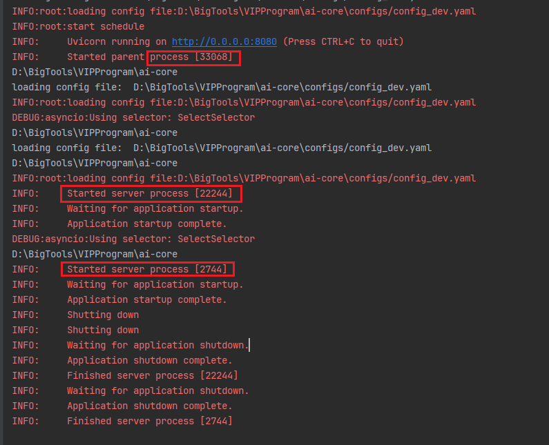

# 需求

1）支持stream

2）支持异步操作

# 问题

1）uvicorn异步情况下如何使用线程池

```
发现一个进程一个单例
每个单例启动一个线程池，线程个数=单例个数*单个线程池线程数
```

2）flask可以支持异步方法吗

```
答案可以
from flask import Flask
```

3）flask单进程多线程有什么问题

```
支持异步，但是异步的时候不支持流，一旦支持流，就可以彻底解决这个问题
验证一下
```

4）如果uvicorn框架，能解决单例的问题吗

```
方案1）一个进程，多个线程，虽然是异步，但是线程数有限，性能差

方案2）多个进程，多个线程
1）多例情况出现缓存进程错乱的问题
2）一个进程配置一个单例，单例中会进行数据库的刷新，需要把数据库刷新的定时任务提前到main进程，防止大量访问数据库
```

5）异步流与Flask

如果你需要真正的异步支持（即，并发处理多个连接而不阻塞），Flask 本身无法支持，需要借助像 `Quart` 这样的 ASGI 框架，或是使用 Flask 的扩展如 `gevent` 或 `eventlet`，但这些方式不如天然设计用于异步的框架高效。


# 结论

Flask不支持异步操作，使用fask+uvicorn则支持异步操作，需要解决的问题如下

方案一）多进程多线程

1）单例加载的问题

2）兼容线程池，验证线程池是否会导致线程过多的问题，并解决

3）多线程缓存问题

方案2）单进程多线程

1）测试多线程性能瓶颈

2）单例如何解决线程池问题

3）可忽略线程问题

# 背景

## ai-core

uvicorn用于启动一个server,一个server可以设置多个进程

一个父进程，两个子进程，一共三个进程

## 入口

```python
import uvicorn
from fastapi import FastAPI, Request
app = FastAPI()

def main():
    uvicorn.run("http_server:app", host='127.0.0.1', port=8080,workers=3)

if __name__ == "__main__":
    main()
```



uvicorn

## 流程

1） 先创建app

app = FastAPI()

2）为app创建一个socket:host+port

uvicorn.run("http_server:app", host='127.0.0.1', port=8080,workers=3)

3）创建一个父进程process

```
uvicorn.supervisors.multiprocess.Multiprocess.startup
```

4）创建workers个子进程process

asyncio.run(self.serve(sockets=sockets))

```
for idx in range(self.config.workers):
    process = get_subprocess(
        config=self.config, target=self.target, sockets=self.sockets
    )
    process.start()
    self.processes.append(process)
```

## uvicorn原理

Python Uvicorn 是一个快速的 ASGI（Asynchronous Server Gateway Interface）[服务器](https://so.csdn.net/so/search?q=服务器&spm=1001.2101.3001.7020)，用于构建异步 Web 服务。它基于 asyncio 库，支持高性能的异步请求处理，适用于各种类型的 Web 应用程序。


在实现上，uvicorn、gunicorn 和 uwsgi 都是通过监听同一个网络套接字来实现多进程共享端口的。具体地，它们在主进程中创建一个监听套接字，然后在每个工作进程中使用 fork() 系统调用复制该套接字，从而实现多进程共享端口。

当一个客户端连接时，操作系统会将连接请求分配给监听套接字，然后选择一个空闲的工作进程将连接套接字交给它处理。具体来说，操作系统使用一些负载均衡算法来选择工作进程，比如轮询、随机等等。对于 uvicorn、gunicorn 和 uwsgi，具体的负载均衡算法是由它们自己实现的，不同的服务器可能有不同的实现方式

原文链接：https://blog.csdn.net/laiqun789/article/details/140584638

## FastAPI原理

FastAPI：高性能异步API框架

## asyncio原理

### asyncio中的关键概念

在深入理解asyncio的原理之前，我们需要了解几个关键概念：

**协程** (Coroutines): asyncio使用协程来表示异步任务，可以通过async def定义协程函数，并在其中使用await关键字来等待异步操作完成。

**事件循环** (Event Loop): asyncio通过事件循环来调度和执行所有的协程任务。事件循环负责轮询所有注册的事件，并在事件发生时通知相应的处理程序。

**Future对象**: Future对象代表了一个异步操作的结果。当一个协程调用了一个异步函数时，它会返回一个Future对象，表示该异步操作的未来结果。

**任务 (Task)**: 任务是协程的一种特殊形式，它包装了一个协程，并被添加到事件循环中执行。

原文链接：https://blog.csdn.net/weixin_52908342/article/details/136695789


### asyncio的工作原理

在asyncio中，事件循环是核心组件，它负责注册、调度和执行所有的协程任务。当我们调用asyncio.run()函数时，会创建一个事件循环并运行指定的协程。事件循环会不断地从任务队列中取出待执行的任务，并将它们添加到事件循环中进行调度。

当一个协程中遇到await关键字时，事件循环会挂起当前协程并将控制权交给其他可执行的协程。被挂起的协程会暂时离开事件循环，并在异步操作完成后恢复执行。

异步操作完成后，事件循环会将结果传递给对应的Future对象，然后唤醒等待该Future对象的协程，使其继续执行。

